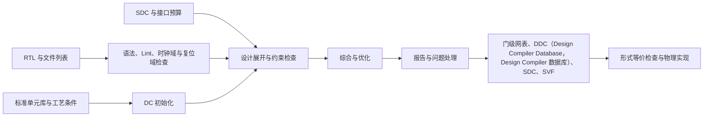
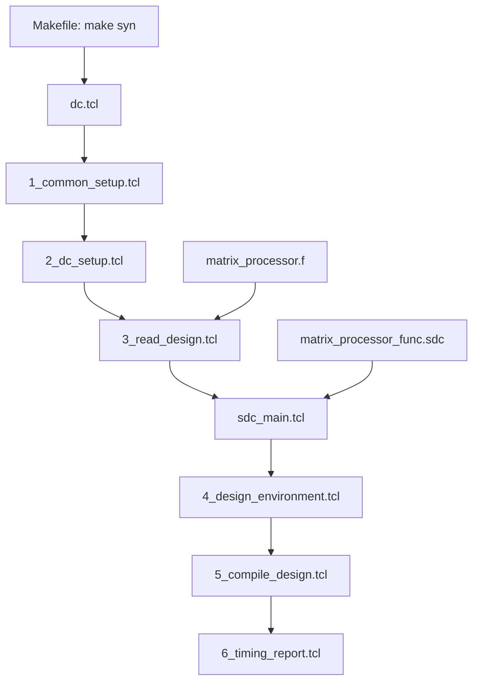

# 工业级 Design Compiler（DC）综合流程教学

本教程说明如何搭建一个面向工程交付的 Design Compiler（DC）综合流程。内容以 `/media/6/Projects/xinyuan/xinyuan-syn` 为具体例子：它已经具备 Makefile、分阶段 Tcl（Tool Command Language，工具命令语言）、RTL 文件列表、SDC（Synopsys Design Constraints，Synopsys 设计约束）与报告输出。教程保留其优点，同时补齐工业项目所需的输入检查、结果记录、约束完整性和交接内容。

> [!note]
> 综合不是“执行一次 `compile`”。它是把 RTL、标准单元库、时序约束、工艺条件与工具选项固定下来，生成门级网表、约束、形式等价检查文件和可审阅报告的过程。任何输入发生变化，都应能明确看出变化来源并再次得到可复查的结果。

## 1. 总体目标与边界

DC 的工作是把 RTL 变成目标标准单元库可实现的门级网表（gate-level netlist），并根据 SDC 评估面积、时序、功耗估算和设计规则。一个可用于项目的综合流程至少要做到：

- 输入明确：顶层、RTL 文件列表、宏模型、标准单元库、SDC、低功耗文件和工具版本均可查到。
- 运行可重复：每次运行有独立输出目录，不覆盖历史结果；脚本不依赖启动目录中的偶然文件。
- 检查前置：在综合前发现 RTL、文件列表、时钟和约束问题，而不是只看最终网表。
- 报告完整：结构、时序、面积、功耗、设计规则和工具消息都有固定输出文件。
- 交接清楚：物理实现使用的网表、SDC、库与运行记录成套提供；形式等价检查使用同一轮的 SVF（Synopsys Verification Format，Synopsys 验证格式）文件。

下面的流程关系值得固定下来：



图中的每个方框都应有明确输入、输出和检查项。这样定位问题时，可以先判断问题属于 RTL、约束、库文件还是综合选项，而不必从最终报告反推全部过程。

## 2. 参考工程的结构与执行顺序

`xinyuan-syn` 的核心目录如下。

| 位置 | 当前内容 | 在流程中的作用 |
| --- | --- | --- |
| `filelist/matrix_processor.f` | SystemVerilog 文件及 `+incdir+../rtl` | 固定 RTL 编译顺序；包文件 `mp_pkg.sv` 位于列表前部。 |
| `sdc/matrix_processor_func.sdc` | 时钟、输入输出延迟、复位例外、时钟不确定度 | 功能模式时序约束。 |
| `syn/Makefile` | 设计名、库路径、工艺条件、日期目录和开关 | 运行参数入口。 |
| `syn/scr/1_common_setup.tcl` | 环境变量、通用变量、工具设置 | 所有阶段共享的初始设置。 |
| `syn/scr/2_dc_setup.tcl` | `search_path`、目标库、链接库、DesignWare 库 | 让 DC 找到单元、宏和综合库。 |
| `syn/scr/3_read_design.tcl` | `analyze`、`elaborate`、`link`、`check_design` | 读取并展开 RTL。 |
| `syn/scr/sdc_main.tcl` | 工艺条件并引用设计 SDC | 约束装载入口。 |
| `syn/scr/4_design_environment.tcl` | 路径分组、时钟相关设置 | 设计级约束补充。 |
| `syn/scr/5_compile_design.tcl` | 编译、名称处理、网表与 DDC（Design Compiler Database，Design Compiler 数据库）输出 | 综合主体。 |
| `syn/scr/6_timing_report.tcl` | QoR（Quality of Results，综合质量摘要）、面积、时序、约束和功耗报告 | 固定的结果审阅材料。 |

实际执行从 `syn/Makefile` 的 `make syn` 开始。Makefile 将 `DESIGN_TOP`、`PROJ_PATH`、`RTL_ROOT`、标准单元库名称、工艺条件等导出为环境变量，然后以 `dc_shell -f scr/dc.tcl` 启动 DC。`dc.tcl` 依次 source 六个阶段脚本。

> [!tip]
> 这种“Makefile 负责运行参数、Tcl 负责工具操作”的分层值得保留。不要把绝对路径、顶层模块名和编译选项散落在多个 Tcl 文件中；否则修改一次设计配置就容易遗漏某个位置。

参考工程使用 FreePDK45 的 `gscl45nm.db`，工作条件为 `typical`，并在 SDC 中创建了周期为 `3.33 ns` 的 `vsi_clk`。这说明其报告可用于学习脚本结构，但不能直接作为其他工艺、其他接口预算或其他频率的目标。CDC（Clock Domain Crossing，时钟域跨越）和 RDC（Reset Domain Crossing，复位域跨越）检查是综合前的独立输入检查。

### 2.1 参考工程的固定输入

本章的“原版”是检查时读取到的工程文件内容，不对其中的拼写、路径或开关作修正。这样可以将工程实际行为与后文的改进写法分开理解。工程使用 DC `V-2023.12-SP3`，综合顶层为 `matrix_processor`，目标库为 FreePDK45 的 `gscl45nm.db`，工作条件为 `typical`。功能模式约束把 `vsi_clk` 定义为周期 `3.33 ns` 的 `CLK`。

原版流程的调用关系如下：



下表先概括每个文件的作用和需要特别留意的内容；原版内容及逐段说明见后续小节。

| 文件 | 主要动作 | 运行结果 | 阅读时应注意 |
| --- | --- | --- | --- |
| `syn/Makefile` | 导出设计、库、目录和功能开关，启动 `dc_shell` | 创建按日期命名的输出目录与 `syn.log` | `DATE` 只有日期，日内多次运行会共用目录；`tee` 未保留 DC 的返回状态。 |
| `syn/scr/dc.tcl` | 按顺序读取各阶段 Tcl | 驱动整个批处理 | `DCT` 分支中的路径缺少 `/`；`INTERRUPT=1` 时不执行 `exit`。 |
| `1_common_setup.tcl` | 从环境变量取得流程参数并设置通用变量 | 后续 Tcl 可使用同一组 Tcl 变量 | 变量名 `SYN_CONER` 与通常的 `CORNER` 拼写不同，修改时必须同时修改 Makefile 和 Tcl。 |
| `2_dc_setup.tcl` | 设置 `search_path`、`target_library`、`synthetic_library`、`link_library` | DC 能找到标准单元与综合库 | 原始 Makefile 中 AFE（Analog Front End，模拟前端）、SRAM（Static Random Access Memory，静态随机存取存储器）、IO（Input/Output，输入/输出）等库变量为空，当前实际仅使用标准单元库。 |
| `3_read_design.tcl` | 建立 work 库、读取 RTL、展开顶层、链接与结构检查 | `*_elab.ddc`、SVF（Synopsys Verification Format，Synopsys 验证格式）、`check_design` 信息 | 文件列表路径由 `PRJ_HOME` 组成；RTL 宏固定为 `SYNTHESIS`。 |
| `sdc_main.tcl` | 选择工作条件并读取功能模式 SDC | 时钟和接口时序约束生效 | `../sdc/...` 依赖从 `syn/` 目录启动；`set_max_area 0.0` 会形成零面积目标。 |
| `4_design_environment.tcl` | 创建 REGIN、REGOUT、FEEDTHROUGH 路径组 | 按路径类别审阅时序 | 时钟端口由时钟树根端口集合排除。 |
| `5_compile_design.tcl` | 修复多端口网络、执行 `compile`、改名、输出网表和 DDC | 综合结果、检查报告与初步时序报告 | 时钟门控和 DFT（Design for Test，可测试性设计）的 `compile_ultra` 分支仍处于注释状态。 |
| `6_timing_report.tcl` | 输出 QoR、面积、时序、功耗与单元使用报告 | 固定报告集合 | 报告反映单一库、单一工作条件和当前 SDC，不能替代全模式、全 PVT（Process/Voltage/Temperature，工艺、电压与温度）的静态时序分析。 |
| `filelist/matrix_processor.f` | 指定包含目录和 RTL 编译顺序 | 作为 `analyze` 的输入 | package 必须在使用它的模块之前。 |
| `sdc/matrix_processor_func.sdc` | 定义时钟、I/O 最大延迟、复位例外和时钟不确定度 | 功能模式时序要求 | 只定义了 I/O `-max` 延迟，未定义 `-min` 延迟与端口驱动/电容。 |

### 2.2 原版 Makefile 与启动脚本

以下为原版 `syn/Makefile`。首行单独写出的 `export` 使 Makefile 中定义的变量作为环境变量提供给 DC。`syn` 目标建立 `output/<DATE>` 后启动 `dc_shell`；`debug` 目标读取单独的调试脚本；`clean` 只删除当前 `syn/` 目录内的日志、SVF、WORK 与 alib 目录。

```makefile
export
DC_SHELL            :=  dc_shell

DESIGN_TOP_NAME 	:= matrix_processor
PT_STAGE		    :=  pre
PT_CHECK_FUNCTION	:=  func
PT_CHECK_CONER		:=  fast

INTERRUPT			:=	1
DCT					:=	0

DATE				:=	$(shell date +%y%m%d)
PROJ				:=  VESC2026
PROJ_PATH			:=	$(PWD)
PROJ_ROOT			:=	$(PROJ_PATH)/..
PRJ_HOME			:=	$(PROJ_ROOT)
PROJ_TEMP			:=	$(PROJ_PATH)/output/$(DATE)
RTL_ROOT            :=  $(PROJ_ROOT)/rtl

postCTS				:=  0
clockGate			:=  0
enableDFT			:=  0

#Change Design List to  filelist
DESIGN				:=	$(DESIGN_TOP_NAME)
DESIGN_TOP			:=	$(DESIGN)
DESIGN_SRC			:=
DESIGN_ROOT			:=  $(PROJ_ROOT)/..

DESIGN_SCR			:=	$(PROJ_PATH)/scr/dc.tcl
DESIGN_DEBUG_SCR	:=	$(PROJ_PATH)/scr/dc_debug.tcl
DESIGN_DFT_SCR		:=	$(PROJ_PATH)/scr/dc_dft.tcl
DESIGN_DONTCH_SDC	:=	$(PROJ_PATH)/scr/$(DESIGN)_dont_touch.tcl
DESIGN_DONTUSE_SDC  :=	$(PROJ_PATH)/scr/$(DESIGN)_dont_use.tcl

DESIGN_SYN_SDC		:=	$(PROJ_PATH)/scr/sdc_main.tcl
DESIGN_DFT_SDC		:=	$(PROJ_ROOT)/sdc/$(DESIGN)_scan.sdc


DW_DB_PATH         	:=
STD_DB_PATH1       	:= 	$(PROJ_ROOT)/syn/lib/FreePDK45/osu_soc/lib/files
STD_DB_PATH2       	:=
STD_DB_PATH         := 	$(STD_DB_PATH1)
SYNC_DB_PATH        := 	$(STD_DB_PATH)
STD_LIB_PATH        :=
STD_MODEL_PATH      :=
MEM_DB_PATH         :=
IO_DB_PATH			:=
LPK_DB_PATH         :=
AFE_DB_PATH         :=
AFE_LIB_PATH        :=

PROCE               := 	gscl45nm
SYN_CONER			:=
SYN_OPER_CONDITION  :=  typical
SYN_OPR_CON			:= 	$(SYN_CONER)
SYN_STD_LIB_NAME    :=   gscl45nm

STD_DB_LIST1       	:= 	gscl45nm.db
STD_DB_LIST2       	:=
STD_DB_LIST       	:=  $(STD_DB_LIST1)
STD_LIB_LIST       	:=
SYNC_DB_LIST        := 	$(STD_DB_LIST)
STD_MODEL           :=
MEM_DB_LIST         :=
IO_DB_LIST			:=
LPK_DB_LIST         :=
AFE_DB_LIST         :=
AFE_LIB_LIST        :=

.PHONY:

env:.PHONY
	@env

syn:.PHONY
	mkdir -p $(PROJ_TEMP)
	$(DC_SHELL) -f $(DESIGN_SCR) | tee syn.log
debug:.PHONY
	$(DC_SHELL) -f $(DESIGN_DEBUG_SCR)
clean:
	rm  -rf *.log *.svf
	rm  -rf WORK alib-52
```

原版 Makefile 的层次是清楚的：设计名派生出顶层、脚本与 SDC 名称；库目录和库名分别用不同变量表示；工艺条件与功能开关集中在同一位置。需要区别“已有开关”和“实际生效的开关”：`clockGate`、`enableDFT` 与 `DCT` 已传入 DC，但在当前原版流程中，前两项对应的编译命令仍被注释，`DCT=0` 时也不会进入其分支。

下面是原版主控脚本 `syn/scr/dc.tcl`。它自身不执行综合命令，而是按固定顺序读取各阶段 Tcl。将主控脚本保持为短小的顺序表，有利于确认综合停在哪个阶段。

```tcl
#--------------------------------------------
# Common Setup
#--------------------------------------------
set PROJ_PATH [getenv PROJ_PATH]
source -e -v ${PROJ_PATH}/scr/1_common_setup.tcl

#--------------------------------------------
# Setup Library
#--------------------------------------------

source -e -v ${PROJ_PATH}/scr/2_dc_setup.tcl

if { $DCT == 1 } {
    source -e -v ${PROJ_PATH}scr/2_dct_setup.tcl
}

#--------------------------------------------
# Parse Design and Uniquify
#--------------------------------------------

source -e -v ${PROJ_PATH}/scr/3_read_design.tcl

#--------------------------------------------
# Constrain Design
#--------------------------------------------

source -e -v ${DESIGN_SYN_SDC}
#source -e -v ${DESIGN_DONTCH_SDC}
#source -e -v ${DESIGN_DONTUSE_SDC}

#--------------------------------------------
# Design Environment
#--------------------------------------------

source -e -v ${PROJ_PATH}/scr/4_design_environment.tcl

#--------------------------------------------
# Compile
#--------------------------------------------

source -e -v ${PROJ_PATH}/scr/5_compile_design.tcl

#--------------------------------------------
# Set False Path and Report Timing
#--------------------------------------------

source -e -v ${PROJ_PATH}/scr/6_timing_report.tcl

if {$INTERRUPT != 1} {
    exit
}
```

`source -e -v` 会把执行的 Tcl 命令显示在日志中，并在发生错误时停止当前 source。原版第一个 `source` 使用了正确的 `${PROJ_PATH}/scr/...` 路径；DCT 分支中的 `${PROJ_PATH}scr/...` 少了路径分隔符，只有把 `DCT` 设为 `1` 后才会暴露。最后的条件与变量名的直观含义相反：`INTERRUPT` 为 `1` 时不执行 `exit`。批处理流程更适合无条件使用 `quit` 或 `exit`，并把成功、失败状态交给 Makefile。

### 2.3 原版环境与库设置脚本

原版 `1_common_setup.tcl` 将 Makefile 环境变量转为 Tcl 变量，再构造标准单元、存储器、同步单元、IO 和 AFE 库的目录与文件列表。虽然当前工程大部分扩展库变量为空，这种分层适合后续加入 SRAM、PLL、IO 单元或专用宏。`set_host_options -max_cores 1` 把该工程固定为单核运行，`report_host_options` 会将这一工具设置写入日志。

```tcl
set_host_options -max_cores 1
report_host_options
#---------------------------------------
# Gen Environment Settings
#---------------------------------------
set INTERRUPT           [getenv INTERRUPT ]
set DCT                 [getenv DCT       ]

set DATE                [getenv DATE      ]
set PROJ                [getenv PROJ      ]
set PROJ_PATH           [getenv PROJ_PATH ]
set PROJ_ROOT           [getenv PROJ_ROOT ]
set PROJ_TEMP           [getenv PROJ_TEMP ]

set postCTS             [getenv postCTS   ]
set enableDFT           [getenv enableDFT ]
set clockGate           [getenv clockGate ]

set DESIGN              [getenv DESIGN    ]
set DESIGN_TOP          [getenv DESIGN_TOP]
set DESIGN_SRC          [getenv DESIGN_SRC]

set DESIGN_SYN_SDC      [getenv DESIGN_SYN_SDC   ]
set DESIGN_DONTCH_SDC   [getenv DESIGN_DONTCH_SDC]
set DESIGN_DONTUSE_SDC  [getenv DESIGN_DONTUSE_SDC]
set DESIGN_DFT_SDC      [getenv DESIGN_DFT_SDC   ]

set DW_DB_PATH          [getenv DW_DB_PATH]

set STD_DB_PATH         [getenv STD_DB_PATH]
set AFE_DB_PATH         [getenv AFE_DB_PATH]
set SYNC_DB_PATH        [getenv SYNC_DB_PATH]
set IO_DB_PATH          [getenv IO_DB_PATH]
set IO_DB_LIST          [getenv IO_DB_LIST]
set PROCE		        [getenv PROCE]
set RTL_ROOT            [getenv RTL_ROOT]
set DESIGN_ROOT         [getenv DESIGN_ROOT]
set AFE_DB_LIST         [getenv AFE_DB_LIST]

set flow  "syn"
#----------------------------------------
# Set Process and Local parameters
#----------------------------------------

set CORNER              [getenv SYN_CONER]
set std_db_path         "${STD_DB_PATH}"
set mem_db_path         [getenv MEM_DB_PATH]
set sync_db_path        "${SYNC_DB_PATH}"
set std_db_list         [getenv STD_DB_LIST]
set mem_db_list         [getenv MEM_DB_LIST]
set std_lib_name        [getenv SYN_STD_LIB_NAME]
set sync_db_list        ""
set std_db_name         "${PROCE}_${CORNER}"
set std_buff_cell       "BUFHSV1"
set std_buff_cell_drive "Z"
set std_buff_cell_load  "I"

set lpk_db_list         [getenv LPK_DB_LIST]
set lpk_db_path         [getenv LPK_DB_PATH]

set std_operating_condition  [getenv SYN_OPER_CONDITION]

set afe_db_enable       true
set afe_db_path         "${AFE_DB_PATH}"
set afe_db_list         "${AFE_DB_LIST}"
set afe_dft_wrapper     false

set io_db_path          "${IO_DB_PATH}"
set io_db_list          "${IO_DB_LIST}"

set spare_cell_enable   false
set verilogout_show_unconnected_pins true
set hdlin_auto_save_templates true
```

原版 `2_dc_setup.tcl` 使用上述变量设置库。`search_path` 定义库文件的搜索目录；`target_library` 是 DC 进行逻辑实现时可选用的库；`link_library` 是链接设计时可解析的库集合。`*` 代表当前内存中的设计。`synthetic_library` 指向 DesignWare 综合库；它与目标标准单元库的职责不同，不应将 `.sldb` 当作标准单元实现库。

```tcl

if {$afe_db_enable == false} {
    set search_path         [concat $std_db_path $mem_db_path $search_path $sync_db_path $lpk_db_path]
    set target_library      [concat $std_db_list $afe_db_list]
} else {
    set search_path         [concat $std_db_path $afe_db_path $mem_db_path  $search_path $sync_db_path $io_db_path $lpk_db_path]
    set target_library      [concat $std_db_list $afe_db_list ]
}
set synthetic_library   [concat dw_foundation.sldb]
set link_library        [concat * $target_library ]
```

在当前 Makefile 中，`AFE_DB_LIST` 为空，而 `afe_db_enable` 被设为 `true`，因此两个分支得到的 `target_library` 实质上相同；区别只在 `search_path` 是否加入 AFE 与 IO 目录。`mem_db_list`、`sync_db_list` 与 `io_db_list` 没有加入 `link_library`，当设计实例化 SRAM、IO 或其他宏时，必须把相应时序模型加入 `link_library`，否则 `link` 可能保留未解析引用。

### 2.4 原版 RTL 读取脚本与文件列表

原版 `3_read_design.tcl` 完成设计读取。`define_design_lib` 指定编译产物的 work 库位置；`set_svf` 在展开前开启 SVF 输出，供后续形式等价检查使用；`analyze` 使用 VCS 风格参数读取文件列表；`elab` 展开 `DESIGN_TOP`；`uniquify -force` 给重复实例建立独立设计副本；最后的 `link` 和 `check_design` 分别解析单元引用并检查结构。

```tcl
define_design_lib work -path "./WORK"

set_svf ${PROJ_TEMP}/${DESIGN_TOP}.svf

set_app_var simplified_verification_mode true

set macro_param ""

echo "#------------------------------------------"
echo "Redefine RTL Parameters:"
echo "$macro_param"
echo "#------------------------------------------"
set PRJ_HOME           [getenv PRJ_HOME]
echo ${PRJ_HOME}
analyze  -vcs "+define+SYNTHESIS +incdir+${RTL_ROOT} -f ${PRJ_HOME}/filelist/${DESIGN_TOP}.f"  -format sverilog

elab ${DESIGN_TOP}

write -f ddc -h -o ${PROJ_TEMP}/${DESIGN_TOP}_elab.ddc

set verilogout_no_tri true
set verilogout_show_unconnected_pins true
set hdlin_enable_rtldrc_info true
set hdlin_vrlg_std "2001"
set power_preserve_rtl_hier_names true
set hdlin_shorten_long_module_name true
set hdlin_module_name_limit 256

current_design ${DESIGN_TOP}

set uniquify_naming_style "${DESIGN_TOP}_%s_%d"
uniquify -force

link

check_design
```

`macro_param` 在原版中被置为空字符串，所以其 `echo` 只起到显示当前位置的作用，并未真正覆盖 RTL 参数。`elab` 是 `elaborate` 的简写。`write -f ddc` 位于 `uniquify` 前，因此 `*_elab.ddc` 是展开后的保存点，不包含后续的实例改名和独立化结果。`verilogout_no_tri true`、`verilogout_show_unconnected_pins true` 等设置影响后续写出的 Verilog 形式；它们不会替代对 RTL 三态结构和未连接端口的人工审阅。

原版文件列表如下。首行使编译器搜索 `rtl` 目录，第二行先读取 package，后续模块按其引用关系排列，最后一行是顶层模块。

```text
+incdir+../rtl
../rtl/mp_pkg.sv
../rtl/mp_ctrl.sv
../rtl/mp_exu_dot_array.sv
../rtl/mp_mt_near_file.sv
../rtl/mp_exu_compute_unit.sv
../rtl/mp_exu.sv
../rtl/mp_idu.sv
../rtl/mp_lsu.sv
../rtl/mp_regs.sv
../rtl/mp_wbu.sv
../rtl/matrix_processor.sv
```

### 2.5 原版 SDC、路径分组、综合和报告脚本

原版 `sdc_main.tcl` 先按库名与工作条件设置工艺条件，再选择 wire-load model，最后读取功能模式 SDC。`set_max_area 0.0` 是“面积必须不大于零”的硬约束，而不是“取消面积约束”；参考结果中的 `max_area` 违例正由此产生。现代有物理信息的流程通常不再以 wire-load model 表示布线电容，应按项目的物理实现流程使用相应设置。

```tcl
set_operating_conditions -library "${std_lib_name}" "${std_operating_condition}"
set auto_wire_load_selection "true"
set_wire_load_mode top
set_max_area 0.0

source -e -v ../sdc/${DESIGN_TOP}_func.sdc
#source -e -v ../sdc/${DESIGN_TOP}_intf.sdc
```

功能模式 SDC 的原版如下。脚本先判断当前程序是否为 PT（PrimeTime，静态时序分析工具）或 `gca_shell`，再以 `time_unit_rate` 和 `time_scale` 统一数值。实际启用的是 300 MHz 注释下的 `3.33 ns` 周期。除时钟与低有效复位端口外，所有输入只有 `-max` 输入延迟；所有输出只有 `-max` 输出延迟；复位到所有端点的路径被排除。

```tcl

if {![info exists synopsys_program_name]} {
    set synopsys_program_name ""
}

if {${synopsys_program_name} == "pt_shell" || ${synopsys_program_name} == "gca_shell" } {
    set syno_tool    "pt"
} else {
    set syno_tool    "dc"
}
set time_scale              1.0
set time_unit_rate          1.0

#100MHz
#set clk_period          [expr $time_unit_rate*5.6*$time_scale]

#300MHz
set clk_period          [expr $time_unit_rate*3.33*$time_scale]

set setup_uncer 0.1*$time_unit_rate
set hold_uncer  0.1*$time_unit_rate
##Clock create
create_clock -name "CLK"        [get_ports vsi_clk]         -period $clk_period     -waveform "0 [expr $clk_period/2.0]"

set_input_delay  -max [expr 0.5*$clk_period]   -clock [get_clocks "CLK"] [remove_from_collection [all_inputs] [get_ports {vsi_clk vsi_rst_n}]]
set_output_delay  -max [expr 0.1*$clk_period]   -clock [get_clocks "CLK"] [all_outputs]


set_false_path -from [get_ports "vsi_rst_n"]

set_clock_uncertainty -setup [expr $setup_uncer] [all_clocks]
set_clock_uncertainty -hold  [expr $hold_uncer] [all_clocks]
```

下面是路径分组、综合与报告的原版 Tcl。路径分组脚本把输入至寄存器、寄存器至输出以及输入至输出路径分别命名为 `REGIN`、`REGOUT` 和 `FEEDTHROUGH`，所以 QoR 报告会将它们与寄存器到寄存器的 `CLK` 组分开列出。综合脚本实际执行基础 `compile`，然后输出综合网表、DDC 和 SDC；报告脚本补齐 QoR、面积、约束、功耗与时钟门控报告。

```tcl
set ports_clock_root [get_ports [all_fanout -flat -clock_tree -level 0]]
group_path -name REGOUT -to [all_outputs]
group_path -name REGIN -from [remove_from_collection [all_inputs] $ports_clock_root]
group_path -name FEEDTHROUGH -from [remove_from_collection [all_inputs] $ports_clock_root] -to [all_outputs]

set_operating_conditions $std_operating_condition -library [get_libs ${std_lib_name}]

set timing_enable_multiple_clocks_per_reg "true"

set_max_area 0

#set_clock_gating_style -sequential_cell latch \
#    -positive_edge_logic {integrated} \
#    -control_signal scan_enable \
#    -control_point before \
#    -minimum_bitwidth 3 \
#    -max_fanout 2048

```

```tcl
set_fix_multiple_port_nets -all -exclude_clock_network
set_app_var dc_allow_rtl_pg true
#if  {$enableDFT==1} {
#compile_ultra -scan -gate_clock -no_seq_output_inversion \
#    -no_boundary_optimization -no_autoungroup
#    } elseif {$clockGate == 1} {
#compile_ultra  -gate_clock -no_seq_output_inversion \
#    -no_boundary_optimization -no_autoungroup
#    } else {
#compile_ultra  -no_seq_output_inversion \
#    -no_boundary_optimization -no_autoungroup
#}

compile -map_effort medium -area_effort low -power_effort none

change_names -rules verilog -verbose -hierarchy

check_design    >   ${PROJ_TEMP}/${DESIGN_TOP}_check_design.rpt
check_timing    >   ${PROJ_TEMP}/${DESIGN_TOP}_check_timing.rpt

write -f verilog -h -o ${PROJ_TEMP}/${DESIGN_TOP}_syn.vg
write -f ddc     -h -o ${PROJ_TEMP}/${DESIGN_TOP}_syn.ddc


write_sdc              ${PROJ_TEMP}/${DESIGN_TOP}_syn.sdc
report_timing -nets -input -trans -cap -nworst 5 > ${PROJ_TEMP}/${DESIGN_TOP}_before_dft_timing.rpt
```

```tcl
report_qor                           >   ${PROJ_TEMP}/${DESIGN_TOP}_qor.rpt
report_area                          >   ${PROJ_TEMP}/${DESIGN_TOP}_area.rpt
report_area -hier                    >>  ${PROJ_TEMP}/${DESIGN_TOP}_area.rpt
report_design                        >   ${PROJ_TEMP}/${DESIGN_TOP}_design.rpt
report_reference                     >   ${PROJ_TEMP}/${DESIGN_TOP}_reference.rpt
report_constraints                   >   ${PROJ_TEMP}/${DESIGN_TOP}_constraints.rpt
report_constraints -all_violator     >>  ${PROJ_TEMP}/${DESIGN_TOP}_constraints.rpt
report_constraints -all_violator -v  >>  ${PROJ_TEMP}/${DESIGN_TOP}_constraints.rpt
report_timing -nets -input -trans -cap -nworst 5 > ${PROJ_TEMP}/${DESIGN_TOP}_timing.rpt
report_power -hier -verbose          > ${PROJ_TEMP}/${DESIGN_TOP}_power.rpt
report_power           >> ${PROJ_TEMP}/${DESIGN_TOP}_power.rpt
report_threshold_voltage_group           > ${PROJ_TEMP}/${DESIGN_TOP}_cell_usage.rpt
sizeof_collection [get_cells -h]     >   ${PROJ_TEMP}/${DESIGN_TOP}_instances.rpt

report_clock_gating -v -ungated      >   ${PROJ_TEMP}/${DESIGN_TOP}_clock_gating.rpt
```

`set_fix_multiple_port_nets -all -exclude_clock_network` 会为多端口网络插入所需的缓冲或拆分逻辑，但不处理时钟网络。`change_names -rules verilog -hierarchy` 在写出 Verilog 前将层级名称改成 Verilog 可接受形式。`report_timing` 中的 `-nets -input -trans -cap` 使每条路径同时列出网络、输入到达信息、转换时间和电容，适合分析具体违例；`-nworst 5` 则使每个路径组只保留最差的五条路径。

## 3. 建议的工程目录

工业项目应把固定输入、脚本、运行输出和人工审阅记录分开。下面是推荐的最小目录；目录名称可以按团队规则调整，但职责应保持稳定。

```text
project/
├── Makefile
├── config/
│   ├── project.tcl             # 顶层、文件列表、运行模式
│   ├── library.tcl             # .db/.sldb、工艺条件、单位
│   └── tool.tcl                # DC 版本相关选项
├── rtl/
├── filelist/
│   └── <top>.f
├── constraints/
│   ├── <top>_func.sdc
│   ├── <top>_scan.sdc
│   └── io_budget.tcl
├── power/
│   └── <top>.upf               # 使用低功耗设计时提供
├── scripts/
│   ├── run_dc.tcl
│   ├── 00_preflight.tcl
│   ├── 10_setup_library.tcl
│   ├── 20_read_rtl.tcl
│   ├── 30_apply_constraints.tcl
│   ├── 40_compile.tcl
│   ├── 50_report.tcl
│   └── 60_write_out.tcl
├── run/
│   └── <run_id>/
│       ├── log/
│       ├── report/
│       ├── netlist/
│       ├── constraint/
│       ├── formal/
│       └── manifest.txt
└── docs/
    └── review.md
```

`run/<run_id>` 不能只用日期。例如同一天多次运行时，`20260812_143025_<git短提交号>` 比 `260812` 更容易区分。若 RTL 不在 Git 中，也应在 `manifest.txt` 写入文件列表路径、每个输入文件的校验值、DC 版本、顶层模块、工艺条件、库文件名、执行命令、开始时间和结束时间。

> [!warning]
> 不要把 `run/` 放进 RTL 目录，也不要让综合脚本写回 `rtl/`、`filelist/` 或 `constraints/`。输入应保持只读，生成物只写入当前运行目录。这样可以防止一次失败的运行污染下一次。

## 4. 先固定 Makefile 参数

参考工程的 Makefile 已经采用环境变量传递参数。下面的写法增加了独立运行目录和错误返回，适合作为教学骨架。

```makefile
SHELL := /usr/bin/env bash

DC_SHELL      ?= dc_shell
TOP           ?= matrix_processor
ROOT          := $(abspath .)
RTL_ROOT      := $(ROOT)/rtl
FILELIST      := $(ROOT)/filelist/$(TOP).f
SDC_FILE      := $(ROOT)/constraints/$(TOP)_func.sdc
RUN_ROOT      := $(ROOT)/run
RUN_ID        ?= $(shell date +%Y%m%d_%H%M%S)_$(shell git rev-parse --short HEAD 2>/dev/null || echo nogit)
RUN_DIR       := $(RUN_ROOT)/$(RUN_ID)
SYN_SCRIPT    := $(ROOT)/scripts/run_dc.tcl
COMPILE_MODE  ?= medium

export TOP ROOT RTL_ROOT FILELIST SDC_FILE RUN_DIR COMPILE_MODE

.PHONY: syn

syn:
	mkdir -p $(RUN_DIR)/{log,report,netlist,constraint,formal}
	set -o pipefail; $(DC_SHELL) -f $(SYN_SCRIPT) 2>&1 | tee $(RUN_DIR)/log/dc.log; exit $${PIPESTATUS[0]}
```

这里有四个要点：

1. `TOP`、`FILELIST`、`SDC_FILE` 和 `RUN_DIR` 是整个流程最重要的输入字段，应在日志起始处打印。
2. DC 命令、`tee` 和 `PIPESTATUS[0]` 必须放在同一条 Makefile recipe 中，避免 DC 失败但 Makefile 因为 `tee` 成功而误报成功。
3. `RUN_ID` 可由持续集成系统传入，也可由本地默认规则生成。
4. 运行目录的清理应使用单独的归档脚本，并要求明确的 `RUN_ID`；不要用笼统的 `make clean` 删除全部历史结果。

参考工程使用 `PROJ_TEMP=$(PROJ_PATH)/output/$(DATE)`。这一做法结构清楚，但同日重复运行会写入同一个目录。建议改为上面的 `RUN_DIR`，或者在已有规则中额外加入时间和 RTL 提交编号。

## 5. 库设置：先确认 DC 看到了什么

综合质量首先取决于目标库、链接库和工艺条件是否正确。DC 中最关键的三个变量如下：

| 变量 | 作用 | 常见错误 |
| --- | --- | --- |
| `search_path` | 查找 `.db`、`.sldb`、RTL 包含文件的目录 | 只写了相对目录，换启动位置后找不到文件。 |
| `target_library` | DC 用于实现逻辑的标准单元 `.db` | 误用另一工艺或另一电压条件的库。 |
| `link_library` | 链接设计时可引用的库；通常包含 `*`、目标库和宏库 | 漏掉 SRAM/IO 宏的时序模型，导致黑盒或链接失败。 |

一个清晰的库设置脚本示例如下。

```tcl
# scripts/10_setup_library.tcl
set search_path [list \
    $::env(RTL_ROOT) \
    $::env(ROOT)/lib/stdcell \
    $::env(ROOT)/lib/macro]

set target_library [list gscl45nm.db]
set synthetic_library [list dw_foundation.sldb]
set link_library [concat * $target_library $synthetic_library]

set_operating_conditions typical -library gscl45nm
set_host_options -max_cores 8

puts "INFO: target_library = $target_library"
puts "INFO: link_library   = $link_library"
report_lib > $::env(RUN_DIR)/report/library.rpt
```

实际项目需将 `gscl45nm.db`、`typical` 替换为 PDK 指定的文件和条件。多个 PVT（Process/Voltage/Temperature，工艺、电压与温度）通常不能只靠一个典型条件覆盖。综合阶段可以采用项目规定的优化条件；最终时序分析会覆盖项目规定的全部模式和 PVT 条件。

> [!warning]
> 库设置中的 `link_library` 不能只含标准单元。设计实例化的 SRAM、ROM（Read-Only Memory，只读存储器）、PLL（Phase-Locked Loop，锁相环）、模拟接口封装或其他硬宏，都需要提供对应的时序模型；没有模型时，应明确以黑盒方式处理并在报告中列出。

### 5.1 从参考工程学习

参考工程在 `2_dc_setup.tcl` 中设置 `search_path`，并以 `gscl45nm.db` 建立 `target_library`；`link_library` 包含 `*` 与目标库，`synthetic_library` 使用 `dw_foundation.sldb`。这是合适的基础结构。

可进一步增加以下检查：

```tcl
if {[sizeof_collection [get_libs *]] == 0} {
    error "No technology library is loaded."
}
if {[sizeof_collection [get_lib_cells */DFF*]] == 0} {
    error "No sequential cell is visible in the target libraries."
}
```

这些检查使库路径错误在编译 RTL 前就停止，而不是等到后面的 `link` 或 `compile` 才出现大量错误。

### 5.2 三种库设置方式

库脚本必须先回答两个问题：哪些单元允许 DC 用来实现 RTL，哪些模型只用于解析已实例化的宏。下表给出三种常见组织方式。示例中的库名、库单元名和工作条件均为占位符，必须替换为 PDK（Process Design Kit，工艺设计套件）实际交付的名称。

| 方式 | 适用情况 | `target_library` | `link_library` |
| --- | --- | --- | --- |
| 单一标准单元库 | 教学设计或单一典型条件的早期评估 | 一个标准单元 `.db` | `*`、目标库与 DesignWare 库。 |
| 标准单元库加硬宏 | 设计中已实例化 SRAM、ROM、PLL 或 IO 宏 | 通常仍只有标准单元库 | `*`、目标库、每个宏的时序模型与 DesignWare 库。 |
| 按 PVT 选择库 | 项目为不同优化条件分别运行综合 | 当前运行条件的一组标准单元库 | 当前目标库与当前条件下所有硬宏模型。 |

**方式一：单一标准单元库。** 这是参考工程去除空变量后的最小写法。`target_library` 只含可用于实现逻辑的标准单元，`link_library` 将当前设计、标准单元和 DesignWare 都纳入解析范围。

```tcl
set LIB_ROOT $::env(ROOT)/lib/stdcell
set search_path [list $LIB_ROOT]

set target_library [list gscl45nm.db]
set synthetic_library [list dw_foundation.sldb]
set link_library [concat * $target_library $synthetic_library]

set_operating_conditions typical -library gscl45nm
```

**方式二：标准单元库加硬宏。** SRAM 等硬宏已经具有固定实现，不能放入 `target_library` 供 DC 任意替换；但它们的 `.db` 必须进入 `link_library`，使其端口、时序弧和功耗数据参与分析。

```tcl
set STD_LIB_ROOT   $::env(ROOT)/lib/stdcell
set MACRO_LIB_ROOT $::env(ROOT)/lib/macro
set search_path [list $STD_LIB_ROOT $MACRO_LIB_ROOT]

set target_library [list stdcell_ss_0p72v_125c.db]
set macro_library [list \
    sram_1rw_1024x32_ss_0p72v_125c.db \
    pll_ss_0p72v_125c.db \
    io_ss_0p72v_125c.db]
set synthetic_library [list dw_foundation.sldb]
set link_library [concat * $target_library $macro_library $synthetic_library]

set_operating_conditions ss_0p72v_125c -library stdcell_ss_0p72v_125c
```

**方式三：由运行条件选择库。** 这种写法使不同 PVT 运行使用同一套 Tcl，但每次运行只选择一个明确条件。文件名和 `set_operating_conditions` 的名称必须来自库交付说明；不要通过字符串猜测库内工作条件名。

```tcl
set CORNER $::env(CORNER)
array set stdcell_db {
    ss_0p72v_125c stdcell_ss_0p72v_125c.db
    tt_0p80v_25c  stdcell_tt_0p80v_25c.db
    ff_0p88v_m40c stdcell_ff_0p88v_m40c.db
}
array set library_name {
    ss_0p72v_125c stdcell_ss_0p72v_125c
    tt_0p80v_25c  stdcell_tt_0p80v_25c
    ff_0p88v_m40c stdcell_ff_0p88v_m40c
}
array set operating_condition {
    ss_0p72v_125c ss_0p72v_125c
    tt_0p80v_25c  tt_0p80v_25c
    ff_0p88v_m40c ff_0p88v_m40c
}

if {![info exists stdcell_db($CORNER)]} {
    error "Unsupported CORNER: $CORNER"
}

set search_path [list $::env(ROOT)/lib/stdcell $::env(ROOT)/lib/macro]
set target_library [list $stdcell_db($CORNER)]
set macro_library [list sram_1rw_1024x32_${CORNER}.db]
set synthetic_library [list dw_foundation.sldb]
set link_library [concat * $target_library $macro_library $synthetic_library]

set_operating_conditions $operating_condition($CORNER) \
    -library $library_name($CORNER)
```

示例把库文件名、库名和工作条件名分别维护，三者即使相同也不要只靠字符串拼接推导。每次读取库后都应保存 `report_lib`、`report_operating_conditions` 和 `printvar target_library link_library` 的结果；这比只在脚本中查看变量更容易发现库版本或工艺条件不一致。

## 6. RTL 读取与预检查

RTL 文件列表决定编译顺序。参考工程的 `matrix_processor.f` 先列出 `mp_pkg.sv`，再列出使用该 package 的控制、执行、寄存器和顶层模块，这种顺序是正确的。

建议把文件列表当作正式输入维护：

- package、interface 和宏定义文件排在引用它们的模块之前；
- 不要让文件列表混入编辑器备份、仿真生成文件或旧版本 RTL；
- `+incdir+` 使用相对于文件列表的固定规则，或由脚本展开为绝对路径；
- 宏定义如 `+define+SYNTHESIS` 必须有文档说明，并与仿真、形式等价检查的条件保持一致；
- 综合前先执行 lint、CDC（Clock Domain Crossing，时钟域跨越）和 RDC（Reset Domain Crossing，复位域跨越）检查，处理或记录每一项例外。

参考工程在 `3_read_design.tcl` 使用：

```tcl
define_design_lib work -path ./WORK
analyze -format sverilog -vcs \
    "+define+SYNTHESIS +incdir+${RTL_ROOT} -f ${FILELIST}"
elaborate $TOP
current_design $TOP
uniquify -force
link
check_design
```

`analyze` 只检查并编译 RTL，`elaborate` 才依据顶层参数把设计展开，`link` 将已展开的引用解析到库单元或模块。`check_design` 是必须保留的结构检查。

### 6.1 三种 RTL 读取方式

三种方式的综合结果应相同，差别仅在输入清单由谁维护。无论采用哪一种，package、interface 和被引用模块都必须先于引用它们的模块读入，综合与形式等价检查还必须使用同一组宏定义和参数。

**方式一：由 VCS（Verilog Compiled Simulator，Verilog 编译型仿真器）风格文件列表驱动。** 参考工程使用这一方式。优点是文件列表可以被仿真、lint 与综合共同使用；缺点是列表内的相对路径依赖启动位置，宜在入口脚本中将工作目录固定为工程根目录，或把列表内容改成绝对路径。

```tcl
define_design_lib WORK -path $::env(RUN_DIR)/WORK
analyze -format sverilog -vcs \
    "+define+SYNTHESIS +incdir+$::env(RTL_ROOT) -f $::env(FILELIST)"
elaborate $::env(TOP)
current_design $::env(TOP)
link
```

**方式二：在 Tcl 中显式维护有序文件列表。** 文件较少、需要针对不同顶层挑选 RTL 集合时，这种方式最直观。每个文件分别调用 `analyze`，出错时日志能够准确指出失败的文件。

```tcl
define_design_lib WORK -path $::env(RUN_DIR)/WORK

set rtl_files [list \
    $::env(RTL_ROOT)/mp_pkg.sv \
    $::env(RTL_ROOT)/mp_ctrl.sv \
    $::env(RTL_ROOT)/mp_exu_dot_array.sv \
    $::env(RTL_ROOT)/mp_mt_near_file.sv \
    $::env(RTL_ROOT)/mp_exu_compute_unit.sv \
    $::env(RTL_ROOT)/mp_exu.sv \
    $::env(RTL_ROOT)/mp_idu.sv \
    $::env(RTL_ROOT)/mp_lsu.sv \
    $::env(RTL_ROOT)/mp_regs.sv \
    $::env(RTL_ROOT)/mp_wbu.sv \
    $::env(RTL_ROOT)/matrix_processor.sv]

foreach rtl_file $rtl_files {
    if {![file isfile $rtl_file]} {
        error "RTL file does not exist: $rtl_file"
    }
    analyze -format sverilog $rtl_file
}
elaborate $::env(TOP)
current_design $::env(TOP)
link
```

**方式三：使用 `read_file` 读取顶层和 RTL 目录。** 部分 DC 版本提供 `read_file` 的 `-autoread` 写法。它把读取与顶层展开合在一起，适合由工具自动查找被引用模块的设计；但文件顺序、包含目录与宏定义的控制不如前两种直接。使用前应在当前 DC 版本执行 `help read_file`，确认 `-autoread`、SystemVerilog 格式和参数写法。

```tcl
define_design_lib WORK -path $::env(RUN_DIR)/WORK
set search_path [concat $search_path [list $::env(RTL_ROOT)]]
read_file -format sverilog -top $::env(TOP) \
    -autoread $::env(RTL_ROOT)
current_design $::env(TOP)
link
```

自动读取不能取代正式文件列表：若工程有多个同名模块、生成文件或仅用于仿真的 RTL，自动搜索容易读入错误版本。交付综合结果时仍应记录实际读取的文件集合。

> [!note]
> `uniquify -force` 会为重复实例建立独立设计副本，使各实例可以分别优化。是否需要保留层级，应由形式等价检查、调试需求和物理实现策略共同决定；不要在不了解影响时批量 `ungroup`。

### 6.2 必做的预检查

建议在 `00_preflight.tcl` 实现下列检查，并在任一关键项失败时退出：

| 检查 | 建议方法 | 处理方式 |
| --- | --- | --- |
| 必需环境变量 | 读取 `TOP`、`FILELIST`、`SDC_FILE`、`RUN_DIR`，检查非空且文件存在 | 缺失即停止。 |
| 顶层一致性 | `elaborate $TOP` 后执行 `current_design` | 顶层名不一致不得继续。 |
| 未解析引用 | `link` 后检查 `report_design` 与工具消息 | 未定义模块、宏模型或库单元不得忽略。 |
| RTL 结构 | `check_design` | 未连接端口、常量输出、三态结构等逐项分类。 |
| 时钟对象 | SDC 后 `report_clock` | 至少有一个预期时钟；名称与端口正确。 |
| 约束覆盖 | `check_timing -verbose` | 输入、输出、寄存器间路径和例外路径均应有合理说明。 |

不要把 `check_design` 里的 notice 一概忽略。参考工程已有一次运行的报告中出现大量未连接端口与常量输出提示；这类提示可能来自刻意保留的可选接口，也可能说明顶层连接或宏定义不正确。正确做法是列出端口名、原因、责任模块和处理日期；不应只用报告总数判断。

## 7. SDC：让时序要求完整而可审阅

SDC（Synopsys Design Constraints）描述外部时钟、接口到达时间、接口要求时间、时钟关系和设计规则。SDC 不应只包含一个 `create_clock`；它应表达真实接口预算和架构允许的例外。

### 7.1 参考工程当前约束

`matrix_processor_func.sdc` 的主要内容为：

- 在 `vsi_clk` 创建 `CLK`，周期 `3.33 ns`，占空比 50%。
- 设置 `0.1 ns` 的 setup 和 hold 时钟不确定度。
- 除时钟和低有效复位外，为输入端口设置最大输入延迟，数值是一个周期的 50%。
- 为输出端口设置最大输出延迟，数值是一个周期的 10%。
- 将 `vsi_rst_n` 设为 false path。

这些内容足以开始教学运行，但它只设置了 I/O 的 `-max` 延迟。已有 `check_timing` 报告提示部分输入延迟未完整定义。对于同步接口，通常需要同时提供 `-max` 和 `-min`；否则 hold 分析的边界不完整。

### 7.2 一个更完整的功能模式模板

以下示例中的数值仅用于说明写法，必须由接口时序预算替换。

```tcl
# constraints/matrix_processor_func.sdc
set CLK_PORT       vsi_clk
set CLK_NAME       CLK
set CLK_PERIOD     3.33
set CLK_SRC_JITTER 0.05
set CLK_UNCERT_S   0.10
set CLK_UNCERT_H   0.05

create_clock -name $CLK_NAME -period $CLK_PERIOD \
    -waveform [list 0 [expr {$CLK_PERIOD / 2.0}]] \
    [get_ports $CLK_PORT]

set_clock_uncertainty -setup $CLK_UNCERT_S [get_clocks $CLK_NAME]
set_clock_uncertainty -hold  $CLK_UNCERT_H [get_clocks $CLK_NAME]

# 由芯片顶层、封装、板级和相邻模块给出接口预算。
set in_ports  [remove_from_collection [all_inputs] [get_ports "$CLK_PORT vsi_rst_n"]]
set out_ports [all_outputs]

set_input_delay  -clock $CLK_NAME -max 1.20 $in_ports
set_input_delay  -clock $CLK_NAME -min 0.20 $in_ports
set_output_delay -clock $CLK_NAME -max 0.80 $out_ports
set_output_delay -clock $CLK_NAME -min 0.10 $out_ports

# 输入驱动和输出端口电容必须来自接口假设或顶层预算。
set_driving_cell -lib_cell BUF_X4 -pin Y $in_ports
set_load 0.020 $out_ports

# 异步复位不参与常规数据到时钟路径分析。
set_false_path -from [get_ports vsi_rst_n]
```

这里 `set_load` 是 DC 指令名，数值表示输出端口看到的电容。不要把任意默认值长期留在正式约束中；接口预算变更时，这些数值也必须更新。

> [!warning]
> `set_false_path` 与 `set_multicycle_path` 会改变被分析的时序路径。每条例外都应同时保存：起点、终点、功能原因、相关时钟和审阅记录。不要仅为消除违例而添加例外。

### 7.3 多时钟和生成时钟

如果设计有 PLL、分频器、时钟门控单元或多时钟域，除主时钟外还要定义生成时钟和时钟关系。例如：

```tcl
create_generated_clock -name CLK_DIV2 \
    -source [get_ports vsi_clk] \
    -divide_by 2 \
    [get_pins u_clk_div/clk_out]

set_clock_groups -asynchronous \
    -group [get_clocks CLK] \
    -group [get_clocks CLK_ASYNC]
```

`set_clock_groups -asynchronous` 只适用于确实异步的时钟域。若两个时钟频率不同但相位关系已知，应描述其真实关系，而不是把它们全部设为异步。

### 7.4 约束检查清单

- `report_clock` 中时钟数量、周期、波形和端口正确。
- `report_port -verbose` 中输入驱动、输入转换时间和输出端口电容符合接口预算。
- `report_constraint -all_violators` 可以解释每项违例。
- `check_timing -verbose` 不应再报告未定义时钟、缺少 I/O 最小或最大延迟、未约束端点等问题。
- `report_timing -delay min` 与 `report_timing -delay max` 都要审阅。
- 例外路径有书面理由，并由 RTL、架构说明和 CDC/RDC 结果交叉确认。

## 8. 分阶段 Tcl 的推荐写法

脚本应短小、职责单一。发生错误时，日志能明确指出是库、RTL、SDC 还是编译阶段失败。下面给出 `run_dc.tcl` 的骨架。

```tcl
# scripts/run_dc.tcl
set ROOT    $::env(ROOT)
set RUN_DIR $::env(RUN_DIR)

file mkdir $RUN_DIR
puts "INFO: TOP      = $::env(TOP)"
puts "INFO: FILELIST = $::env(FILELIST)"
puts "INFO: SDC_FILE = $::env(SDC_FILE)"
puts "INFO: RUN_DIR  = $RUN_DIR"
puts "INFO: DC       = [version]"

source $ROOT/config/project.tcl
source $ROOT/scripts/00_preflight.tcl
source $ROOT/scripts/10_setup_library.tcl
source $ROOT/scripts/20_read_rtl.tcl
source $ROOT/scripts/30_apply_constraints.tcl
source $ROOT/scripts/40_compile.tcl
source $ROOT/scripts/50_report.tcl
source $ROOT/scripts/60_write_out.tcl

quit
```

`quit` 应在批处理结束时明确调用。参考工程的 `dc.tcl` 有一个由 `INTERRUPT` 控制的 `exit` 条件；教学版本应避免含义不直观的开关，以免批处理在不期望的状态停留在交互提示符。

### 8.1 读 RTL 阶段

```tcl
# scripts/20_read_rtl.tcl
define_design_lib WORK -path $::env(RUN_DIR)/WORK
set_svf $::env(RUN_DIR)/formal/$::env(TOP).svf

analyze -format sverilog -vcs \
    "+define+SYNTHESIS -f $::env(FILELIST)"
elaborate $::env(TOP)
current_design $::env(TOP)
link
check_design > $::env(RUN_DIR)/report/check_design.rpt
```

若文件列表使用相对路径，应在启动前统一工作目录，或改为绝对路径。参考工程的 `sdc_main.tcl` 以 `../sdc/...` 引用约束文件，依赖从 `syn/` 目录启动；更稳妥的写法是通过 `ROOT` 与 `SDC_FILE` 给出完整位置。

### 8.2 读取并检查 SDC

```tcl
# scripts/30_apply_constraints.tcl
source $::env(SDC_FILE)

check_timing -verbose > $::env(RUN_DIR)/report/check_timing_pre.rpt
report_clock              > $::env(RUN_DIR)/report/clock.rpt
report_constraint -all_violators \
    > $::env(RUN_DIR)/report/constraint_pre.rpt
```

必须在 `compile` 前运行 `check_timing`。若先综合再发现时钟未创建、输入延迟不全或例外写错，得到的面积和时序数据就没有参考价值。

### 8.3 编译阶段

参考工程当前实际执行的是：

```tcl
set_fix_multiple_port_nets -all -exclude_clock_network
compile -map_effort medium -area_effort low -power_effort none
change_names -rules verilog -hierarchy
```

其脚本中也保留了注释状态的 `compile_ultra`、时钟门控和 DFT 选项。对项目流程而言，应把选择写成显式模式，而不是通过手工注释切换。示例：

```tcl
# scripts/40_compile.tcl
set_fix_multiple_port_nets -all -exclude_clock_network

if {$::env(COMPILE_MODE) eq "ultra"} {
    compile_ultra
} elseif {$::env(COMPILE_MODE) eq "incremental"} {
    compile -incremental
} else {
    compile -map_effort medium -area_effort medium
}

change_names -rules verilog -hierarchy
check_design > $::env(RUN_DIR)/report/check_design_post.rpt
check_timing -verbose > $::env(RUN_DIR)/report/check_timing_post.rpt
```

`compile_ultra` 往往比基础 `compile` 使用更多优化手段，但运行时间、层级变化和结果差异都需要评估。先用基础模式完成输入与约束检查，再依据项目目标选择优化模式，通常比一开始就追求最激进设置更容易定位问题。

### 8.4 四种综合实现方式

综合命令的选择应由设计阶段和输入是否齐全决定，而不是仅根据“更高 effort”选择。四种常见方式如下。

| 方式 | 典型命令 | 适用条件 | 重点检查 |
| --- | --- | --- | --- |
| 基础综合 | `compile` | 首次读入 RTL，或需要稳定、易定位的结果 | RTL、库、SDC、`check_design` 与 `check_timing` 已无阻塞错误。 |
| 高 effort 综合 | `compile_ultra` | 基础结果稳定后，需改善时序、面积或功耗 | 层级、寄存器数量、形式等价检查结果与 QoR。 |
| 增量综合 | `compile -incremental` | 已读取前一轮 DDC，仅改动少量 RTL 或约束 | 基线 DDC、变更范围与前后报告差异。 |
| 含时钟门控或扫描的综合 | `compile_ultra -gate_clock` 或 `compile_ultra -scan` | 时钟门控规则、测试协议和 DFT 约束已完整定义 | 时钟门控报告、DFT DRC（Design Rule Check，设计规则检查）、测试时钟与功能模式时序。 |

下面的 `switch` 写法把前三种普通功能模式固定为互斥选项。未知模式立即停止，避免因环境变量拼写错误而在不知情的情况下执行默认命令。

```tcl
# scripts/40_compile.tcl
set_fix_multiple_port_nets -all -exclude_clock_network

set compile_mode $::env(COMPILE_MODE)
switch -- $compile_mode {
    baseline {
        compile -map_effort medium -area_effort medium -power_effort none
    }
    ultra {
        compile_ultra -no_seq_output_inversion
    }
    incremental {
        compile -incremental -map_effort medium
    }
    default {
        error "Unsupported COMPILE_MODE: $compile_mode"
    }
}

change_names -rules verilog -hierarchy
check_design > $::env(RUN_DIR)/report/check_design_post.rpt
check_timing -verbose > $::env(RUN_DIR)/report/check_timing_post.rpt
```

增量综合不是在空白会话中直接执行 `compile -incremental`。它应先读取已保存的 DDC，再读取本轮确实改动的约束或替换后的设计，并保留基线运行目录。例如：

```tcl
read_ddc $::env(BASELINE_DDC)
current_design $::env(TOP)
source $::env(SDC_FILE)
compile -incremental
```

含时钟门控或扫描的综合需要额外输入，不能仅在原版注释命令前删除 `#`。时钟门控至少需要明确门控单元类型、使能信号、扫描控制信号与最小位宽；扫描综合还需要完整测试协议、扫描时钟、扫描使能与测试模式约束。上述输入未准备好时，`-gate_clock` 或 `-scan` 得到的网表不应作为功能模式物理实现输入。

### 8.5 报告与输出阶段

```tcl
# scripts/50_report.tcl
report_qor > $::env(RUN_DIR)/report/qor.rpt
report_area -hierarchy > $::env(RUN_DIR)/report/area_hier.rpt
report_timing -delay max -max_paths 50 \
    -path_type full_clock_expanded \
    > $::env(RUN_DIR)/report/timing_setup.rpt
report_timing -delay min -max_paths 50 \
    -path_type full_clock_expanded \
    > $::env(RUN_DIR)/report/timing_hold.rpt
report_constraint -all_violators \
    > $::env(RUN_DIR)/report/constraint.rpt
report_power > $::env(RUN_DIR)/report/power.rpt
report_reference > $::env(RUN_DIR)/report/reference.rpt
```

```tcl
# scripts/60_write_out.tcl
write -format ddc -hierarchy \
    -output $::env(RUN_DIR)/netlist/$::env(TOP).ddc
write -format verilog -hierarchy \
    -output $::env(RUN_DIR)/netlist/$::env(TOP).vg
write_sdc $::env(RUN_DIR)/constraint/$::env(TOP).sdc
```

除 `.ddc`、`.vg`、`.sdc` 外，`set_svf` 生成的 `.svf` 也应保存。形式等价检查需要它解释综合过程中的寄存器优化、层级变化和名称变化。

## 9. 如何审阅一次综合结果

审阅不能只看一行 WNS（Worst Negative Slack，最差负裕量）或 TNS（Total Negative Slack，总负裕量）。建议固定审阅顺序：

1. 打开 `dc.log`，先处理 error、fatal、未解析引用和被跳过文件。
2. 查看 `check_design_post.rpt`，确认未连接端口、常量端口、三态结构和多驱动网络均有具体解释。
3. 查看 `check_timing_post.rpt` 与 `report_clock`，确认所有预期时钟和端点都被约束。
4. 查看 `constraint.rpt`，分别审阅 setup、hold、最大转换时间、最大电容和最大扇出。
5. 查看 `timing_setup.rpt` 和 `timing_hold.rpt` 的完整路径，而不是只看摘要数字。
6. 查看 `area_hier.rpt`，识别面积异常的层级和重复逻辑。
7. 查看 `power.rpt`，确认活动率、开关概率和工艺条件的来源；未提供活动信息时，功耗仅可作粗略估算。
8. 对比本次和上一基线运行的顶层单元数、寄存器数、面积、最差路径类别和工具警告数。

### 9.1 参考工程报告中的教学案例

参考工程 `syn/output/260618` 的报告由 DC `V-2023.12-SP3` 在 2026-06-18 生成，采用原版 `3.33 ns` 时钟约束。QoR 显示：`CLK` 组 setup WNS/TNS 为 `0.00 ns`，但有 4 条 hold 违例；设计面积为 `1132073.138950`；`342819` 条网络中有 `106205` 条最大电容违例。`check_timing` 还报告 214 个输入端口只定义了部分输入延迟，并在高扇出网络延迟计算中采用默认扇出数 1000。由于原版设置了 `set_max_area 0.0`，约束报告还会将实际面积列为 `max_area` 违例。

这组结果不应被解读为“综合已经完成”。它正好说明固定审阅顺序的价值：

| 观察项 | 可能含义 | 应做的检查 |
| --- | --- | --- |
| `CLK` 组 setup WNS/TNS 为 `0.00 ns` | 时钟周期 `3.33 ns` 下没有 setup 违例，但没有余量 | 检查完整关键路径、时钟不确定度、接口延迟和工艺条件。 |
| 4 条 hold 违例 | 最小延迟分析不满足要求 | 补齐 I/O `-min` 延迟，检查时钟关系，并交由后续物理阶段处理需要的延迟修复。 |
| 106205 条最大电容违例 | wire-load model、单元驱动能力或端口电容需要检查 | 查找高扇出网络和端口电容来源，不能只看违例总数。 |
| 214 个部分输入延迟 | 原版 SDC 只给出输入 `-max` 延迟 | 为同步输入输出同时定义 `-min` 与 `-max`，并复查复位与时钟端口排除集合。 |
| `max_area` 违例 | `set_max_area 0.0` 将零面积作为目标 | 删除该约束，或改为由项目面积预算给出的正数。 |
| 大量 `check_design` 提示 | 可能是可选功能，也可能是连接遗漏 | 导出端口清单，逐项说明并修改 RTL 或约束。 |

> [!important]
> “setup 没有负裕量”只是审阅的一个项目。约束是否完整、最小延迟是否满足、设计规则是否满足、库是否正确、形式等价检查是否通过，同样决定本轮结果能否交给下一阶段。

## 10. 面向物理实现的交接内容

完成综合后，交给物理实现的内容应来自同一个 `RUN_DIR`。至少包括：

| 类别 | 文件或信息 | 用途 |
| --- | --- | --- |
| 门级设计 | `<top>.vg` 与 `<top>.ddc` | Verilog 供物理实现读取；DDC 供 DC 复用或调试。 |
| 时序约束 | `<top>.sdc` 与模式说明 | 在物理实现和静态时序分析中使用相同约束。 |
| 库与工艺条件 | 标准单元、宏时序模型、使用条件、单位 | 确认下一阶段使用兼容的库版本。 |
| 低功耗资料 | UPF（Unified Power Format，统一功耗格式）/CPF（Common Power Format，通用功耗格式）、供电域说明、隔离与电平转换单元要求 | 有低功耗设计时必需。 |
| 形式等价检查 | `<top>.svf`、RTL 文件列表和综合日志 | 建立 RTL 与门级设计的一致性检查。 |
| 质量报告 | QoR、时序、约束、面积、功耗、结构检查报告 | 供问题定位与结果比较。 |
| 运行记录 | 顶层、提交编号、文件校验值、DC 版本、命令、时间、模式、库文件与 PVT | 保证结果可以再次得到。 |

交接前应把功能模式、扫描模式、测试时钟、异步时钟组和复位处理写成简短说明。仅交付一个网表文件，无法让接收方判断约束和库条件是否一致。

## 11. 对参考工程的具体改进建议

以下建议基于已阅读的 `xinyuan-syn` 脚本和既有报告，目的是把教学原型提升为更稳健的工程模板；不需要改变其 RTL 功能。

1. 为每次运行增加时间和提交编号，替代仅按日期的 `output/<DATE>`。
2. 将所有 SDC 路径改为由 `PROJ_ROOT` 或 `SDC_FILE` 构成的绝对位置，去除对当前目录的依赖。
3. 在 `compile` 前执行并保存 `check_timing -verbose`、`report_clock` 与约束报告；补齐输入输出的 `-min` 与 `-max` 延迟。
4. 将 `clockGate`、`enableDFT`、`DCT` 等功能开关写成明确模式，并在日志中打印最终值。参考脚本中 `DCT` 的 source 路径少了一个目录分隔符，应在启用前修正并测试。
5. 把 `SYN_CONER` 统一改为拼写清楚的 `SYN_CORNER`，同时检查 Makefile 与 Tcl 中的名称一致。
6. 保留当前 DC 版本已执行成功的 `report_constraints`，并补充 `report_constraint -all_violators`、最大延迟、最小延迟和设计规则相关报告。
7. 为未连接端口、常量端口、重复 package 和 signed/unsigned 转换建立逐项问题表，而不是把 warning 数量视为可忽略信息。
8. 明确工作目录和退出行为。批处理脚本结束时使用 `quit`；失败时让 Makefile 收到非零返回值。
9. 在实际物理实现可用后，采用物理信息驱动的综合方式，并以项目指定的寄生参数、工艺条件和多模式约束复查结果；不要长期依赖教学库的 wire-load model。
10. 在正式交接前执行形式等价检查，并将 `.svf`、日志与运行目录一同归档。

## 12. 从零搭建时的执行清单

### 第一天：让工具稳定读入设计

- [ ] 确认 `dc_shell -version`、库文件和许可证环境正常。
- [ ] 准备唯一的顶层模块和排序正确的 `.f` 文件。
- [ ] 只设置 `target_library`、`link_library`、`search_path` 后运行 `analyze`、`elaborate`、`link`。
- [ ] 处理所有未解析模块与库单元。
- [ ] 保存 `check_design` 报告。

### 第二天：让约束覆盖真实接口

- [ ] 与芯片顶层或接口设计人员确认时钟、周期、抖动、源延迟和传播延迟。
- [ ] 为每个同步输入输出给出最小和最大延迟。
- [ ] 提供输入驱动、输入转换时间或驱动单元，以及输出端口电容。
- [ ] 写出生成时钟、异步时钟组、复位与测试模式的处理方式。
- [ ] 用 `check_timing -verbose` 清理未约束项目。

### 第三天：得到可比较的 QoR

- [ ] 固定 `compile` 模式与工具选项。
- [ ] 输出 setup、hold、面积、功耗、约束和结构报告。
- [ ] 为每轮运行保存输入字段和工具版本。
- [ ] 比较两轮运行的寄存器数量、单元数量、面积和关键路径。
- [ ] 对每项变化写出具体原因：RTL、SDC、库、综合选项或工艺条件。

### 第四天：准备下一阶段

- [ ] 输出 `.vg`、`.ddc`、`.sdc` 与 `.svf`。
- [ ] 做一次形式等价检查。
- [ ] 整理模式、时钟、低功耗要求和宏模型说明。
- [ ] 将本轮报告、日志和输入字段放在同一交接目录。

## 13. 延伸阅读与动手任务

完成上述流程后，可以按以下顺序加深理解：

1. 仅改变一个输入延迟，比较 `report_timing` 中起点到达时间的变化。
2. 为分频时钟补充 `create_generated_clock`，观察未约束端点是否消失。
3. 选择一个高扇出控制信号，检查最大扇出、最大电容和缓冲单元插入的关系。
4. 分别运行基础 `compile` 与 `compile_ultra`，比较面积、关键路径和层级报告；每次只改动一个因素。
5. 让物理实现工具读取同一份网表和 SDC，再比较综合阶段与布局布线后的时序差异，并找出由布线、时钟树和寄生参数造成的变化。

指令的具体用法见 [DC常用指令参考](DC常用指令参考.md)。
