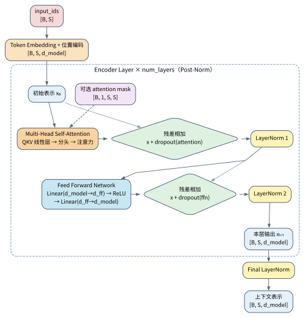

# Transformer：从思想到公式，再到代码实现

## 目录

1. 背景与动机
2. Transformer 的核心思想
3. 整体结构总览
4. Token、嵌入与位置编码
5. 缩放点积注意力
6. 多头注意力
7. 前馈网络、残差连接与层归一化
8. Encoder 与 Decoder 的完整流程
9. 训练目标、掩码与推理方式
10. 一个可手算的注意力示例
11. NumPy 版注意力代码
12. PyTorch 版简化 Transformer 代码
13. Keras 版简化 Transformer 代码
14. Transformer 的复杂度、优缺点与演进
15. 总结

## 1. 背景与动机

在 Transformer 出现之前，序列建模主要依赖 RNN、LSTM 和 GRU。它们可以按时间步逐个处理 token，天然适合处理时序数据，但也存在几个非常现实的瓶颈。

第一，序列计算是串行的。第 $t$ 个位置的输出要依赖第 $t-1$ 个位置的隐藏状态，这使得训练和推理都难以充分并行化。第二，长距离依赖难以稳定捕捉。虽然 LSTM 通过门控机制缓解了梯度消失，但随着序列变长，信息仍然会逐渐衰减。第三，模型状态是压缩在一个隐向量中的，信息瓶颈明显，尤其当输入很长时，这种压缩会限制表达能力。

Transformer 的关键突破是：不再把序列信息硬塞进一个按时间递推的隐藏状态，而是让每个位置直接去“看”其他位置，从而通过注意力机制建立任意位置之间的动态联系。这样做的直接收益有两个：

一是计算可以高度并行；二是依赖关系可以跨越很远的距离，不必经过很多步递推才能传播。

2017 年 Vaswani 等人在论文 Attention Is All You Need 中提出 Transformer 后，NLP 的主流范式迅速转向基于注意力的架构，后来又扩展到视觉、语音、推荐系统和多模态领域。可以说，Transformer 不只是一个具体模型，更是一种通用的序列表示与交互范式。

## 2. Transformer 的核心思想

Transformer 的核心可以概括为一句话：让序列中的每个位置，都通过注意力机制，对序列中所有位置的信息做自适应加权汇聚。

这里有三个关键词。

第一是“自适应”。权重不是预先固定的，也不是由手工规则设定的，而是由模型根据当前输入内容动态计算出来的。比如在句子 “The animal did not cross the road because it was tired” 里，it 应该更关注 animal 而不是 road；而在另一句话里，it 可能指代别的词。注意力权重可以随上下文变化。

第二是“全局交互”。RNN 的信息传播依赖链式传递，而注意力允许任意两个位置直接交互。一个位置对另一个位置的影响，不需要等很多步传播。

第三是“多视角表达”。多头注意力把同一组输入投影到多个子空间中，允许不同的头关注不同的关系，例如语法关系、指代关系、局部搭配关系、长程依赖关系等。

从直觉上看，Transformer 就像一个“可学习的信息检索系统”：每个 token 先生成一个查询向量 Query，然后去和所有 token 的 Key 做相似度匹配，再用匹配分数对对应的 Value 做加权求和。输出不是一个固定模板，而是与上下文相关的动态表示。

## 3. 整体结构总览

经典 Transformer 是一个 Encoder—Decoder 模型。以机器翻译为例，Encoder 先读完整的源句 `I love AI`，得到每个源 token 的上下文表示；Decoder 再从起始符开始，逐个输出目标句，例如 `我`、`喜欢`、`人工智能`。

Encoder 的职责是理解输入：每个 token 既保留自身内容，也吸收其他 token 提供的上下文。Decoder 的职责是条件生成：它只能使用已经生成的目标端前缀，同时读取 Encoder 的输出，再给出下一个 token 的概率。

一个标准 Block 反复使用五类组件：

1. 多头自注意力：让同一序列中的 token 彼此读取信息。
2. 交叉注意力：仅存在于原始 Decoder；目标端读取源端表示。
3. 前馈网络：对每个位置独立执行两层非线性变换。
4. 残差相加与 LayerNorm：让深层叠加时保留输入，并使数值分布更易处理。
5. Dropout：训练期间随机暂时置零一部分中间值；推理时关闭。

### 3.1 架构图：先看数据如何流动

<p align="center">
  
</p>

图 1：Transformer 的 Encoder—Decoder 结构。左侧是 Encoder，右侧是 Decoder；实际模型通常把同类 Block 堆叠 $N$ 次。图像作者为 dvgodoy，来源：[Wikimedia Commons](https://commons.wikimedia.org/wiki/File:Transformer,_full_architecture.png)，许可为 [CC BY 4.0](https://creativecommons.org/licenses/by/4.0/)。本地副本未裁剪或改画。

读图时沿箭头从下往上看：

1. 源句 token 经 Embedding 和位置编码后进入左侧 Encoder。
2. Encoder 中的自注意力让源句内部各位置交流信息；多层处理后形成一组“读懂源句”的表示。
3. Decoder 底部输入的是**右移后的目标句**。训练翻译 `I love AI → 我喜欢人工智能` 时，预测 `喜欢` 的输入前缀是“`<BOS> 我`”。
4. Decoder 的 Masked Self-Attention 只允许当前位置读取自己和过去的目标 token。
5. Decoder 的 Cross-Attention 以当前目标端状态作为 Query，以 Encoder 输出作为 Key 和 Value，从源句中取回当前最有用的信息。
6. 最顶端的 Linear 和 Softmax 把最后一个位置的隐藏向量变成词表上的概率分布。

现代 BERT 常只保留 Encoder；GPT 一类生成模型常只保留带因果遮罩的 Decoder。它们都复用本章介绍的 token 表示、注意力、前馈网络、残差和归一化。

### 3.2 先统一公式、函数和形状的读法

本文把一个 token 的特征写成**行向量**。代码中，整个批次通常保存为 `[B, S, d_model]`：第一个轴是样本数，第二个轴是 token 位置，最后一个轴是特征。

| 记号 | 含义 | 读法或形状 |
| --- | --- | --- |
| $B$ | batch 大小 | 一次送入模型的序列条数 |
| $S$ 或 $n$ | 序列长度 | 一条序列中 token 的个数 |
| $V_{\mathrm{vocab}}$ | 词表大小 | 可选 token 编号的总数；不要和 Value 矩阵 $V$ 混淆 |
| $d_{\mathrm{model}}$ | 隐藏维度 | 每个 token 的特征长度 |
| $h$ | 注意力头数 | 多头注意力并行使用的头的个数 |
| $d_k,d_v$ | 单个头中 Key、Value 的宽度 | 常取 $d_k=d_v=d_{\mathrm{model}}/h$ |
| $X$ | 输入表示 | 常见形状为 $[B,S,d_{\mathrm{model}}]$ |
| $Q,K,V$ | Query、Key、Value | $Q,K$ 常为 $[B,h,S,d_k]$；$V$ 常为 $[B,h,S,d_v]$ |
| $\mathbb R$、$\in$ | 实数集合、“属于” | $x\in\mathbb R^d$ 表示 $x$ 是长度为 $d$ 的实数向量 |
| $T$ 上标 | 转置 | $K^T$ 交换矩阵的行与列，使 $(S,d_k)$ 变成 $(d_k,S)$ |
| $\odot$ | 逐元素相乘 | 同一位置的两个数相乘，不是矩阵乘 |
| $\operatorname{Concat}$ | 拼接 | 把多个头的输出沿特征维接在一起 |
| $\exp,\log,\sqrt{\cdot}$ | 指数、自然对数、平方根 | Softmax、损失和缩放公式中的常用函数 |
| $\arg\max$ | 取最大值所在的位置 | 例如选概率最大的 token |
| $O(\cdot)$ | 复杂度记号 | 描述计算量或存储量随尺寸增大的增长速度 |
| 上标 $(0)$、$(\ell)$ | 层编号 | $z^{(0)}$ 是进入第 1 层前的表示，$z^{(\ell)}$ 是第 $\ell$ 层输出 |
| 上标 $*$ | 真实标签或参考答案 | 例如 $y_t^*$ 是第 $t$ 个位置的正确 token |

后文出现新符号时，也会在公式附近解释其作用。阅读矩阵公式时，先核对形状：左矩阵的最后一维必须等于右矩阵的倒数第二维。

## 4. Token、嵌入与位置编码

### 4.1 token 到底是什么

token 是模型读取文本时使用的最小离散单位，但它**不一定等于一个自然语言中的“词”**。它可能是一个完整单词、一个子词、一个汉字、标点符号，或特殊符号。

以句子 `I love AI!` 为例，下面的切分仅用于说明；不同 tokenizer 的结果可以不同：

| 步骤 | 结果 | 要点 |
| --- | --- | --- |
| 原始文本 | `I love AI!` | 人类看到的是字符串 |
| token 序列 | `[BOS]`、`I`、`love`、`AI`、`!`、`[EOS]` | `[BOS]` 是起始符，`[EOS]` 是结束符 |
| token 编号 | `[1, 17, 93, 421, 6, 2]` | 这些整数只是词表中的行号 |
| 补齐后的编号 | `[1, 17, 93, 421, 6, 2, 0, 0]` | `0` 常用作 `[PAD]`，让一个 batch 内长度一致 |

编号的大小没有语义顺序。编号为 421 的 `AI` 并不比编号为 17 的 `I` 更“大”或更重要；编号只用于从嵌入表中选取对应行。遇到词表中没有的文本时，常用 `[UNK]`（未知 token）代替。

在代码中，一批 token 编号的形状通常是 `[B,S]`。例如 $B=2,S=8$ 表示一次输入两条、每条最多八个 token 的序列。

### 4.2 Token Embedding：从编号取出向量

设词表大小为 $V_{\mathrm{vocab}}$，嵌入维度为 $d_{\mathrm{model}}$。嵌入表是可学习矩阵：

$$
E\in\mathbb R^{V_{\mathrm{vocab}}\times d_{\mathrm{model}}}.
$$

第 $i$ 个位置的 token 编号记为 $x_i$。Embedding 的计算就是取出 $E$ 的第 $x_i$ 行：

$$
e_i=E[x_i],\qquad e_i\in\mathbb R^{d_{\mathrm{model}}}.
$$

也可以用 one-hot 向量写出同一件事：

$$
e_i=\operatorname{onehot}(x_i)^T E.
$$

其中 $\operatorname{onehot}(x_i)$ 的长度为 $V_{\mathrm{vocab}}$，只有第 $x_i$ 个位置为 1，其余位置为 0。它左乘 $E$ 后，只保留嵌入表中的第 $x_i$ 行。真实程序不会构造这么长的 one-hot 向量，而是直接查表，因此更节省存储和计算。

形状变化可以写成：

$$
[B,S]\xrightarrow{\operatorname{Embedding}}[B,S,d_{\mathrm{model}}].
$$

这一步只提供“token 是谁”的信息；它还没有说明 token 位于句首、句中还是句尾。

### 4.3 为什么还要位置编码

若不给位置，注意力只看到一组 token 向量。把输入顺序整体调换，注意力会以同样方式调换输出顺序，无法仅靠内容识别谁先谁后。

例如 `狗 咬 人` 与 `人 咬 狗` 含有同样的三个 token，却表达不同事件。词义本身不足以说明动作发出者和接受者的先后位置；模型还需要位置线索。

常见做法有两类：

1. 绝对位置编码：为每个位置准备一个向量，并与 token 向量逐元素相加。
2. 相对位置编码：在注意力分数中直接加入“两个位置相距多远、谁在前”的信息。

原始 Transformer 使用固定的正弦余弦位置编码。对位置 $pos$ 与特征对编号 $i$：

$$
PE_{(pos,2i)}
=\sin\left(\frac{pos}{10000^{2i/d_{\mathrm{model}}}}\right),
$$

$$
PE_{(pos,2i+1)}
=\cos\left(\frac{pos}{10000^{2i/d_{\mathrm{model}}}}\right).
$$

这些符号的含义如下：

| 符号 | 含义 |
| --- | --- |
| $pos$ | token 的绝对位置，通常从 0 到 $S-1$ |
| $i$ | 特征对编号，范围为 $0$ 到 $d_{\mathrm{model}}/2-1$ |
| $2i,2i+1$ | 一对相邻特征维：偶数维用 Sin，奇数维用 Cos |
| $10000$ | 控制不同维度波长的常数；维度越靠后，位置变化越缓慢 |
| $\sin,\cos$ | 正弦和余弦函数，输出都在 $-1$ 到 $1$ 之间 |
| $d_{\mathrm{model}}$ | token 向量总长度；原始写法通常要求它为偶数 |

例如 $d_{\mathrm{model}}=4$、$pos=1$ 时，前两维使用分母 1，后两维使用分母 100：

$$
PE_1=[\sin(1),\cos(1),\sin(0.01),\cos(0.01)]
\approx[0.8415,0.5403,0.0100,0.99995].
$$

固定正弦余弦函数可以为训练时未出现的位置计算数值；不过很长输入上的效果仍取决于训练长度、任务和模型本身。现代模型也常使用可学习位置表、RoPE 或 ALiBi。

### 4.4 词向量与位置向量如何相加

输入到第 1 层 Transformer 的表示写为：

$$
z_i^{(0)}=e_i+PE_i.
$$

$z_i^{(0)}$ 是位置 $i$ 的初始向量；$e_i$ 提供 token 内容，$PE_i$ 提供位置。加号是逐元素加法，所以两者长度都必须是 $d_{\mathrm{model}}$。

下面用 4 维示意值手算。这里的 $PE$ 数值**只为展示加法**，不等同于上节正弦余弦公式的实际输出：

$$
e_{\mathrm{I}}=[0.2,0.0,0.1,0.4],\qquad
PE_0=[0,1,0,1],
$$

$$
e_{\mathrm{love}}=[0.0,0.3,0.2,0.1],\qquad
PE_1=[1,0,1,0].
$$

于是：

$$
z_0^{(0)}=e_{\mathrm{I}}+PE_0=[0.2,1.0,0.1,1.4],
$$

$$
z_1^{(0)}=e_{\mathrm{love}}+PE_1=[1.0,0.3,1.2,0.1].
$$

同一个 `I` 若出现在不同位置，会加上不同的 $PE$，因而得到不同的初始表示。这就是 Transformer 获得顺序信息的第一步。

## 5. 缩放点积注意力

注意力的任务可以概括为：**每个 Query 先对全部 Key 打分，再用归一化后的分数加权汇总 Value。**最常见的形式叫缩放点积注意力（Scaled Dot-Product Attention）。

### 5.1 Q、K、V 从哪里来

先只看一条序列，令输入为：

$$
X\in\mathbb R^{S\times d_{\mathrm{model}}}.
$$

通过三组可学习线性投影得到：

$$
Q=XW^Q+b^Q,\qquad
K=XW^K+b^K,\qquad
V=XW^V+b^V.
$$

其中：

| 符号 | 常见形状 | 作用 |
| --- | --- | --- |
| $X$ | $(S,d_{\mathrm{model}})$ | 加入位置编码后的输入 |
| $W^Q,W^K$ | $(d_{\mathrm{model}},d_k)$ | 生成 Query、Key 的权重 |
| $W^V$ | $(d_{\mathrm{model}},d_v)$ | 生成 Value 的权重 |
| $b^Q,b^K,b^V$ | 分别为 $d_k,d_k,d_v$ | 线性层的 bias；有些教材公式会省略它 |
| $Q,K,V$ | $(S,d_k),(S,d_k),(S,d_v)$ | 三组供注意力使用的向量 |

下面的 NLP 比喻有助于入门，但它不是人工写死的规则：

| 量 | 可以怎样理解 | 在句子“The animal did not cross the road because it was tired”中的直觉 |
| --- | --- | --- |
| Query | “当前位置此刻要找什么” | “it”的表示可能在寻找一个可作指代对象的上下文 |
| Key | “这个位置可被怎样匹配” | “animal”的表示可能带有适合被指代的特征 |
| Value | “一旦被选中，要取回什么内容” | “animal”位置携带的上下文信息会参与“it”的新表示 |

模型会从数据中学习这些向量。注意力权重不是词典释义，也不保证每个头都能被人类直接解释。

### 5.2 从输入到输出的四步计算

对一个注意力头，计算顺序与形状如下：

$$
X:(S,d_{\mathrm{model}})
\xrightarrow{\text{三组线性层}}
Q,K:(S,d_k),\quad V:(S,d_v),
$$

$$
L=\frac{QK^T}{\sqrt{d_k}}+M
\in\mathbb R^{S\times S},
$$

$$
A=\operatorname{Softmax}(L)
\in\mathbb R^{S\times S},
\qquad
O=AV\in\mathbb R^{S\times d_v}.
$$

其中：

1. $QK^T$ 让每个 Query 与每个 Key 做一次点积，所以得到 $S\times S$ 的分数表。
2. $M$ 是可选遮罩。允许读取的位置加 0，不允许的位置加 $-\infty$。
3. Softmax 沿 $L$ 的**最后一维**执行，也就是每个 Query 对全部 Key 的那一行。
4. $A$ 的第 $i$ 行是第 $i$ 个 Query 的权重；再与 $V$ 相乘，得到第 $i$ 个位置的新向量。

### 5.3 单个分数、缩放项和 Softmax

第 $i$ 个 Query 对第 $j$ 个 Key 的遮罩后分数为：

$$
\ell_{ij}=\frac{q_i k_j^T}{\sqrt{d_k}}+m_{ij}.
$$

| 符号 | 含义 |
| --- | --- |
| $i$ | 当前 Query 的位置编号 |
| $j$ | 被读取的 Key/Value 位置编号 |
| $q_i,k_j$ | 第 $i$ 个 Query 与第 $j$ 个 Key，都是行向量 |
| $q_i k_j^T$ | 两个向量的点积，得到一个标量相似度分数 |
| $d_k$ | Key 的向量长度 |
| $m_{ij}$ | 遮罩项；允许时为 0，不允许时为 $-\infty$ |
| $\ell_{ij}$ | 送入 Softmax 前的最终分数，也常被称为 attention logits |

若向量各分量的均值约为 0、方差约为 1，$q_i k_j^T$ 的数值范围通常会随 $d_k$ 增大。除以 $\sqrt{d_k}$ 后，Softmax 的输入量级更合适，不容易过分偏向少数位置。

数值稳定的 Softmax 写法为：

$$
m_i=\max_{1\le r\le S}\ell_{ir},
$$

$$
\alpha_{ij}
=\frac{\exp(\ell_{ij}-m_i)}
{\sum_{r=1}^{S}\exp(\ell_{ir}-m_i)}.
$$

$m_i$ 是第 $i$ 行的最大分数。分子和分母都减去它，不改变权重比例，却能避免 $\exp(\cdot)$ 的输入过大。$\alpha_{ij}$ 是注意力权重，满足：

$$
\sum_{j=1}^{S}\alpha_{ij}=1.
$$

最后的输出是：

$$
o_i=\sum_{j=1}^{S}\alpha_{ij}v_j.
$$

所以 $o_i$ 是多个 Value 的加权平均：权重大的位置贡献多，权重接近 0 的位置几乎不贡献。

### 5.4 Causal Mask：为什么生成时不能看未来

生成文本时，模型在第 $i$ 个位置必须只读取自己和过去，否则训练阶段会提前看到正确答案。对长度为 3 的序列，加性因果遮罩可写成：

$$
M=
\begin{bmatrix}
0&-\infty&-\infty\\
0&0&-\infty\\
0&0&0
\end{bmatrix}.
$$

例如模型正在依次生成“我 喜欢 人工智能”。预测第 2 个 token “喜欢”时，允许读取起始符和“我”，但不能读取尚未生成的“人工智能”。当 $m_{ij}=-\infty$ 时，$\exp(\ell_{ij})$ 在数值上相当于 0，因而该位置的 $\alpha_{ij}=0$。

本文后续 NumPy 与 PyTorch 代码使用布尔遮罩：“True”表示允许关注，“False”表示屏蔽；代码会把 False 的位置替换为一个很小的数。

### 5.5 形象理解：注意力不是“寻找一个词”，而是按比例取信息

设句子是“小明 把 作业 交给 老师”。处理“交”这个 token 时，一个头可能给“作业”“小明”“老师”不同权重。它不必只挑一个 token：例如它可以取 0.50 的“作业”信息、0.30 的“小明”信息和 0.20 的“老师”信息，再把这些 Value 向量按比例相加。

这与在资料中按问题检索不同片段有些相似：Query 像当前问题，Key 像每段资料的索引，Value 像取回的内容。但在 Transformer 中，Q、K、V 都是经过训练得到的连续向量，权重会随层数、注意力头和上下文而变化。

### 5.6 计算示例：从 Q、K、V 到注意力输出

设 $S=3,d_k=d_v=2$，输入矩阵为：

$$
X=
\begin{bmatrix}
1&0\\
0&1\\
1&1
\end{bmatrix}.
$$

为了突出计算流程，令：

$$
W^Q=
\begin{bmatrix}1&0\\0&1\end{bmatrix},\qquad
W^K=
\begin{bmatrix}1&1\\0&1\end{bmatrix},\qquad
W^V=
\begin{bmatrix}1&0\\0&1\end{bmatrix},
$$

并暂时令三组 bias 为 0。于是：

$$
Q=
\begin{bmatrix}1&0\\0&1\\1&1\end{bmatrix},\quad
K=
\begin{bmatrix}1&1\\0&1\\1&2\end{bmatrix},\quad
V=
\begin{bmatrix}1&0\\0&1\\1&1\end{bmatrix}.
$$

对第 1 个位置，$q_1=[1,0]$。它对三组 Key 的点积依次为：

$$
[1,0]\cdot[1,1]=1,\qquad
[1,0]\cdot[0,1]=0,\qquad
[1,0]\cdot[1,2]=1.
$$

由于 $\sqrt{d_k}=\sqrt2\approx1.414$，缩放后的分数为：

$$
[\ell_{11},\ell_{12},\ell_{13}]
=[0.707,0,0.707].
$$

Softmax 后：

$$
[\alpha_{11},\alpha_{12},\alpha_{13}]
\approx[0.401,0.198,0.401].
$$

最后按权重汇总三组 Value：

$$
o_1
=0.401[1,0]+0.198[0,1]+0.401[1,1]
\approx[0.802,0.599].
$$

这组数值是教学用向量。注意力权重表示当前向量间的计算比例，不等同于自然语言词义的概率。

## 6. 多头注意力

单头注意力虽然有效，但它只在一个子空间里计算关系，表达能力有限。多头注意力通过多个独立头并行建模，提升了灵活性。

### 6.1 公式

设共有 $h$ 个头，单头宽度为 $d_h=d_{\mathrm{model}}/h$。直接从输入 $X$ 出发，第 $r$ 个头的计算为：

$$
Q_r=XW_r^Q,\qquad K_r=XW_r^K,\qquad V_r=XW_r^V,
$$

$$
\operatorname{head}_r
=\operatorname{Attention}(Q_r,K_r,V_r),
\qquad r=1,\ldots,h.
$$

其中 $W_r^Q,W_r^K,W_r^V\in\mathbb R^{d_{\mathrm{model}}\times d_h}$，因此每个 $Q_r,K_r,V_r$ 的形状都是 $(S,d_h)$。所有头的输出沿特征维拼接，再经过输出投影：

$$
\operatorname{MHA}(X)
=\operatorname{Concat}(\operatorname{head}_1,\ldots,\operatorname{head}_h)W^O+b^O.
$$

为使公式更紧凑，上面的逐头式省略了各头的 bias；bias 是在线性变换后加上的可学习常数向量。第 12 节的“nn.Linear”和第 13 节 Keras 的“MultiHeadAttention”默认都会使用它。

这里 $\operatorname{Concat}(\cdots)$ 的形状为 $(S,h d_h)=(S,d_{\mathrm{model}})$，$W^O\in\mathbb R^{d_{\mathrm{model}}\times d_{\mathrm{model}}}$，所以最终输出仍是 $(S,d_{\mathrm{model}})$，能与输入 $X$ 做残差相加。

实现通常不逐头启动 $3h$ 个线性层，而是先一次性计算大矩阵 $Q,K,V:[B,S,d_{\mathrm{model}}]$，再整理为 $[B,h,S,d_h]$。这两种写法表示相同的计算，只是后者更适合并行硬件。

### 6.2 为什么多头有效

多头并不只是“多算几次”，更重要的是它让模型在不同表示子空间中学习不同类型的关系。比如某个头可能专门关注主谓关系，另一个头关注指代消解，还有一个头关注局部搭配。

如果只有一个头，所有关系都要挤在同一个注意力分布里，表达会更受限。多头把这一任务拆开，等于让模型同时从多个角度阅读同一段文本。

### 6.3 计算中的维度约束

通常总维度 $d_{\mathrm{model}}$ 会被均分给多个头。例如 $d_{\mathrm{model}}=512$、$h=8$ 时，每个头的 $d_h=64$。这要求：

$$
d_{\mathrm{model}}\bmod h=0.
$$

这里 $\bmod$ 表示取余；余数为 0 才能把总维度平均分给每个头。各头拼接后回到 $d_{\mathrm{model}}$，便于后续残差相加。

### 6.4 计算示例：两个头如何拼接

假设某个位置经过两个注意力头后得到的输出分别是：

$$
h^{(1)} = [0.8, 0.6], \quad h^{(2)} = [0.3, 0.9]
$$

那么拼接后的向量就是：

$$
\mathrm{Concat}(h^{(1)}, h^{(2)}) = [0.8, 0.6, 0.3, 0.9].
$$

如果输出投影矩阵 $W^O$ 暂按单位矩阵处理，最终输出仍是这个 4 维向量。一般情况下，$W^O$ 会继续混合各头的特征，让下一层可以同时使用不同头提供的信息。

## 7. 前馈网络、残差连接与层归一化

### 7.1 位置前馈网络

注意力层解决的是 token 与 token 的交互；前馈网络（position-wise feed-forward network，FFN）则对**每个位置独立**做非线性变换。它不会让不同位置互相读取，位置间的信息交流已经由注意力完成。

原始 Transformer 里的前馈网络通常是两层全连接，中间加 ReLU：

$$
\operatorname{FFN}(x)
=\operatorname{ReLU}(xW_1+b_1)W_2+b_2.
$$

其中：

- $x$ 是一个长度为 $d_{\mathrm{model}}$ 的 token 向量；
- $W_1\in\mathbb R^{d_{\mathrm{model}}\times d_{\mathrm{ff}}}$，$b_1\in\mathbb R^{d_{\mathrm{ff}}}$；
- $W_2\in\mathbb R^{d_{\mathrm{ff}}\times d_{\mathrm{model}}}$，$b_2\in\mathbb R^{d_{\mathrm{model}}}$；
- $\operatorname{ReLU}(u)=\max(0,u)$，对向量中每个元素单独计算。

因此形状依次是：

$$
[B,S,d_{\mathrm{model}}]
\rightarrow[B,S,d_{\mathrm{ff}}]
\rightarrow[B,S,d_{\mathrm{model}}].
$$

一般 $d_{\mathrm{ff}}$ 会比 $d_{\mathrm{model}}$ 大得多，例如 2048 对 512。先扩展、激活、再压回原宽度，可以让每个 token 自身完成更丰富的特征组合。

### 7.2 残差连接

Transformer 中每个子层都使用残差连接：

$$
y = x + \mathrm{Sublayer}(x)
$$

$\mathrm{Sublayer}(\cdot)$ 是“当前子层”的通用写法；在 Transformer 中，它可以是多头注意力，也可以是 FFN。$x$ 是子层输入，$y$ 是残差相加后的输出。

残差连接的作用很重要。它让梯度更容易反向传播，避免深层堆叠时训练困难；同时也允许模型在必要时保留输入信息，不必每层都强行重写表示。

加法要求两侧形状完全相同。若 $x$ 是 $[B,S,d_{\mathrm{model}}]$，那么 $\operatorname{Sublayer}(x)$ 也必须是这个形状。

### 7.3 LayerNorm

LayerNorm 对每个 token 的最后一个特征维独立计算。若输入是 $[B,S,d_{\mathrm{model}}]$，则每个 $(b,s)$ 位置各自对长度 $d_{\mathrm{model}}$ 的向量做一次归一化，不会把不同样本或不同 token 混在一起。

对输入向量 $x\in\mathbb R^d$，LayerNorm 定义为：

$$
\mu = \frac{1}{d}\sum_{i=1}^{d}x_i, \quad
\sigma^2 = \frac{1}{d}\sum_{i=1}^{d}(x_i-\mu)^2
$$

$$
\operatorname{LayerNorm}(x)
=\gamma\odot\frac{x-\mu}{\sqrt{\sigma^2+\epsilon}}+\beta.
$$

| 符号 | 含义 |
| --- | --- |
| $x_i$ | 当前 token 的第 $i$ 个特征 |
| $d$ | 当前归一化向量的长度，本章常为 $d_{\mathrm{model}}$ |
| $\mu$ | 这 $d$ 个特征的平均值 |
| $\sigma^2$ | 这 $d$ 个特征的方差；上标 2 表示平方，不是第二个变量 |
| $\epsilon$ | 很小的正数，避免除以 0 |
| $\gamma,\beta$ | 长度为 $d$ 的可学习缩放与平移参数 |
| $\odot$ | 逐元素相乘；$\gamma$ 的第 $i$ 个数只作用于第 $i$ 个特征 |

LayerNorm 先按单个 token 的特征均值与方差标准化，再由 $\gamma,\beta$ 调整输出。BatchNorm 则会依赖 batch 统计量；当文本长度和 batch 大小经常变化时，LayerNorm 更适合序列模型。

### 7.4 Post-Norm 与 Pre-Norm

原始 Transformer 使用的是 Post-Norm，也就是先做残差相加，再做 LayerNorm：

$$
\mathrm{LN}(x + \mathrm{Sublayer}(x))
$$

后来大量大模型采用 Pre-Norm，即先归一化再进子层：

$$
x + \mathrm{Sublayer}(\mathrm{LN}(x))
$$

Pre-Norm 会让残差路径更直接，深层模型的训练过程通常更容易保持数值稳定，因此在现代大模型中更常见。本章第 12 节的手写 PyTorch 模块和 DOT 图采用 Post-Norm，以便与原始结构和公式保持一致。

### 7.5 计算示例：FFN、残差连接与 LayerNorm

设某个位置的输入向量为：

$$
x = [1, 2]
$$

为了手算简单，令前馈网络暂时等同于输入，也就是：

$$
\mathrm{FFN}(x) = [1, 2]
$$

则残差相加后的结果为：

$$
x + \mathrm{FFN}(x) = [2, 4]
$$

接着做 LayerNorm。先算均值：

$$
\mu = \frac{2+4}{2} = 3
$$

方差为：

$$
\sigma^2 = \frac{(2-3)^2 + (4-3)^2}{2} = 1
$$

归一化后得到：

$$
\frac{[2,4]-3}{\sqrt{1+\epsilon}} \approx [-1, 1]
$$

如果再令 $\gamma=[1,1]$、$\beta=[0,0]$，那么最终输出仍然是：

$$
[-1, 1]
$$

这个例子说明，FFN 负责变换表示，残差负责保留输入，LayerNorm 则先重新调整单个 token 内各特征的尺度与中心位置。

### 7.6 Dropout 在何时生效

Dropout 只在训练状态生效：它按设定概率随机把一部分中间元素置为 0，并对其余元素做相应缩放。这样模型不会过度依赖少量固定特征。推理状态下 Dropout 关闭，输入直接通过。

因此，同一个输入在训练状态下多次经过带 Dropout 的层，输出可能略有不同；在 `model.eval()` 或 Keras 推理状态下，输出应保持一致。

## 8. Encoder 与 Decoder 的完整流程

### 8.1 Encoder Block

一个标准 Encoder Block 包括两部分：

1. 多头自注意力
2. 前馈网络

每部分外面都包着残差连接和归一化。若记输入为 $X$，则 Encoder Block 可以写成：

$$
H = \mathrm{LN}(X + \mathrm{MultiHeadSelfAttention}(X))
$$

$$
Y = \mathrm{LN}(H + \mathrm{FFN}(H))
$$

这里 $\mathrm{LN}$ 是 LayerNorm 的简写，$H$ 是注意力子层后的中间表示，$Y$ 是整个 Encoder Block 的输出。这两式采用 Post-Norm 写法，与第 12 节的代码一致。按计算顺序理解：

1. 输入 $X:[B,S,d_{\mathrm{model}}]$ 先进入自注意力，每个 token 汇总同一序列中允许读取的位置。
2. 注意力输出与原输入 $X$ 相加，再做 LayerNorm，得到 $H$。
3. $H$ 中每个 token 独立进入 FFN；FFN 输出与 $H$ 相加，再做 LayerNorm，得到 $Y$。
4. $Y$ 的形状仍是 $[B,S,d_{\mathrm{model}}]$，因此可以作为下一层 Encoder Block 的输入。

Encoder 不使用因果遮罩。若任务是句子分类、情感分析或双向文本理解，一个 token 通常可以读取句子中前后两侧的有效 token；补齐位置仍应由 Padding Mask 屏蔽。

### 8.2 Decoder Block

Decoder Block 比 Encoder Block 多一层交叉注意力。它通常包含：

1. Masked Multi-Head Self-Attention
2. Cross-Attention
3. Feed Forward Network

如果 Decoder 当前层输入为 $X_d$，Encoder 输出为 $X_e$，那么：

$$
H_1 = \mathrm{LN}(X_d + \mathrm{MaskedMHA}(X_d))
$$

$$
H_2 = \mathrm{LN}(H_1 + \mathrm{CrossAttention}(H_1, X_e, X_e))
$$

$$
Y = \mathrm{LN}(H_2 + \mathrm{FFN}(H_2))
$$

这里 Cross-Attention 的 Query 来自 Decoder 当前状态，而 Key 和 Value 来自 Encoder 输出。省略多头拆分后，核心形状和公式可以写成：

$$
Q=H_1W^Q:\ [B,T,d_k],
$$

$$
K=X_eW^K:\ [B,S,d_k],\qquad
V=X_eW^V:\ [B,S,d_v],
$$

$$
\operatorname{CrossAttention}(H_1,X_e,X_e)
=\operatorname{Softmax}\left(\frac{QK^T}{\sqrt{d_k}}\right)V
:\ [B,T,d_v].
$$

$T$ 是目标端当前长度，$S$ 是源端长度。每个目标 token 有一行长度为 $S$ 的权重，可以从整个源句中按比例取回信息。

### 8.3 编码器和解码器的分工

可以把 Encoder 理解为“理解输入”，把 Decoder 理解为“按条件生成输出”。Encoder 先把整句输入变成一组高维上下文表示；Decoder 在每一步利用这些表示和已有输出前缀预测下一个 token。

在机器翻译中，这种分工尤其自然：Encoder 负责读懂源语言，Decoder 负责写出目标语言。

### 8.4 计算示例：Encoder 编码后如何被 Decoder 读取

假设源句是 `I love AI`。经过 Encoder 后，三个位置的输出表示分别为：

$$
h_1 = [0.9, 0.1], \quad h_2 = [0.2, 0.8], \quad h_3 = [0.6, 0.4]
$$

为便于手算，先令交叉注意力的 Key 和 Value 直接使用这些 Encoder 输出，相当于本例的相应投影矩阵是单位矩阵。现在 Decoder 已经生成了前缀 `我 喜欢`，当前 Query 记为：

$$
q = [1, 0]
$$

它与三个 Encoder 输出做点积：

$$
q\cdot h_1 = 0.9, \quad q\cdot h_2 = 0.2, \quad q\cdot h_3 = 0.6
$$

Softmax 后得到近似权重：

$$
[0.447, 0.222, 0.331].
$$

于是交叉注意力得到的上下文向量为：

$$
c=0.447\cdot[0.9,0.1]+0.222\cdot[0.2,0.8]+0.331\cdot[0.6,0.4]
$$

$$
\approx[0.645,0.355].
$$

这个上下文向量会进入 Decoder 的后续子层，帮助预测下一个 token。它说明 Decoder 不是凭空生成，而是在每一步按当前需要读取 Encoder 提供的源句信息。

## 9. 训练目标、掩码与推理方式

### 9.1 语言建模目标

如果是自回归生成任务，模型通常学习最大化条件概率：

$$
P(y|x)=\prod_{t=1}^{T} P(y_t | y_{<t}, x)
$$

训练时常用交叉熵损失：

$$
\mathcal{L} = -\sum_{t=1}^{T} \log P(y_t^{*} | y_{<t}^{*}, x)
$$

这两式的符号含义如下：

| 符号 | 含义 |
| --- | --- |
| $x$ | 条件输入，例如待翻译的源句 |
| $y=(y_1,\ldots,y_T)$ | 目标 token 序列 |
| $y_{<t}$ | 第 $t$ 个位置之前的所有 token，即 $y_1,\ldots,y_{t-1}$ |
| $P(y_t\mid y_{<t},x)$ | 已知前缀和输入时，第 $t$ 个 token 的条件概率 |
| $\prod$ | 连乘；整句概率等于每一步条件概率的乘积 |
| $\mathcal L$ | 损失值；训练时希望它更小 |
| $y_t^*$ | 第 $t$ 个位置的真实 token；上标 $*$ 表示参考答案 |
| $\log$ | 自然对数；把概率连乘变成便于累加的损失项 |

实际训练会对 Padding Mask 标记的补齐位置忽略损失；这些位置不是文本内容，不应影响参数更新。

### 9.2 Teacher Forcing

训练阶段常用 Teacher Forcing，也就是把真实前缀喂给 Decoder，而不是把模型自己刚生成的 token 再送回去。这样每一步都有正确历史作为条件，训练通常更稳定，达到相同损失所需的迭代次数往往更少。

但这也带来一个经典问题：训练时看到的上下文是真实前缀，推理时看到的是模型自己的历史输出，两者分布并不完全一致，这就是 exposure bias 的来源之一。

### 9.3 推理方式

推理时需要一步一步生成。

最简单的方法是 greedy decoding，每一步都选概率最大的 token：

$$
y_t = \arg\max_{w \in V_{\mathrm{vocab}}} P(w | y_{<t}, x).
$$

这里 $w$ 遍历词表中的每个候选 token，$\arg\max$ 返回概率最大的那个编号。这种方法简单但未必得到整体概率最高的完整句子。Beam Search 会保留若干个候选前缀，综合比较它们的累计对数概率。

### 9.4 Padding Mask 与 Causal Mask

实际输入通常有 padding。为了避免模型关注到无意义的补齐位置，需要 Padding Mask。对于 Decoder 还需要 Causal Mask，防止未来信息泄露。

两种掩码通常会一起使用：

- Padding Mask：屏蔽无效 token
- Causal Mask：屏蔽未来 token

工程实现时，常把它们转换成加性 mask，然后在 attention logits 上直接加 $-\infty$。本章的布尔 mask 约定是：True 表示允许读取，False 表示屏蔽；这一约定与第 11、12、13 节代码一致。

### 9.5 计算示例：Mask、Loss 与 Greedy Decoding

假设序列长度为 3，Causal Mask 为：

$$
M = \begin{bmatrix}
0 & -\infty & -\infty \\
0 & 0 & -\infty \\
0 & 0 & 0
\end{bmatrix}
$$

如果某一行原始注意力 logits 是：

$$
[2, 1, 0]
$$

那么在第 2 个位置做 masked attention 时，第三个位置会被屏蔽，只剩下：

$$
[2, 1, -\infty]
$$

Softmax 后约为：

$$
[0.731, 0.269, 0]
$$

这表示当前位置只能看见自己和过去，不能看未来。

再看训练损失。假设模型对真实 token 的预测概率是 $p=0.2$，那么交叉熵损失就是：

$$
\mathcal{L} = -\log(0.2) \approx 1.609
$$

如果做 greedy decoding，而各候选 token 的概率分别是：

$$
[0.1, 0.6, 0.3]
$$

那么就选概率最大的第二个 token。这个过程每一步重复一次，直到生成结束符号。

## 10. 一个可手算的注意力示例

为了直观理解注意力，我们看一个非常小的例子。设序列长度为 3，每个 token 的表示维度为 2。我们直接令 $Q=K=V=X$，并取：

$$
X = \begin{bmatrix}
1 & 0 \\
0 & 1 \\
1 & 1
\end{bmatrix}
$$

于是：

$$
QK^T =
\begin{bmatrix}
1 & 0 & 1 \\
0 & 1 & 1 \\
1 & 1 & 2
\end{bmatrix}
$$

若 $d_k=2$，则缩放后为：

$$
\frac{QK^T}{\sqrt{2}} =
\begin{bmatrix}
0.707 & 0 & 0.707 \\
0 & 0.707 & 0.707 \\
0.707 & 0.707 & 1.414
\end{bmatrix}
$$

对第一行做 Softmax。先算指数近似值：

$$
e^{0.707} \approx 2.028, \quad e^0=1
$$

这里 $e\approx2.71828$ 是自然常数，$e^x$ 与 $\exp(x)$ 表示同一个指数函数。

所以第一行权重约为：

$$
[0.401, 0.198, 0.401]
$$

这意味着第一个 token 会同时关注第 1 个和第 3 个位置，而对第 2 个位置关注较少。

输出向量就是加权和：

$$
o_1 = 0.401\cdot [1,0] + 0.198\cdot [0,1] + 0.401\cdot [1,1]
$$

$$
= [0.802, 0.599]
$$

同理可以计算其他位置的输出。这个例子说明，注意力层实际上是在每个位置上做“内容相关的动态平均”，只是这个平均权重是由模型自动学习出来的，而不是固定滑动窗口。

## 11. NumPy 版注意力代码

下面给出一个尽量简洁的 NumPy 实现，用于理解公式如何落地。

```python
import numpy as np


def softmax(x, axis=-1):
    x = x - np.max(x, axis=axis, keepdims=True)
    exp_x = np.exp(x)
    return exp_x / np.sum(exp_x, axis=axis, keepdims=True)


def scaled_dot_product_attention(q, k, v, mask=None):
    d_k = q.shape[-1]
    scores = np.matmul(q, np.swapaxes(k, -1, -2)) / np.sqrt(d_k)

    if mask is not None:
        # True 表示允许读取；False 的位置在 Softmax 后权重接近 0。
        scores = np.where(mask, scores, -1e9)

    weights = softmax(scores, axis=-1)
    output = np.matmul(weights, v)
    return output, weights


# 示例输入：batch_size=1, seq_len=3, d_model=2
x = np.array([
    [[1.0, 0.0],
     [0.0, 1.0],
     [1.0, 1.0]]
])

# 直接令 Q=K=V=X，方便观察计算过程
output, weights = scaled_dot_product_attention(x, x, x)

print("attention weights:\n", weights)
print("output:\n", output)
```

这段代码与公式完全对应：

| 代码对象 | 形状 | 对应公式 | 作用 |
| --- | --- | --- | --- |
| `q`、`k`、`v` | `[B,S,D]` | $Q,K,V$ | 输入的三组向量 |
| `np.swapaxes(k,-1,-2)` | `[B,D,S]` | $K^T$ | 只交换最后两个轴 |
| `scores` | `[B,S,S]` | $QK^T/\sqrt{d_k}$ | 每个 Query 对每个 Key 的分数 |
| `weights` | `[B,S,S]` | $A$ | 每一行的和为 1 |
| `output` | `[B,S,D]` | $AV$ | 加权后的新 token 向量 |

`softmax` 先减去每行最大值，再计算指数；这不会改变同一行的权重比例，却能降低 `np.exp` 溢出的风险。参数 `axis=-1` 表示沿最后一维，也就是 Key 位置维计算 Softmax。

如果需要加入上三角掩码，可以这样构造：

```python
seq_len = x.shape[1]
causal_mask = np.tril(np.ones((seq_len, seq_len), dtype=bool))
causal_mask = causal_mask[None, :, :]

output_masked, weights_masked = scaled_dot_product_attention(x, x, x, mask=causal_mask)
```

`np.tril` 会生成下三角区域。上面的布尔矩阵中 True 表示允许读取，因此第 0 行只能读取第 0 个位置，第 1 行能读取第 0、1 个位置。

## 12. PyTorch 版简化 Transformer 代码

下面实现一个 **Encoder-only** 的简化模型：输入 token 编号，输出每个位置的上下文表示。它适合理解 BERT 类编码器的基本计算；它**不包含**机器翻译 Decoder、交叉注意力和逐 token 生成。

### 12.1 先看层连接关系

<p align="center">
  
</p>

图 2：第 12 节代码的层连接关系。为适应竖版页面，图在正文中限制为 540 px 宽；SVG 是矢量图，放大后文字仍清晰。图由 [DOT 源文件](../assets/Transformer/tiny-transformer-encoder-layers.dot) 渲染，使用的是 Post-Norm 顺序。

| 图中部分 | 代码中的对象 | 输出形状 | 作用 |
| --- | --- | --- | --- |
| `input_ids` | `input_ids` | `[B,S]` | token 编号；`0` 预留作补齐位 |
| Token Embedding + 位置编码 | `embed`、`pos` | `[B,S,d_model]` | 查表得到 token 向量，再加入顺序信息 |
| Self-Attention | `MultiHeadSelfAttention` | `[B,S,d_model]` | 计算 Q、K、V、注意力权重和加权输出 |
| 两个残差相加 | `x + dropout(...)` | 不变 | 保留子层输入 |
| LayerNorm 1、2 | `norm1`、`norm2` | 不变 | 在每个 token 的特征维上归一化 |
| Feed Forward Network | `FeedForward` | `[B,S,d_model]` | 对每个 token 独立执行两层全连接 |
| Final LayerNorm | `norm` | `[B,S,d_model]` | 给多层输出再做一次归一化 |

### 12.2 完整代码

```python
import math

import torch
import torch.nn as nn


def make_padding_mask(input_ids, pad_id=0):
    """
    返回形状 [B, 1, 1, S] 的布尔 mask。
    True 表示该 Key 位置允许被读取，False 表示补齐位置。
    这个形状会自动广播到 [B, num_heads, S, S]。
    """
    valid_key = input_ids.ne(pad_id)  # [B, S]
    return valid_key[:, None, None, :]


def make_causal_mask(seq_len, device):
    """
    返回形状 [1, 1, S, S] 的下三角布尔 mask。
    生成任务中，第 i 个 Query 只能读取 j <= i 的位置。
    """
    allowed = torch.ones(seq_len, seq_len, dtype=torch.bool, device=device).tril()
    return allowed[None, None, :, :]


class MultiHeadSelfAttention(nn.Module):
    def __init__(self, d_model, num_heads, dropout=0.0):
        super().__init__()
        if d_model % num_heads != 0:
            raise ValueError("d_model 必须能被 num_heads 整除。")

        self.d_model = d_model
        self.num_heads = num_heads
        self.d_head = d_model // num_heads

        self.w_q = nn.Linear(d_model, d_model)
        self.w_k = nn.Linear(d_model, d_model)
        self.w_v = nn.Linear(d_model, d_model)
        self.w_o = nn.Linear(d_model, d_model)
        self.dropout = nn.Dropout(dropout)

    def split_heads(self, x):
        # x: [B, S, d_model] -> [B, num_heads, S, d_head]
        batch_size, seq_len, _ = x.shape
        x = x.reshape(batch_size, seq_len, self.num_heads, self.d_head)
        return x.transpose(1, 2)

    def forward(self, x, mask=None):
        # 三个线性层分别得到 Q、K、V。
        q = self.split_heads(self.w_q(x))
        k = self.split_heads(self.w_k(x))
        v = self.split_heads(self.w_v(x))

        # [B, h, S, d_head] @ [B, h, d_head, S] -> [B, h, S, S]
        scores = torch.matmul(q, k.transpose(-2, -1)) / math.sqrt(self.d_head)

        if mask is not None:
            # mask 的 True 表示允许读取；False 的分数替换为很小的数。
            scores = scores.masked_fill(~mask.bool(), torch.finfo(scores.dtype).min)

        attn = torch.softmax(scores, dim=-1)
        attn = self.dropout(attn)

        # [B, h, S, S] @ [B, h, S, d_head] -> [B, h, S, d_head]
        out = torch.matmul(attn, v)
        out = out.transpose(1, 2).contiguous()
        out = out.reshape(x.size(0), x.size(1), self.d_model)
        return self.w_o(out), attn


class FeedForward(nn.Module):
    def __init__(self, d_model, d_ff, dropout=0.0):
        super().__init__()
        self.net = nn.Sequential(
            nn.Linear(d_model, d_ff),
            nn.ReLU(),
            nn.Dropout(dropout),
            nn.Linear(d_ff, d_model),
        )

    def forward(self, x):
        return self.net(x)


class TransformerEncoderLayer(nn.Module):
    """Post-Norm Encoder Layer，与图 2 的顺序一致。"""

    def __init__(self, d_model, num_heads, d_ff, dropout=0.0):
        super().__init__()
        self.self_attn = MultiHeadSelfAttention(d_model, num_heads, dropout)
        self.ffn = FeedForward(d_model, d_ff, dropout)
        self.norm1 = nn.LayerNorm(d_model)
        self.norm2 = nn.LayerNorm(d_model)
        self.dropout = nn.Dropout(dropout)

    def forward(self, x, mask=None):
        attn_out, attn_weights = self.self_attn(x, mask)
        x = self.norm1(x + self.dropout(attn_out))

        ffn_out = self.ffn(x)
        x = self.norm2(x + self.dropout(ffn_out))
        return x, attn_weights


class PositionalEncoding(nn.Module):
    def __init__(self, d_model, max_len=512):
        super().__init__()
        if d_model % 2 != 0:
            raise ValueError("正弦余弦位置编码要求 d_model 为偶数。")

        pe = torch.zeros(max_len, d_model)
        position = torch.arange(max_len, dtype=torch.float32).unsqueeze(1)
        div_term = torch.exp(
            torch.arange(0, d_model, 2, dtype=torch.float32)
            * (-math.log(10000.0) / d_model)
        )

        pe[:, 0::2] = torch.sin(position * div_term)
        pe[:, 1::2] = torch.cos(position * div_term)
        self.register_buffer("pe", pe.unsqueeze(0))

    def forward(self, x):
        if x.size(1) > self.pe.size(1):
            raise ValueError("输入序列长度超过 max_len。")
        return x + self.pe[:, :x.size(1)].to(dtype=x.dtype)


class TinyTransformerEncoder(nn.Module):
    def __init__(
        self,
        vocab_size,
        d_model=128,
        num_heads=4,
        d_ff=256,
        num_layers=2,
        max_len=512,
        dropout=0.1,
        pad_id=0,
    ):
        super().__init__()
        self.pad_id = pad_id
        self.embed = nn.Embedding(vocab_size, d_model, padding_idx=pad_id)
        self.pos = PositionalEncoding(d_model, max_len)
        self.layers = nn.ModuleList(
            [
                TransformerEncoderLayer(d_model, num_heads, d_ff, dropout)
                for _ in range(num_layers)
            ]
        )
        self.norm = nn.LayerNorm(d_model)

    def forward(self, input_ids, mask=None):
        # input_ids: [B, S]
        if mask is None:
            mask = make_padding_mask(input_ids, self.pad_id)

        x = self.pos(self.embed(input_ids))  # [B, S, d_model]
        last_attn_weights = None

        for layer in self.layers:
            x, last_attn_weights = layer(x, mask)

        return self.norm(x), last_attn_weights
```

### 12.3 最小前向调用与 mask 形状

```python
torch.manual_seed(7)

model = TinyTransformerEncoder(
    vocab_size=1_000,
    d_model=128,
    num_heads=4,
    d_ff=256,
    num_layers=2,
    max_len=16,
    dropout=0.0,
    pad_id=0,
)

# 第 1 条序列后面有两个补齐位 0；第 2 条序列长度刚好为 5。
input_ids = torch.tensor([
    [17, 93, 421, 6, 0],
    [11, 8, 57, 24, 2],
])

padding_mask = make_padding_mask(input_ids, pad_id=0)  # [2, 1, 1, 5]

model.eval()
with torch.no_grad():
    output, attention = model(input_ids, mask=padding_mask)

print(output.shape)     # torch.Size([2, 5, 128])
print(attention.shape)  # torch.Size([2, 4, 5, 5])
```

`padding_mask` 只屏蔽 Key/Value 侧的补齐位置，因此不会出现“某一行全部被屏蔽”而导致 Softmax 无法计算的情况。输出仍保留补齐位置对应的行，以维持批量张量形状；后续的池化、分类或损失计算应继续使用同一份有效 token 信息忽略这些行。若要做自回归生成，可把补齐 mask 与因果 mask 用按位与结合：

```python
causal_mask = make_causal_mask(seq_len=input_ids.size(1), device=input_ids.device)
decoder_self_attention_mask = padding_mask & causal_mask
# 结果形状为 [B, 1, S, S]，True 表示允许读取。
```

真正完整的 Transformer Decoder 还要加入 Cross-Attention；为聚焦注意力和 Encoder 的基础计算，本节没有实现它。想快速搭建时，也可以使用 PyTorch 自带的 `nn.TransformerEncoderLayer` 和 `nn.TransformerDecoderLayer`，但手写版本更便于把代码逐行对应到公式。

## 13. Keras 版简化 Transformer 代码

本节给出与 PyTorch 示例功能相近的 `tf.keras` 实现：它是一个 **Encoder 型文本二分类器**。输入一条自然语言文本，输出“正面类别”的概率。示例重点展示文本如何变成 token 编号、如何建立补齐 mask，以及 Keras 内置多头注意力层如何组成 Encoder。

### 13.1 数据流和形状

设：

| 记号 | 含义 | 本例取值 |
| --- | --- | --- |
| $B$ | 一个 batch 中的文本条数 | 由训练时的 batch size 决定 |
| $T$ | 补齐后的最大 token 数 | $12$ |
| $V_{\mathrm{vocab}}$ | 词表大小 | 由 `TextVectorization` 建立 |
| $D$ | 隐藏维度 | $32$ |
| $h$ | 注意力头数 | $2$ |
| $F$ | FFN 的中间宽度 | $64$ |

因此单头宽度是 $D/h=16$。形状依次变化为：

| 阶段 | 输入形状 | 输出形状 | 作用 |
| --- | --- | --- | --- |
| `TextVectorization` | $B$ 条字符串 | `[B,T]` | 分词、编号、截断和补齐 |
| Token Embedding | `[B,T]` | `[B,T,D]` | 按 token 编号查表 |
| Position Embedding | `[T]` | `[T,D]` | 给每个位置一条可学习向量 |
| 两者相加 | `[B,T,D]`、`[T,D]` | `[B,T,D]` | 获得带顺序信息的表示 |
| Attention Mask | `[B,T]` | `[B,T,T]` | 标出每个 Query 可读取的 Key |
| Transformer Encoder | `[B,T,D]` | `[B,T,D]` | 自注意力、FFN、残差、归一化 |
| Masked Mean Pooling | `[B,T,D]` | `[B,D]` | 只对有效 token 求平均 |
| 分类层 | `[B,D]` | `[B,1]` | 给出正面类别概率 |

例如 `this movie is good` 经词表处理后，可能得到 `[8,15,4,9,0,0,\ldots]`。前四个数是词表编号，后面的 0 是补齐位；编号大小没有语义顺序。

### 13.2 Keras 完整实现

下面采用 TensorFlow 2 的 `tf.keras`。若使用独立 Keras 3，必须在任何 `import keras` 之前指定 TensorFlow 后端；本节的自定义层使用了 `tf.shape`、`tf.range`、`tf.broadcast_to`，`TextVectorization` 也依赖 TensorFlow。此时用下面几行替换主代码块开头的三条导入语句，二者不要混用：

```python
import os

os.environ["KERAS_BACKEND"] = "tensorflow"

import tensorflow as tf
import keras
from keras import layers
```

```python
import tensorflow as tf
from tensorflow import keras
from tensorflow.keras import layers


class TokenAndPositionEmbedding(layers.Layer):
    """把 token 向量与可学习位置向量相加。"""

    def __init__(self, vocab_size, max_length, embed_dim, **kwargs):
        super().__init__(**kwargs)
        self.token_embedding = layers.Embedding(
            input_dim=vocab_size,
            output_dim=embed_dim,
            mask_zero=False,  # 本例显式构造补齐 mask。
            name="token_embedding",
        )
        self.position_embedding = layers.Embedding(
            input_dim=max_length,
            output_dim=embed_dim,
            name="position_embedding",
        )

    def call(self, token_ids):
        # token_ids: [B, T]
        seq_len = tf.shape(token_ids)[1]
        positions = tf.range(seq_len)  # [T]，值为 0, 1, ..., T-1

        token_vectors = self.token_embedding(token_ids)        # [B, T, D]
        position_vectors = self.position_embedding(positions)  # [T, D]
        return token_vectors + position_vectors                 # [B, T, D]


class PaddingAttentionMask(layers.Layer):
    """
    返回 [B, T, T] 的布尔 mask。
    True 表示某个 Query 可以读取该 Key；0 号 token 被视为补齐位。
    """

    def call(self, token_ids):
        valid_key = tf.not_equal(token_ids, 0)  # [B, T]
        batch_size = tf.shape(token_ids)[0]
        seq_len = tf.shape(token_ids)[1]

        # 每个 Query 共享同一组可读 Key，避免补齐 Query 出现全 False 的一行。
        key_mask = valid_key[:, tf.newaxis, :]  # [B, 1, T]
        return tf.broadcast_to(key_mask, [batch_size, seq_len, seq_len])


class MaskedMeanPooling(layers.Layer):
    """只对非补齐 token 的输出向量求平均。"""

    def call(self, inputs):
        x, token_ids = inputs
        # x: [B, T, D]；valid: [B, T, 1]
        valid = tf.cast(tf.not_equal(token_ids, 0), x.dtype)
        valid = valid[:, :, tf.newaxis]

        value_sum = tf.reduce_sum(x * valid, axis=1)    # [B, D]
        token_count = tf.reduce_sum(valid, axis=1)      # [B, 1]
        return value_sum / tf.maximum(token_count, tf.ones_like(token_count))


class TransformerEncoder(layers.Layer):
    """一个 Post-Norm Transformer Encoder Block。"""

    def __init__(self, embed_dim, num_heads, ff_dim, dropout=0.1, **kwargs):
        super().__init__(**kwargs)
        if embed_dim % num_heads != 0:
            raise ValueError("embed_dim 必须能被 num_heads 整除。")

        self.self_attention = layers.MultiHeadAttention(
            num_heads=num_heads,
            key_dim=embed_dim // num_heads,
            dropout=dropout,
            name="self_attention",
        )
        self.ffn = keras.Sequential(
            [
                layers.Dense(ff_dim, activation="relu", name="ffn_expand"),
                layers.Dense(embed_dim, name="ffn_restore"),
            ],
            name="feed_forward",
        )
        self.dropout_after_attention = layers.Dropout(dropout)
        self.dropout_after_ffn = layers.Dropout(dropout)
        self.norm1 = layers.LayerNormalization(epsilon=1e-6, name="norm1")
        self.norm2 = layers.LayerNormalization(epsilon=1e-6, name="norm2")

    def call(self, x, attention_mask=None, training=None):
        # x: [B, T, D]；attention_mask: [B, T, T]
        attention_output = self.self_attention(
            query=x,
            value=x,
            key=x,
            attention_mask=attention_mask,
            training=training,
        )
        x = self.norm1(
            x + self.dropout_after_attention(attention_output, training=training)
        )

        ffn_output = self.ffn(x, training=training)
        return self.norm2(
            x + self.dropout_after_ffn(ffn_output, training=training)
        )


def build_text_classifier(
    vocab_size,
    max_length=12,
    embed_dim=32,
    num_heads=2,
    ff_dim=64,
    dropout=0.1,
):
    token_ids = keras.Input(
        shape=(max_length,),
        dtype="int32",
        name="token_ids",
    )  # [B, T]

    attention_mask = PaddingAttentionMask(name="padding_attention_mask")(token_ids)
    x = TokenAndPositionEmbedding(
        vocab_size=vocab_size,
        max_length=max_length,
        embed_dim=embed_dim,
        name="token_and_position",
    )(token_ids)
    x = TransformerEncoder(
        embed_dim=embed_dim,
        num_heads=num_heads,
        ff_dim=ff_dim,
        dropout=dropout,
        name="encoder_1",
    )(x, attention_mask=attention_mask)

    x = MaskedMeanPooling(name="masked_mean_pool")([x, token_ids])
    x = layers.Dropout(dropout, name="classifier_dropout")(x)
    probability = layers.Dense(
        1,
        activation="sigmoid",
        name="positive_probability",
    )(x)

    return keras.Model(token_ids, probability, name="tiny_transformer_classifier")
```

`keras.layers.MultiHeadAttention` 会在内部完成 Q、K、V 线性投影、分头、缩放点积、Softmax、各头拼接和输出投影。根据 [Keras API](https://keras.io/api/layers/attention_layers/multi_head_attention/)，`attention_mask` 的推荐形状为 `[B,T,S]`；布尔值 True/1 表示允许关注，False/0 表示禁止关注。自注意力中 $T=S$，所以本例是 `[B,T,T]`。

### 13.3 最小文本训练示例

这组数据只用于展示调用步骤，样本数量太少，训练结果不能代表真实模型能力。

```python
train_texts = [
    "this movie is wonderful",
    "the book is excellent",
    "the food tastes great",
    "this movie is boring",
    "the book is terrible",
    "the food tastes awful",
]
train_labels = tf.constant([[1], [1], [1], [0], [0], [0]], dtype=tf.float32)

max_length = 12
vectorizer = layers.TextVectorization(
    max_tokens=2_000,
    standardize="lower_and_strip_punctuation",
    split="whitespace",
    output_mode="int",
    output_sequence_length=max_length,
    name="text_vectorizer",
)

# 词表只能从训练文本中建立，不能提前读取验证或测试文本。
vectorizer.adapt(train_texts)
vocab_size = len(vectorizer.get_vocabulary())

x_train = tf.cast(vectorizer(train_texts), tf.int32)
model = build_text_classifier(vocab_size, max_length=max_length)
model.compile(
    optimizer=keras.optimizers.Adam(learning_rate=3e-4),
    loss=keras.losses.BinaryCrossentropy(),
    metrics=[keras.metrics.BinaryAccuracy(name="accuracy")],
)
model.fit(x_train, train_labels, epochs=10, batch_size=2, verbose=2)

test_ids = tf.cast(
    vectorizer(["this book is wonderful", "this food is awful"]),
    tf.int32,
)
print(model.predict(test_ids, verbose=0))
```

`TextVectorization(output_mode="int")` 会把文本处理成整数序列。通常 0 用于补齐，1 用于词表外 token，其余编号对应词表条目。英文例子按空格切分；中文原文没有空格时，应先使用合适的中文 tokenizer 并以空格连接 token，或在字符级任务中选择按字符切分。详细参数可参考 [TensorFlow 的 TextVectorization 文档](https://www.tensorflow.org/api_docs/python/tf/keras/layers/TextVectorization)。

### 13.4 Encoder 分类与 Decoder 生成的 mask 区别

本节是文本分类，完整句子已经给定，因此有效 token 可以读取它前后的文本，只需要 Padding Mask。

若任务是根据前文预测下一个 token，则还需要 Causal Mask：

$$
\operatorname{causal}[i,j]
=
\begin{cases}
1,&j\le i,\\
0,&j>i.
\end{cases}
$$

$i$ 是 Query 位置，$j$ 是 Key 位置。Keras 的 `MultiHeadAttention` 可直接设置 `use_causal_mask=True`；如果同时使用补齐 mask，则两类 mask 都应保证 True 表示可读取。

### 13.5 常见错误

| 现象 | 常见原因 | 处理方式 |
| --- | --- | --- |
| 注意力层报维度错误 | `embed_dim` 不能被 `num_heads` 整除 | 让 `embed_dim % num_heads == 0` |
| 补齐位影响分类 | 只给注意力加 mask，却在池化时平均了补齐输出 | 像 `MaskedMeanPooling` 一样只平均有效 token |
| mask 方向反了 | 把 True/False 的含义写反 | Keras 中 True/1 表示允许，False/0 表示禁止 |
| `attention_mask` 形状不对 | 只传了 `[B,T]` | 自注意力显式构造 `[B,T,T]`，更便于检查 |
| 位置表下标越界 | 输入长度超过 `max_length` | 增大位置表，或先截断输入 |
| 把 Encoder 分类当成生成 | 忽略了因果遮罩需求 | 只有自回归生成才需要 Causal Mask |

## 14. Transformer 的复杂度、优缺点与演进

### 14.1 复杂度

令序列长度为 $S$、隐藏维度为 $d_{\mathrm{model}}$。一个标准 Transformer 层的主要计算量可粗略分成两部分：

$$
O(Sd_{\mathrm{model}}^2)
\quad\text{（QKV、输出投影和 FFN）},
$$

$$
O(S^2d_{\mathrm{model}})
\quad\text{（注意力分数 $QK^T$ 与加权 $AV$）}.
$$

若保留全部 $h$ 个头的注意力分数或权重，存储量为 $O(hS^2)$；通常把 $h$ 看作固定常数时，才简写为 $O(S^2)$。上面的第一项把 $d_{\mathrm{ff}}$ 视作与 $d_{\mathrm{model}}$ 同阶；若两者相差很大，应显式写为 $O(Sd_{\mathrm{model}}^2+Sd_{\mathrm{model}}d_{\mathrm{ff}})$。$S$ 较小时，线性层和 FFN 往往占大量计算；$S$ 很长时，$S^2$ 项会成为主要压力。这也是稀疏注意力、线性注意力、滑动窗口注意力和分块计算持续出现的原因。

### 14.2 优点

Transformer 的主要优点包括：

1. 可以并行计算，训练效率高
2. 长距离依赖建模能力强
3. 结构规整，易于扩展到大规模模型
4. 适配多种模态和任务
5. 容易和预训练范式结合

### 14.3 局限性

它的局限也很明显：

1. 二次复杂度在长序列上代价高
2. 对位置信息的处理需要额外设计
3. 纯注意力并不天然具备卷积那样的局部归纳偏置
4. 在数据较少时，可能不如强归纳偏置模型稳定

### 14.4 主要演进方向

Transformer 提出后，围绕它出现了大量变体：

- BERT：以 Encoder 为主，适合理解类任务
- GPT：以 Decoder 为主，适合自回归生成
- T5：把任务统一成 text-to-text 范式
- ViT：把图像切成 patch 后用 Transformer 处理
- Longformer、Performer、Linformer 等：尝试降低长序列计算成本
- RoPE、ALiBi、相对位置编码：改进位置建模

可以看到，Transformer 已经从一种具体结构，演化成一整套通用建模基础设施。

## 15. 总结

Transformer 的核心创新不是某一个单独的技巧，而是把“序列中任意位置之间的交互”作为第一公民来建模。它通过 Query、Key、Value 的机制，让每个 token 都能根据上下文动态决定要关注谁；通过多头注意力，它能在多个子空间中并行学习不同关系；通过前馈网络、残差连接和层归一化，它保证了深层堆叠的稳定性；通过位置编码和掩码，它让模型同时拥有顺序感和因果约束。

如果用一句工程化的话来概括：Transformer 是一种“把序列建模问题转化为内容检索与信息聚合问题”的架构。它将传统递推式建模改造成可并行的全局交互系统，因此在训练规模、模型容量和任务迁移能力上都展现出极强优势。

对于学习者来说，理解 Transformer 最好的路径不是只背公式，而是把它拆成三层：

1. 机制层：Q、K、V 如何做匹配与汇聚
2. 结构层：Attention、FFN、Residual、Norm 如何组合成 Block
3. 系统层：Encoder、Decoder、Mask、Loss、Decoding 如何完成完整任务

只要把这三层打通，Transformer 的大部分变体都能很快读懂。后续如果你继续研究 BERT、GPT、ViT、LLaMA 或多模态模型，本质上都会回到这些基础组件。

如果需要进一步学习，建议继续补充三类内容：

1. 更细的反向传播推导，理解注意力梯度如何流动
2. 更完整的 Decoder 实现，理解 cross-attention 和 causal mask
3. 现代位置编码方案，例如 RoPE、ALiBi 和相对位置偏置

到这里，Transformer 的思想、结构、公式和基础代码框架就已经完整串起来了。你可以把这篇笔记作为后续学习大模型、视觉 Transformer 和多模态架构的总入口。
