# 数字IC设计经典笔试题

> 来源：https://zhuanlan.zhihu.com/p/146041317
> 原始文件：`(88 封私信 _ 80 条消息) 数字IC设计经典笔试题 - 知乎.html`
> 整理说明：由本地保存的知乎 HTML 清洗为 Markdown，保留原文问答和正文图片，并按题号重新分节。
> 题号注记：原文未见第 77 题，本文按原始题号保留跳号。

## 1. 什么是同步逻辑和异步逻辑？（汉王）

同步逻辑是时钟之间有固定的因果关系。异步逻辑是各时钟之间没有固定的因果关系。

同步时序逻辑电路的特点：各触发器的时钟端全部连接在一起，并接在系统时钟端，只有当时钟脉冲到来时，电路的状态才能改变。改变后的状态将一直保持到下一个时钟脉冲的到来，此时无论外部输入 x 有无变化，状态表中的每个状态都是稳定的。

异步时序逻辑电路的特点：电路中除可以使用带时钟的触发器外，还可以使用不带时钟的触发器和延迟元件作为存储元件，电路中没有统一的时钟，电路状态的改变由外部输入的变化直接引起。

## 2. 同步电路和异步电路的区别：

同步电路：存储电路中所有触发器的时钟输入端都接同一个时钟脉冲源，因而所有触发器的状态的变化都与所加的时钟脉冲信号同步。

异步电路：电路没有统一的时钟，有些触发器的时钟输入端与时钟脉冲源相连，只有这些触发器的状态变化与时钟脉冲同步，而其他的触发器的状态变化不与时钟脉冲同步。

## 3. 时序设计的实质：

时序设计的实质就是满足每一个触发器的建立/保持时间的要求。

## 4. 建立时间与保持时间的概念？

建立时间：触发器在时钟上升沿到来之前，其数据输入端的数据必须保持不变的最小时间。

保持时间：触发器在时钟上升沿到来之后，其数据输入端的数据必须保持不变的最小时间。

## 5. 为什么触发器要满足建立时间和保持时间？

因为触发器内部数据的形成是需要一定的时间的，如果不满足建立和保持时间，触发器将进入亚稳态，进入亚稳态后触发器的输出将不稳定，在0和1之间变化，这时需要经过一个恢复时间，其输出才能稳定，但稳定后的值并不一定是你的输入值。这就是为什么要用两级触发器来同步异步输入信号。这样做可以防止由于异步输入信号对于本级时钟可能不满足建立保持时间而使本级触发器产生的亚稳态传播到后面逻辑中，导致亚稳态的传播。

（比较容易理解的方式）换个方式理解：需要建立时间是因为触发器的D端像一个锁存器在接受数据，为了稳定的设置前级门的状态需要一段稳定时间；需要保持时间是因为在时钟沿到来之后，触发器要通过反馈来锁存状态，从后级门传到前级门需要时间。

## 6. 什么是亚稳态？为什么两级触发器可以防止亚稳态传播？

这也是一个异步电路同步化的问题。亚稳态是指触发器无法在某个规定的时间段内到达一个可以确认的状态。使用两级触发器来使异步电路同步化的电路其实叫做“一位同步器”，他只能用来对一位异步信号进行同步。两级触发器可防止亚稳态传播的原理：假设第一级触发器的输入不满足其建立保持时间，它在第一个脉冲沿到来后输出的数据就为亚稳态，那么在下一个脉冲沿到来之前，其输出的亚稳态数据在一段恢复时间后必须稳定下来，而且稳定的数据必须满足第二级触发器的建立时间，如果都满足了，在下一个脉冲沿到来时，第二级触发器将不会出现亚稳态，因为其输入端的数据满足其建立保持时间。同步器有效的条件：第一级触发器进入亚稳态后的恢复时间 + 第二级触发器的建立时间 < = 时钟周期。

更确切地说，输入脉冲宽度必须大于同步时钟周期与第一级触发器所需的保持时间之和。最保险的脉冲宽度是两倍同步时钟周期。 所以，这样的同步电路对于从较慢的时钟域来的异步信号进入较快的时钟域比较有效，对于进入一个较慢的时钟域，则没有作用 。

## 7. 系统最高速度计算（最快时钟频率）和流水线设计思想：

同步电路的速度是指同步系统时钟的速度，同步时钟愈快，电路处理数据的时间间隔越短，电路在单位时间内处理的数据量就愈大。假设Tco是触发器的输入数据被时钟打入到触发器到数据到达触发器输出端的延时时间；Tdelay是组合逻辑的延时；Tsetup是Ｄ触发器的建立时间。假设数据已被时钟打入D触发器，那么数据到达第一个触发器的Ｑ输出端需要的延时时间是Tco，经过组合逻辑的延时时间为Tdelay，然后到达第二个触发器的Ｄ端，要希望时钟能在第二个触发器再次被稳定地打入触发器，则时钟的延迟必须大于Tco＋Tdelay＋Tsetup，也就是说最小的时钟周期Tmin =Tco＋Tdelay＋Tsetup，即最快的时钟频率Fmax =1/Tmin。FPGA开发软件也是通过这种方法来计算系统最高运行速度Fmax。因为Tco和Tsetup是由具体的器件工艺决定的，故设计电路时只能改变组合逻辑的延迟时间Tdelay，所以说缩短触发器间组合逻辑的延时时间是提高同步电路速度的关键所在。由于一般同步电路都大于一级锁存，而要使电路稳定工作，时钟周期必须满足最大延时要求。故只有缩短最长延时路径，才能提高电路的工作频率。可以将较大的组合逻辑分解为较小的N块，通过适当的方法平均分配组合逻辑，然后在中间插入触发器，并和原触发器使用相同的时钟，就可以避免在两个触发器之间出现过大的延时，消除速度瓶颈，这样可以提高电路的工作频率。这就是所谓"流水线"技术的基本设计思想，即原设计速度受限部分用一个时钟周期实现，采用流水线技术插入触发器后，可用N个时钟周期实现，因此系统的工作速度可以加快，吞吐量加大。注意，流水线设计会在原数据通路上加入延时，另外硬件面积也会稍有增加。

## 8. 时序约束的概念和基本策略？

时序约束主要包括周期约束，偏移约束，静态时序路径约束三种。通过附加时序约束可以综合布线工具调整映射和布局布线，使设计达到时序要求。

附加时序约束的一般策略是先附加全局约束，然后对快速和慢速例外路径附加专门约束。附加全局约束时，首先定义设计的所有时钟，对各时钟域内的同步元件进行分组，对分组附加周期约束，然后对FPGA/CPLD输入输出PAD附加偏移约束、对全组合逻辑的PAD TO PAD路径附加约束。附加专门约束时，首先约束分组之间的路径，然后约束快、慢速例外路径和多周期路径，以及其他特殊路径。

## 9. 附加约束的作用？

1：提高设计的工作频率（减少了逻辑和布线延时）；2：获得正确的时序分析报告；（静态时序分析工具以约束作为判断时序是否满足设计要求的标准，因此要求设计者正确输入约束，以便静态时序分析工具可以正确的输出时序报告）3：指定FPGA/CPLD的电气标准和引脚位置。

## 10. FPGA设计工程师努力的方向：

SOPC，高速串行I/O，低功耗，可靠性，可测试性和设计验证流程的优化等方面。

随着芯片工艺的提高，芯片容量、集成度都在增加，FPGA设计也朝着高速、高度集成、低功耗、高可靠性、高可测、可验证性发展。芯片可测、可验证，正在成为复杂设计所必备的条件，尽量在上板之前查出bug，将发现bug的时间提前，这也是一些公司花大力气设计仿真平台的原因。另外随着单板功能的提高、成本的压力，低功耗也逐渐进入FPGA设计者的考虑范围，完成相同的功能下，考虑如何能够使芯片的功耗最低，据说altera、xilinx都在根据自己的芯片特点整理如何降低功耗的文档。高速串行IO的应用，也丰富了FPGA的应用范围，象xilinx的v2pro中的高速链路也逐渐被应用。

## 11. 对于多位的异步信号如何进行同步？

对以一位的异步信号可以使用“一位同步器进行同步”（使用两级触发器），而对于多位的异步信号，可以采用如下方法：1：可以采用保持寄存器加握手信号的方法（多数据，控制，地址）；2：特殊的具体应用电路结构,根据应用的不同而不同；3：异步FIFO。（最常用的缓存单元是DPRAM）

## 12. FPGA和CPLD的区别？

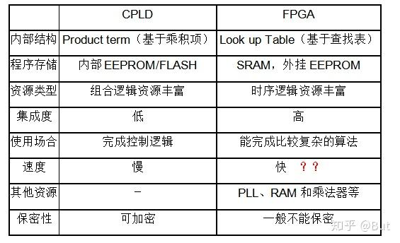

补充答案：

FPGA 和 CPLD 都属于可编程逻辑器件，但结构和适用场景不同。CPLD 通常基于乘积项结构，资源规模较小，组合逻辑延时较确定，上电后一般可立即工作，适合胶合逻辑、地址译码、简单控制逻辑等场景。FPGA 通常基于 LUT、触发器、Block RAM、DSP、PLL 等可配置资源，逻辑规模大、布线资源丰富，适合复杂数字系统、SoC 原型、算法加速和高速接口设计。

CPLD 的优点是时序可预测、配置简单、非易失特性常见；FPGA 的优点是容量大、灵活性强、可实现复杂时序逻辑和大规模并行处理。缺点上，CPLD 资源有限；FPGA 一般需要配置过程，设计和时序约束复杂度更高。

## 13. 锁存器（latch）和触发器（flip-flop）区别？

电平敏感的存储器件称为锁存器。可分为高电平锁存器和低电平锁存器，用于不同时钟之间的信号同步。

有交叉耦合的门构成的双稳态的存储原件称为触发器。分为上升沿触发和下降沿触发。可以认为是两个不同电平敏感的锁存器串连而成。前一个锁存器决定了触发器的建立时间，后一个锁存器则决定了保持时间。

## 14. FPGA芯片内有哪两种存储器资源？

FPGA芯片内有两种存储器资源：一种叫BLOCK RAM,另一种是由LUT配置成的内部存储器（也就是分布式RAM）。BLOCK RAM由一定数量固定大小的存储块构成的，使用BLOCK RAM资源不占用额外的逻辑资源，并且速度快。但是使用的时候消耗的BLOCK RAM资源是其块大小的整数倍。

## 15. 什么是时钟抖动？

时钟抖动是指芯片的某一个给定点上时钟周期发生暂时性变化，也就是说时钟周期在不同的周期上可能加长或缩短。它是一个平均值为0的平均变量。

## 16. FPGA设计中对时钟的使用？（例如分频等）

FPGA芯片有固定的时钟路由，这些路由能有减少时钟抖动和偏差。需要对时钟进行相位移动或变频的时候，一般不允许对时钟进行逻辑操作，这样不仅会增加时钟的偏差和抖动，还会使时钟带上毛刺。一般的处理方法是采用FPGA芯片自带的时钟管理器如PLL,DLL或DCM，或者把逻辑转换到触发器的D输入（这些也是对时钟逻辑操作的替代方案）。

## 17. FPGA设计中如何实现同步时序电路的延时？

首先说说异步电路的延时实现：异步电路一半是通过加buffer、两级与非门等来实现延时（我还没用过所以也不是很清楚），但这是不适合同步电路实现延时的。在同步电路中，对于比较大的和特殊要求的延时，一半通过高速时钟产生计数器，通过计数器来控制延时；对于比较小的延时，可以通过触发器打一拍，不过这样只能延迟一个时钟周期。

## 18. FPGA中可以综合实现为RAM/ROM/CAM的三种资源及其注意事项？

三种资源：BLOCK RAM，触发器（FF），查找表（LUT）；

注意事项：

1：在生成RAM等存储单元时，应该首选BLOCK RAM 资源；其原因有二：第一：使用BLOCK RAM等资源，可以节约更多的FF和4-LUT等底层可编程单元。使用BLOCK RAM可以说是“不用白不用”，是最大程度发挥器件效能，节约成本的一种体现；第二：BLOCK RAM是一种可以配置的硬件结构，其可靠性和速度与用LUT和REGISTER构建的存储器更有优势。

2：弄清FPGA的硬件结构，合理使用BLOCK RAM资源；

3：分析BLOCK RAM容量，高效使用BLOCK RAM资源；

4：分布式RAM资源（DISTRIBUTE RAM）

## 19. Xilinx中与全局时钟资源和DLL相关的硬件原语：

常用的与全局时钟资源相关的Xilinx器件原语包括：IBUFG,IBUFGDS,BUFG,BUFGP,BUFGCE,BUFGMUX,BUFGDLL,DCM等。关于各个器件原语的解释可以参考《FPGA设计指导准则》p50部分。

## 20. HDL语言的层次概念？

HDL语言是分层次的、类型的，最常用的层次概念有系统与标准级、功能模块级，行为级，寄存器传输级和门级。

系统级，算法级，RTL级(行为级)，门级，开关级

## 21. 查找表的原理与结构？

查找表（look-up-table）简称为LUT，LUT本质上就是一个RAM。目前FPGA中多使用4输入的LUT，所以每一个LUT可以看成一个有 4位地址线的16x1的RAM。 当用户通过原理图或HDL语言描述了一个逻辑电路以后，PLD/FPGA开发软件会自动计算逻辑电路的所有可能的结果，并把结果事先写入RAM,这样，每输入一个信号进行逻辑运算就等于输入一个地址进行查表，找出地址对应的内容，然后输出即可

## 22. IC设计前端到后端的流程和EDA工具？

设计前端也称逻辑设计，后端设计也称物理设计，两者并没有严格的界限，一般涉及到与工艺有关的设计就是后端设计。

1：规格制定：客户向芯片设计公司提出设计要求。

2：详细设计：芯片设计公司（Fabless）根据客户提出的规格要求，拿出设计解决方案和具体实现架构，划分模块功能。目前架构的验证一般基于systemC语言，对价后模型的仿真可以使用systemC的仿真工具。例如：CoCentric和Visual Elite等。

3：HDL编码：设计输入工具：ultra ，visual VHDL等

4：仿真验证：modelsim

5：逻辑综合：synplify

6：静态时序分析：synopsys的Prime Time

7：形式验证：Synopsys的Formality.

## 23. 寄生效应在IC设计中怎样加以克服和利用（这是我的理解，原题好像是说，IC设计过

程中将寄生效应的怎样反馈影响设计师的设计方案）？

所谓寄生效应就是那些溜进你的PCB并在电路中大施破坏、令人头痛、原因不明的小故障。它们就是渗入高速电路中隐藏的寄生电容和寄生电感。其中包括由封装引脚和印制线过长形成的寄生电感；焊盘到地、焊盘到电源平面和焊盘到印制线之间形成的寄生电容；通孔之间的相互影响，以及许多其它可能的寄生效应。

理想状态下，导线是没有电阻，电容和电感的。而在实际中，导线用到了金属铜，它有一定的电阻率，如果导线足够长，积累的电阻也相当可观。两条平行的导线，如果互相之间有电压差异，就相当于形成了一个平行板电容器（你想象一下）。通电的导线周围会形成磁场（特别是电流变化时），磁场会产生感生电场，会对电子的移动产生影响，可以说每条实际的导线包括元器件的管脚都会产生感生电动势，这也就是寄生电感。

在直流或者低频情况下，这种寄生效应看不太出来。而在交流特别是高频交流条件下，影响就非常巨大了。根据复阻抗公式，电容、电感会在交流情况下会对电流的移动产生巨大阻碍，也就可以折算成阻抗。这种寄生效应很难克服，也难摸到。只能通过优化线路，尽量使用管脚短的SMT元器件来减少其影响，要完全消除是不可能的。

## 24. 用flip-flop和logic-gate设计一个1位加法器，输入carryin和current-stage，输出carryout和next-stage？

carryout=carryin*current-stage；与门

next-stage=carryin’*current-stage+carryin*current-stage’; 与门，非门，或门（或者异或门）

```verilog
module(clk,current-stage,carryin,next-stage,carryout);
  input clk, current-stage,carryin;
  output next-stage,carryout;
  always@(posedge clk)
  carryout<=carryin&current-stage;
  nextstage<=
```

## 25. 设计一个自动饮料售卖机，饮料10分钱，硬币有5分和10分两种，并考虑找零，

1. 画出fsm（有限状态机）

2. 用verilog编程，语法要符合FPGA设计的要求

3. 设计工程中可使用的工具及设计大致过程？

设计过程：

1. 首先确定输入输出，A=1表示投入10分，B=1表示投入5分，Y=1表示弹出饮料，Z=1表示找零。

2. 确定电路的状态，S0表示没有进行投币，S1表示已经有5分硬币。

3. 画出状态转移图。

```verilog
module sell(clk,rst,a,b,y,z);
  input clk,rst,a,b;
  output y,z;
  parameter s0=0,s1=1;
  reg state,next_state;
  always@(posedge clk)
  begin
    if(!rst)
      state<=s0;
    else
      state<=next_state;
  end
  always@(a or b or cstate)
  begin
    y=0;z=0;
    case(state)
      s0: if(a==1&&b==0) next_state=s1;
    else if(a==0&&b==1)
      begin
        next_state=s0; y=1;
      end
    else
      next_state=s0;
      s1: if(a==1&&b==0)
      begin
        next_state=s0;y=1;
      end
    else if(a==0&&b==1)
      begin
        next_state=s0; y=1;z=1;
      end
    else
      next_state=s0;
      default: next_state=s0;
    endcase
  end
endmodule
```


扩展：设计一个自动售饮料机的逻辑电路。它的投币口每次只能投入一枚五角或一元的硬币。投入一元五角硬币后给出饮料；投入两元硬币时给出饮料并找回五角。

确定输入输出，投入一元硬币A=1，投入五角硬币B=1，给出饮料Y=1，找回五角Z=1；

确定电路的状态数，投币前初始状态为S0，投入五角硬币为S1，投入一元硬币为S2。画出转该转移图，根据状态转移图可以写成Verilog代码。

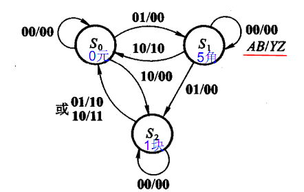

## 26. 什么是"线与"逻辑,要实现它,在硬件特性上有什么具体要求?

线与逻辑是两个输出信号相连可以实现与的功能。在硬件上,要用oc门来实现,由于不用oc门可能使灌电流过大,而烧坏逻辑门. 同时在输出端口应加一个上拉电阻。oc门就是集电极开路门。od门是漏极开路门。

## 27. 什么是竞争与冒险现象?怎样判断?如何消除?

在组合电路中，某一输入变量经过不同途径传输后，到达电路中某一汇合点的时间有先有后，这种现象称竞争；由于竞争而使电路输出发生瞬时错误的现象叫做冒险。（也就是由于竞争产生的毛刺叫做冒险）。

判断方法：代数法（如果布尔式中有相反的信号则可能产生竞争和冒险现象）；卡诺图：有两个相切的卡诺圈并且相切处没有被其他卡诺圈包围，就有可能出现竞争冒险；实验法：示波器观测；

解决方法：1：加滤波电容，消除毛刺的影响；2：加选通信号，避开毛刺；3：增加冗余项消除逻辑冒险。

门电路两个输入信号同时向相反的逻辑电平跳变称为竞争；

由于竞争而在电路的输出端可能产生尖峰脉冲的现象称为竞争冒险。

如果逻辑函数在一定条件下可以化简成Y=A+A’或Y=AA’则可以判断存在竞争冒险现象（只是一个变量变化的情况）。

消除方法，接入滤波电容，引入选通脉冲，增加冗余逻辑

## 28. 你知道那些常用逻辑电平?TTL与COMS电平可以直接互连吗？

常用逻辑电平：TTL、CMOS、LVTTL、LVCMOS、ECL（Emitter Coupled Logic）、PECL（Pseudo/Positive Emitter Coupled Logic）、LVDS（Low Voltage Differential Signaling）、GTL（Gunning Transceiver Logic）、BTL（Backplane Transceiver Logic）、ETL（enhanced transceiver logic）、GTLP（Gunning Transceiver Logic Plus）；RS232、RS422、RS485（12V，5V，3.3V）；

也有一种答案是：常用逻辑电平：12V，5V，3.3V。

TTL和CMOS 不可以直接互连，由于TTL是在0.3-3.6V之间，而CMOS则是有在12V的有在5V的。CMOS输出接到TTL是可以直接互连。TTL接到 CMOS需要在输出端口加一上拉电阻接到5V或者12V。

用CMOS可直接驱动TTL;加上拉电阻后,TTL可驱动CMOS.

上拉电阻用途：

1. 当TTL电路驱动COMS电路时，如果TTL电路输出的高电平低于COMS电路的最低高电平（一般为3.5V），这时就需要在TTL的输出端接上拉电阻，以提高输出高电平的值。

2. OC门电路必须加上拉电阻，以提高输出的高电平值。

3. 为加大输出引脚的驱动能力，有的单片机管脚上也常使用上拉电阻。

4. 在COMS芯片上，为了防止静电造成损坏，不用的管脚不能悬空，一般接上拉电阻产生降低输入阻抗，提供泄荷通路。

5. 芯片的管脚加上拉电阻来提高输出电平，从而提高芯片输入信号的噪声容限增强抗干扰能力。

6. 提高总线的抗电磁干扰能力。管脚悬空就比较容易接受外界的电磁干扰。

7. 长线传输中电阻不匹配容易引起反射波干扰，加上下拉电阻是电阻匹配，有效的抑制反射波干扰。

上拉电阻阻值的选择原则包括:

1. 从节约功耗及芯片的灌电流能力考虑应当足够大；电阻大，电流小。

2. 从确保足够的驱动电流考虑应当足够小；电阻小，电流大。

3. 对于高速电路，过大的上拉电阻可能边沿变平缓。综合考虑以上三点,通常在1k到10k之间选取。对下拉电阻也有类似道理。

OC门电路必须加上拉电阻，以提高输出的高电平值。

OC门电路要输出“1”时才需要加上拉电阻不加根本就没有高电平

在有时我们用OC门作驱动（例如控制一个 LED）灌电流工作时就可以不加上拉电阻

总之加上拉电阻能够提高驱动能力。

## 29. IC设计中同步复位与异步复位的区别？

同步复位在时钟沿变化时，完成复位动作。异步复位不管时钟，只要复位信号满足条件，就完成复位动作。异步复位对复位信号要求比较高，不能有毛刺，如果其与时钟关系不确定，也可能出现亚稳态。

## 30. MOORE 与 MEELEY状态机的特征？

Moore 状态机的输出仅与当前状态值有关, 且只在时钟边沿到来时才会有状态变化。

Mealy 状态机的输出不仅与当前状态值有关, 而且与当前输入值有关。

## 31. 多时域设计中,如何处理信号跨时域？

不同的时钟域之间信号通信时需要进行同步处理，这样可以防止新时钟域中第一级触发器的亚稳态信号对下级逻辑造成影响。

信号跨时钟域同步：当单个信号跨时钟域时，可以采用两级触发器来同步；数据或地址总线跨时钟域时可以采用异步FIFO来实现时钟同步；第三种方法就是采用握手信号。

## 32. 说说静态、动态时序模拟的优缺点？

静态时序分析是采用穷尽分析方法来提取出整个电路存在的所有时序路径，计算信号在这些路径上的传播延时，检查信号的建立和保持时间是否满足时序要求，通过对最大路径延时和最小路径延时的分析，找出违背时序约束的错误。它不需要输入向量就能穷尽所有的路径，且运行速度很快、占用内存较少，不仅可以对芯片设计进行全面的时序功能检查，而且还可利用时序分析的结果来优化设计，因此静态时序分析已经越来越多地被用到数字集成电路设计的验证中。

动态时序模拟就是通常的仿真，因为不可能产生完备的测试向量，覆盖门级网表中的每一条路径。因此在动态时序分析中，无法暴露一些路径上可能存在的时序问题；

## 33. 一个四级的Mux,其中第二级信号为关键信号 如何改善timing.？

关键：将第二级信号放到最后输出一级输出，同时注意修改片选信号，保证其优先级未被修改。（为什么？）

## 34. 给出一个门级的图,又给了各个门的传输延时,问关键路径是什么,还问给出输入, 使得输出依赖于关键路径？

关键路径就是输入到输出延时最大的路径，找到了关键路径便能求得最大时钟频率。

## 35. 为什么一个标准的倒相器中P管的宽长比要比N管的宽长比大?

和载流子有关，P管是空穴导电，N管是电子导电，电子的迁移率大于空穴，同样的电场下，N管的电流大于P管，因此要增大P管的宽长比，使之对称，这样才能使得两者上升时间下降时间相等、高低电平的噪声容限一样、充电放电的时间相等。

## 36. 用mos管搭出一个二输入与非门？

<数字电子技术基础（第五版）> 92页

与非门：上并下串 或非门：上串下并

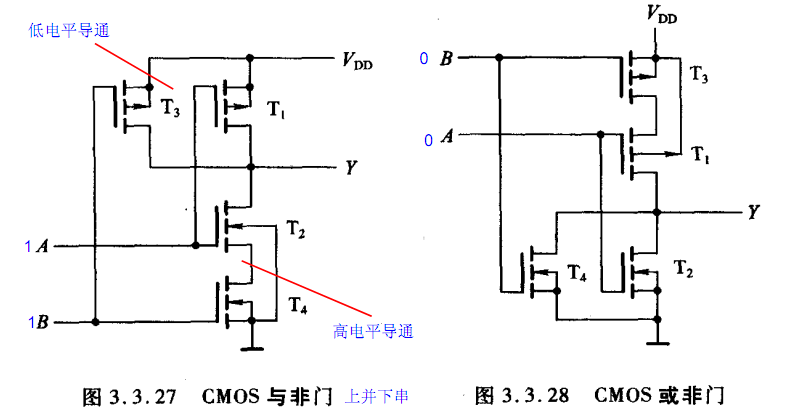

补充答案：

二输入 CMOS 与非门 NAND 的结构是“上并下串”：上拉网络由两个 PMOS 并联接到 VDD，下拉网络由两个 NMOS 串联接到 GND。只有当 A=1 且 B=1 时，两个 NMOS 同时导通、两个 PMOS 同时关断，输出被拉低为 0；其他输入组合下至少有一个 PMOS 导通，输出为 1。

真值表：

```text
A B | Y = ~(A & B)
0 0 | 1
0 1 | 1
1 0 | 1
1 1 | 0
```

与非门是 CMOS 标准单元中很常用的基本门，因为它面积小、速度快，并且任意组合逻辑都可以用 NAND 门实现。

## 37. 画出NOT,NAND,NOR的符号,真值表,还有transistor level（晶体管级）的电路？

<数字电子技术基础（第五版）> 117页—134页

补充答案：

NOT、NAND、NOR 的逻辑关系如下：

```text
NOT:  Y = ~A
NAND: Y = ~(A & B)
NOR:  Y = ~(A | B)
```

真值表：

```text
A | NOT
0 | 1
1 | 0

A B | NAND | NOR
0 0 |  1   |  1
0 1 |  1   |  0
1 0 |  1   |  0
1 1 |  0   |  0
```

晶体管级实现中，反相器由一个 PMOS 上拉和一个 NMOS 下拉构成；NAND 为 PMOS 并联、NMOS 串联；NOR 为 PMOS 串联、NMOS 并联。记忆口诀是：NAND 上并下串，NOR 上串下并。

## 38. 画出CMOS的图,画出tow-to-one mux gate.(威盛VIA 2003.11.06 上海笔试试题) ？

Y=SA+S’B 利用与非门和反相器，进行变换后Y=((SA)’*(S’A)’)’，三个与非门，一个反相器。也可以用传输门来实现数据选择器或者是异或门。

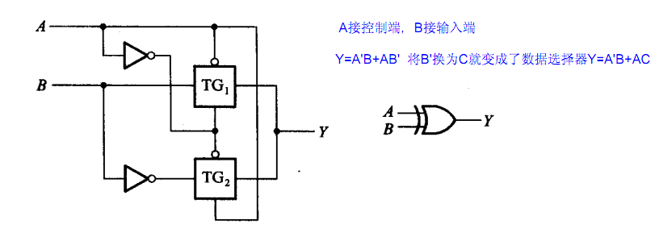

## 39. 用一个二选一mux和一个inv实现异或？

其中:B连接的是地址输入端，A和A非连接的是数据选择端,F对应的的是输出端,使能端固定接地置零(没有画出来).

Y=BA’+B’A

利用4选1实现F(x,y,z)=xz+yz'

F(x,y,z)=xyz+xy’z+xyz'+x’yz’=x’y’0+x’yz’+xy’z+xy1

Y=A’B’D0+A’BD1+AB’D2+ABD3

所以D0=0，D1=z’，D2=z，D3=1

## 40. 画出CMOS电路的晶体管级电路图,实现Y=A*B+C(D+E).(仕兰微电子)？

画出Y=A*B+C的CMOS电路图，画出Y=A*B+C*D的CMOS电路图。

利用与非门和或非门实现

Y=A*B+C(D+E)=((AB’)(CD)’(CE)’)’ 三个两输入与非门，一个三输入与非门

Y=A*B+C=((AB)’C’) 一个反相器，两个两输入与非门

Y=A*B+C*D=((AB)’(CD)’)’ 三个两输入与非门

## 41. 用与非门等设计全加法器？（华为）

《数字电子技术基础》192页。

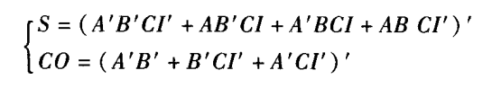

通过摩根定律化成用与非门实现。

补充答案：

全加器有三个输入 `A`、`B`、`Cin`，两个输出 `Sum` 和 `Cout`：

```text
Sum  = A ^ B ^ Cin
Cout = A&B | A&Cin | B&Cin
```

如果要求用与非门实现，可以先把逻辑化为与或形式，再用两次取反转换成 NAND-NAND 结构。因为 NAND 是通用门，异或、与、或、非都可以由 NAND 拼出。工程里更常见的结构是两个半加器加一个或门：第一级计算 `A+B`，第二级加 `Cin`，两个进位再或起来得到 `Cout`。

## 42. A,B,C,D,E进行投票,多数服从少数,输出是F(也就是如果A,B,C,D,E中1的个数比0 多,那么F输出为1,否则F为0),用与非门实现,输入数目没有限制？（与非-与非形式）

先画出卡诺图来化简，化成与或形式，再两次取反便可。

补充答案：

这是 5 输入多数表决器。输出 F=1 的条件是 A、B、C、D、E 中至少有 3 个为 1。因此逻辑表达式可以写成所有三输入乘积项的或：

```text
F = ABC + ABD + ABE + ACD + ACE + ADE + BCD + BCE + BDE + CDE
```

如果用与非门实现，可将上式整体取两次反，得到 NAND-NAND 结构：

```text
F = ~( ~(ABC) & ~(ABD) & ~(ABE) & ~(ACD) & ~(ACE)
     & ~(ADE) & ~(BCD) & ~(BCE) & ~(BDE) & ~(CDE) )
```

第一层 NAND 产生每个三输入项的反，第二层 NAND 汇总输出。题目说输入数目没有限制，因此可以直接使用多输入 NAND；如果实际库中没有多输入门，需要用多级 NAND 树实现。

## 43. 画出一种CMOS的D锁存器的电路图和版图？

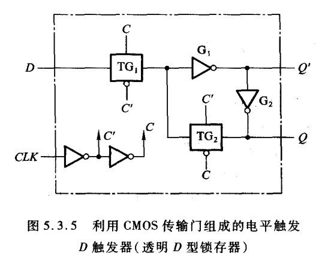

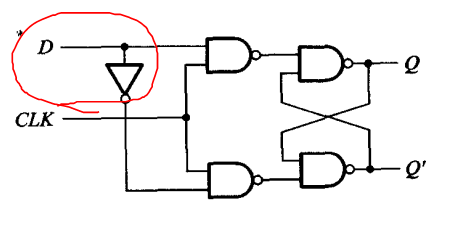

也可以将右图中的与非门和反相器用CMOS电路画出来。

补充答案：

CMOS D 锁存器通常由传输门和反相器构成。时钟有效时，输入传输门打开，D 信号进入内部存储节点，锁存器透明，Q 跟随 D；时钟无效时，输入传输门关闭，反馈传输门打开，由两个反相器形成反馈环保持原来的数据。

也可以用门级结构理解：D latch = 使能控制的存储单元。当 `EN=1` 时采样输入，当 `EN=0` 时保持输出。版图实现时需要画出 PMOS/NMOS 有源区、多晶硅栅、传输门、反相器和反馈路径，同时注意 PMOS/NMOS 尺寸匹配、井接触和衬底接触。

## 44. LATCH和DFF的概念和区别？

补充答案：

Latch 是电平敏感器件，当使能信号处于有效电平时，输出会跟随输入变化；当使能无效时，保持原状态。DFF 是边沿敏感器件，只在时钟上升沿或下降沿采样输入 D，并在下一个有效边沿到来前保持输出 Q 不变。

主要区别：Latch 对电平敏感，DFF 对时钟边沿敏感；Latch 存在透明窗口，可能用于 time borrowing，但也容易引入意外组合通路；DFF 时序边界清晰，更适合同步 RTL 设计。写 RTL 时如果组合逻辑分支赋值不完整，综合工具可能推断出 latch，这是常见风险。

## 45. latch与register的区别,为什么现在多用register.行为级描述中latch如何产生的？

latch是电平触发，register是边沿触发，register在同一时钟边沿触发下动作，符合同步电路的设计思想，而latch则属于异步电路设计，往往会导致时序分析困难，不适当的应用latch则会大量浪费芯片资源。

## 46. 用D触发器做个二分频的电路？画出逻辑电路？

```verilog
module div2(clk,rst,clk_out);
  input clk,rst;
  output reg clk_out;
  always@(posedge clk)
  begin
    if(!rst)
      clk_out <=0;
    else
      clk_out <=~ clk_out;
  end
endmodule
```


现实工程设计中一般不采用这样的方式来设计，二分频一般通过DCM来实现。通过DCM得到的分频信号没有相位差。

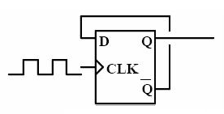

或者是从Q端引出加一个反相器。

## 47. 什么是状态图？

状态图是以几何图形的方式来描述时序逻辑电路的状态转移规律以及输出与输入的关系。

## 48. 用你熟悉的设计方式设计一个可预置初值的7进制循环计数器,15进制的呢？

```verilog
module counter7(clk,rst,load,data,cout);
  input clk,rst,load;
  input [2:0] data;
  output reg [2:0] cout;
  always@(posedge clk)
  begin
    if(!rst)
      cout<=3’d0;
    else if(load)
      cout<=data;
    else if(cout>=3’d6)
      cout<=3’d0;
    else
      cout<=cout+3’d1;
  end
endmodule
```

补充答案：

可预置初值的 7 进制计数器需要包含复位、装载和计数逻辑。计数范围是 0 到 6，当计数到 6 后回到 0；当 `load=1` 时，把外部输入 `data` 装入计数器。15 进制计数器同理，只是计数范围变为 0 到 14，需要 4 bit 寄存器。

7 进制核心逻辑：

```text
reset -> count = 0
load  -> count = data
count == 6 -> count = 0
else -> count = count + 1
```

15 进制只需把位宽改为 4 bit，并把终值判断从 6 改为 14。面试时要强调：这是模 N 计数器，寄存器位宽至少满足 `2^width >= N`，预置值如果超出合法范围需要额外处理。

## 49. 你所知道的可编程逻辑器件有哪些？

PAL，PLA，GAL，CPLD，FPGA

## 50. 用Verilog或VHDL写一段代码,实现消除一个glitch（毛刺）？

将传输过来的信号经过两级触发器就可以消除毛刺。（这是我自己采用的方式：这种方式消除毛刺是需要满足一定条件的，并不能保证一定可以消除）

```verilog
module(clk,data,q_out)
  input clk,data;
  output reg q_out;
  reg q1;
  always@(posedge clk)
  begin
    q1<=data;
    q_out<=q1;
  end
endmodule
```


## 51. SRAM,FALSH MEMORY,DRAM，SSRAM及SDRAM的区别?

SRAM：静态随机存储器，存取速度快，但容量小，掉电后数据会丢失，不像DRAM 需要不停的REFRESH，制造成本较高，通常用来作为快取(CACHE) 记忆体使用。

FLASH：闪存，存取速度慢，容量大，掉电后数据不会丢失

DRAM：动态随机存储器，必须不断的重新的加强(REFRESHED) 电位差量，否则电位差将降低至无法有足够的能量表现每一个记忆单位处于何种状态。价格比SRAM便宜，但访问速度较慢，耗电量较大，常用作计算机的内存使用。

SSRAM：即同步静态随机存取存储器。对于SSRAM的所有访问都在时钟的上升/下降沿启动。地址、数据输入和其它控制信号均于时钟信号相关。

SDRAM：即同步动态随机存取存储器。

## 52. 有四种复用方式，频分多路复用，写出另外三种？

四种复用方式：频分多路复用（FDMA），时分多路复用（TDMA），码分多路复用（CDMA），波分多路复用（WDMA）。

## 53. ASIC设计流程中什么时候修正Setup time violation 和Hold time violation?如何修正？解释setup和hold time violation，画图说明，并说明解决办法。（威盛VIA2003.11.06 上海笔试试题）

见前面的建立时间和保持时间，violation违反，不满足

补充答案：

Setup violation 和 hold violation 一般在综合后 STA、布局布线后 STA 中修正，尤其布局布线后由于真实连线延时更准确，是时序收敛的关键阶段。前端 RTL 阶段也可以通过结构调整提前规避。

Setup violation 表示数据到达太晚，不能在捕获时钟边沿前满足建立时间。常见修正方法：降低时钟频率、优化组合逻辑、拆分长路径、加流水线、换更快单元、改善布局、减少负载。

Hold violation 表示数据到达太早，在捕获时钟边沿后没有保持足够时间。常见修正方法：在数据路径插 buffer、增加最短路径延时、调整时钟偏斜、修改布局布线。Hold violation 与时钟周期无关，不能靠降频解决。

## 54. 给出一个组合逻辑电路，要求分析逻辑功能。

所谓组合逻辑电路的分析，就是找出给定逻辑电路输出和输入之间的关系，并指出电路的逻辑功能。

分析过程一般按下列步骤进行：

1：根据给定的逻辑电路，从输入端开始，逐级推导出输出端的逻辑函数表达式。

2：根据输出函数表达式列出真值表；

3：用文字概括处电路的逻辑功能；

## 55. 如何防止亚稳态？

亚稳态是指触发器无法在某个规定时间段内达到一个可确认的状态。当一个触发器进入亚稳态时，既无法预测该单元的输出电平，也无法预测何时输出才能稳定在某个正确的电平上。在这个稳定期间，触发器输出一些中间级电平，或者可能处于振荡状态，并且这种无用的输出电平可以沿信号通道上的各个触发器级联式传播下去。

解决方法：

1 降低系统时钟频率

2 用反应更快的FF

3 引入同步机制，防止亚稳态传播（可以采用前面说的加两级触发器）。

4 改善时钟质量，用边沿变化快速的时钟信号

## 56. 基尔霍夫定理的内容

基尔霍夫定律包括电流定律和电压定律：

电流定律：在集总电路中，在任一瞬时，流向某一结点的电流之和恒等于由该结点流出的电流之和。

电压定律：在集总电路中，在任一瞬间，沿电路中的任一回路绕行一周，在该回路上电动势之和恒等于各电阻上的电压降之和。

## 57. 描述反馈电路的概念，列举他们的应用。

反馈，就是在电路系统中，把输出回路中的电量（电压或电流）输入到输入回路中去。

反馈的类型有：电压串联负反馈、电流串联负反馈、电压并联负反馈、电流并联负反馈。

负反馈的优点：降低放大器的增益灵敏度，改变输入电阻和输出电阻，改善放大器的线性和非线性失真，有效地扩展放大器的通频带，自动调节作用。

电压负反馈的特点：电路的输出电压趋向于维持恒定。

电流负反馈的特点：电路的输出电流趋向于维持恒定。

## 58. 有源滤波器和无源滤波器的区别

无源滤波器：这种电路主要有无源元件R、L和C组成

有源滤波器：集成运放和R、C组成，具有不用电感、体积小、重量轻等优点。

集成运放的开环电压增益和输入阻抗均很高，输出电阻小，构成有源滤波电路后还具有一定的电压放大和缓冲作用。但集成运放带宽有限，所以目前的有源滤波电路的工作频率难以做得很高。

## 59. 给了reg的setup，hold时间，求中间组合逻辑的delay范围。 Tdelay < Tperiod - Tsetup – Thold

Tperiod > Tsetup + Thold +Tdelay （用来计算最高时钟频率）

Tco= Tsetup + Thold 即触发器的传输延时

## 60. 时钟周期为T,触发器D1的寄存器到输出时间（触发器延时Tco）最大为T1max，最小为T1min。组合逻辑电路最大延迟为T2max,最小为T2min。问，触发器D2的建立时间T3和保持时间应满足什么条件。 T3setup>T+T2max 时钟沿到来之前数据稳定的时间（越大越好），一个时钟周期T加上最大的逻辑延时。

T3hold>T1min+T2min 时钟沿到来之后数据保持的最短时间，一定要大于最小的延时也就是T1min+T2min

## 61. 给出某个一般时序电路的图，有Tsetup，Tdelay，Tck->q（Tco），还有 clock的delay,写出决定最大时钟的因素，同时给出表达式。 T+Tclkdealy>Tsetup+Tco+Tdelay; Thold>Tclkdelay+Tco+Tdelay; 保持时间与时钟周期无关

补充答案：

决定最大时钟频率的是发射触发器的 clock-to-Q 延时、组合逻辑最大延时、接收触发器建立时间，以及时钟偏斜、时钟不确定度等因素。典型 setup 约束为：

```text
Tclk >= Tco_max + Tcomb_max + Tsetup + Tskew + Tuncertainty
Fmax <= 1 / Tclk
```

如果考虑 launch clock 和 capture clock 的到达时间，setup 检查可写成：

```text
Tclk + Tcapture_clk_delay - Tlaunch_clk_delay
  >= Tco_max + Tcomb_max + Tsetup
```

Hold 检查与时钟周期无关，主要看最短路径是否太快：

```text
Tlaunch_clk_delay + Tco_min + Tcomb_min
  >= Tcapture_clk_delay + Thold
```

Setup violation 通常通过降低频率、优化组合逻辑、加流水线、改善布局布线解决；hold violation 通常通过增加数据路径延时、调整 clock skew 或插 buffer 解决，不能靠降低时钟频率解决。

## 62. 实现三分频电路，3/2分频电路等（偶数倍分频 奇数倍分频）

图2是3分频电路，用JK-FF实现3分频很方便，不需要附加任何逻辑电路就能实现同步计数分频。但用D-FF实现3分频时，必须附加译码反馈电路，如图2所示的译码复位电路，强制计数状态返回到初始全零状态，就是用NOR门电路把Q2，Q1=“11B”的状态译码产生“H”电平复位脉冲，强迫FF1和FF2同时瞬间（在下一时钟输入Fi的脉冲到来之前）复零，于是Q2，Q1=“11B”状态仅瞬间作为“毛刺”存在而不影响分频的周期，这种“毛刺”仅在Q1中存在，实用中可能会造成错误，应当附加时钟同步电路或阻容低通滤波电路来滤除，或者仅使用Q2作为输出。D-FF的3分频，还可以用AND门对Q2，Q1译码来实现返回复零。

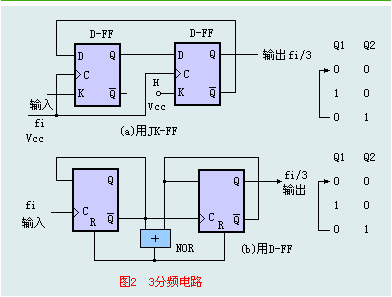

## 63. 名词解释

CMOS（Complementary Metal Oxide Semiconductor），互补金属氧化物半导体，电压控制的一种放大器件。是组成CMOS数字集成电路的基本单元。

MCU(Micro Controller Unit)中文名称为微控制单元，又称单片微型计算机(Single Chip Microcomputer)或者单片机，是指随着大规模集成电路的出现及其发展，将计算机的CPU、RAM、ROM、定时数计器和多种I/O接口集成在一片芯片上，形成芯片级的计算机，为不同的应用场合做不同组合控制。

RISC（reduced instruction set computer，精简指令集计算机）是一种执行较少类型计算机指令的微处理器，起源于80年代的MIPS主机（即RISC机），RISC机中采用的微处理器统称RISC处理器。这样一来，它能够以更快的速度执行操作（每秒执行更多百万条指令，即MIPS）。因为计算机执行每个指令类型都需要额外的晶体管和电路元件，计算机指令集越大就会使微处理器更复杂，执行操作也会更慢。

CISC是复杂指令系统计算机（Complex Instruction Set Computer）的简称，微处理器是台式计算机系统的基本处理部件，每个微处理器的核心是运行指令的电路。指令由完成任务的多个步骤所组成，把数值传送进寄存器或进行相加运算。

DSP（digital signal processor）是一种独特的微处理器，是以数字信号来处理大量信息的器件。其工作原理是接收模拟信号，转换为0或1的数字信号。再对数字信号进行修改、删除、强化，并在其他系统芯片中把数字数据解译回模拟数据或实际环境格式。它不仅具有可编程性，而且其实时运行速度可达每秒数以千万条复杂指令程序，远远超过通用微处理器，是数字化电子世界中日益重要的电脑芯片。它的强大数据处理能力和高运行速度，是最值得称道的两大特色。

FPGA（Field－Programmable Gate Array），即现场可编程门阵列，它是在PAL、GAL、CPLD等可编程器件的基础上进一步发展的产物。它是作为专用集成电路（ASIC）领域中的一种半定制电路而出现的，既解决了定制电路的不足，又克服了原有可编程器件门电路数有限的缺点。

ASIC:专用集成电路，它是面向专门用途的电路，专门为一个用户设计和制造的。根据一个用户的特定要求，能以低研制成本，短、交货周期供货的全定制，半定制集成电路。与门阵列等其它ASIC(Application Specific IC)相比，它们又具有设计开发周期短、设计制造成本低、开发工具先进、标准产品无需测试、质量稳定以及可实时在线检验等优点

PCI(Peripheral Component Interconnect) 外围组件互连，一种由英特尔（Intel）公司1991年推出的用于定义局部总线的标准。

ECC是“Error Correcting Code”的简写，中文名称是“错误检查和纠正”。ECC是一种能够实现“错误检查和纠正”的技术，ECC内存就是应用了这种技术的内存，一般多应用在服务器及图形工作站上，这将使整个电脑系统在工作时更趋于安全稳定。

DDR=Double Data Rate双倍速率同步动态随机存储器。严格的说DDR应该叫DDR SDRAM，人们习惯称为DDR，其中，SDRAM 是Synchronous Dynamic Random Access Memory的缩写，即同步动态随机存取存储器。

IRQ全称为Interrupt Request，即是“中断请求”的意思（以下使用IRQ称呼）。IRQ的作用就是在我们所用的电脑中，执行硬件中断请求的动作，用来停止其相关硬件的工作状态

USB ,是英文Universal Serial BUS（通用串行总线）的缩写，而其中文简称为“通串线，是一个外部总线标准，用于规范电脑与外部设备的连接和通讯。

BIOS是英文"Basic Input Output System"的缩略语，直译过来后中文名称就是"基本输入输出系统"。其实，它是一组固化到计算机内主板上一个ROM芯片上的程序，它保存着计算机最重要的基本输入输出的程序、系统设置信息、开机后自检程序和系统自启动程序。 其主要功能是为计算机提供最底层的、最直接的硬件设置和控制。

## 64. 三极管特性曲线

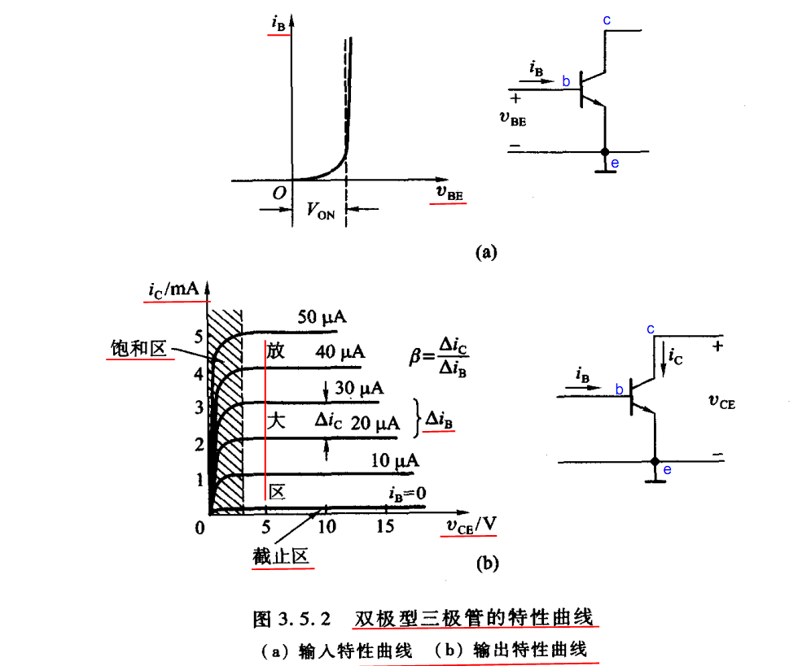

补充答案：

三极管输出特性曲线通常描述在不同基极电流 Ib 下，集电极电流 Ic 随集电极-发射极电压 Vce 的变化关系。主要工作区包括截止区、放大区和饱和区。

截止区：Ib 近似为 0，Ic 很小，三极管等效关断。放大区：发射结正偏、集电结反偏，Ic 近似等于 beta * Ib，适合模拟放大。饱和区：发射结和集电结均正偏，Vce 很小，Ic 不再随 Ib 按比例增加，三极管等效导通开关。数字电路中常用截止区和饱和区表示开关状态。

## 65. Please show the CMOS inverter schematic, layout and its cross section with P-well process. Plot its transfer curve (Vout-Vin) and also explain the operation region of PMOS and NMOS for each segment of the transfer curve? （威盛笔试题circuit design-beijing-03.11.09）

补充答案：

CMOS inverter 由上拉 PMOS 和下拉 NMOS 组成：PMOS 源极接 VDD，NMOS 源极接 GND，两者漏极相连作为输出，两个栅极相连作为输入。

传输特性 Vout-Vin 可分为几个区间：Vin=0 附近，NMOS 截止、PMOS 导通，输出为高；Vin 逐渐升高进入翻转区，NMOS 和 PMOS 同时导通，输出快速翻转，此时存在短路电流；Vin 接近 VDD 时，PMOS 截止、NMOS 导通，输出为低。

P-well 工艺中，NMOS 做在 P-well 中，PMOS 做在 N 型衬底或 N-well 区域中。版图上通常包含 PMOS/NMOS 有源区、多晶硅栅、金属互连、N+/P+ 扩散区以及井接触/衬底接触。为了避免 latch-up，需要良好的 well tap 和 substrate tap。

## 66. To design a CMOS inverter with balance rise and fall time, please define the ration of channel width of PMOS and NMOS and explain? P管要比N管宽

补充答案：

为了让上升沿和下降沿延时接近平衡，需要让 PMOS 的上拉能力接近 NMOS 的下拉能力。由于空穴迁移率低于电子迁移率，PMOS 在相同尺寸下驱动能力弱于 NMOS，所以 PMOS 的宽度通常要做得比 NMOS 更宽。

经验上：

```text
Wp / Wn ≈ μn / μp
```

在常见 CMOS 工艺中，电子迁移率约为空穴迁移率的 2 到 3 倍，因此常取 `Wp/Wn ≈ 2~3`。实际比例还要根据工艺库模型、负载、电源电压和目标噪声容限通过仿真确定。

## 67. Please draw the transistor level schematic of a CMOS 2 input AND gate and explain which input has faster response for output rising edge.(less delay time)。（威盛笔试题circuit design-beijing-03.11.09）

补充答案：

CMOS 2 输入 AND 门通常由一个 2 输入 NAND 门后接一个反相器实现。NAND 部分中，PMOS 上拉网络为两个 PMOS 并联，NMOS 下拉网络为两个 NMOS 串联；再经过一级 inverter 得到 AND 输出。

输出上升沿对应 NAND 内部节点先下降，再由后级反相器输出上升。对 NAND 的下降过程而言，串联 NMOS 中更靠近输出节点的输入通常响应更快，因为它直接控制输出节点到中间节点的放电通路；更靠近 GND 的 NMOS 还受中间节点电容影响，延时可能更大。严格结论取决于具体晶体管排列和寄生电容。

## 68. 为了实现逻辑Y=A’B+AB’+CD，请选用以下逻辑中的一种，并说明为什么？

1）INV 2）AND 3）OR 4）NAND 5）NOR 6）XOR 答案：NAND（未知）

## 69. 用波形表示D触发器的功能。（扬智电子笔试）

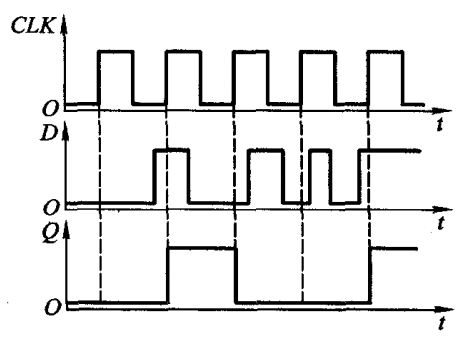

补充答案：

D 触发器在有效时钟边沿采样 D 输入，并把采样值送到 Q 输出。若为上升沿触发，则只有在 `clk` 上升沿到来时，`Q <= D`；在两个上升沿之间，即使 D 发生变化，Q 也保持不变。

波形判断要点：看每个有效时钟边沿到来瞬间 D 的值，边沿之后经过 clock-to-Q 延时，Q 更新为该值。非有效边沿或时钟电平期间 D 的毛刺不应改变 Q，前提是毛刺没有破坏建立/保持时间。

## 70. 用传输门和倒向器搭一个边沿触发器（DFF）。（扬智电子笔试）

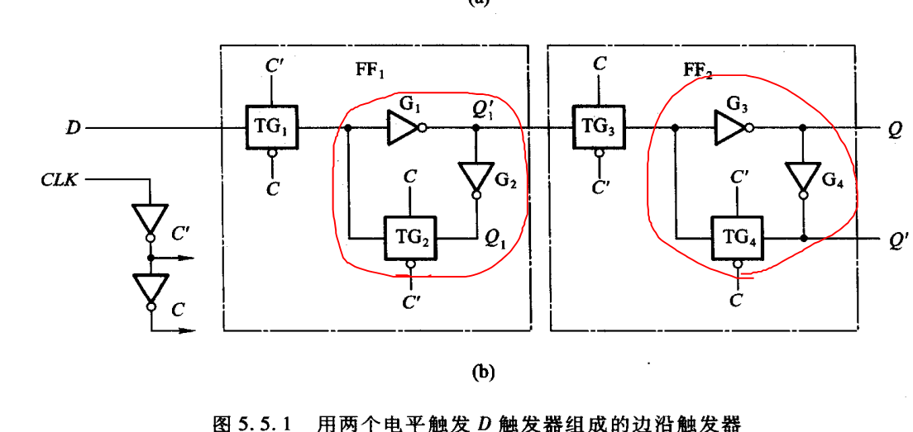

通过级联两个D锁存器组成

补充答案：

边沿触发 DFF 可以由两个电平敏感 D latch 串联构成，即 master-slave 结构。以正边沿触发为例：当 clk=0 时，master latch 透明，slave latch 关闭，输入 D 被 master 捕获；当 clk 从 0 跳到 1 时，master 关闭并保持刚才的数据，slave 打开，把 master 中保存的数据传到 Q。因此 Q 只在时钟上升沿附近更新。

用传输门实现 latch 时，传输门负责采样通路，反相器交叉反馈负责保持数据。两个 latch 使用互补时钟控制，就可以形成边沿触发器。

## 71. 用逻辑门画出D触发器。（威盛VIA 2003.11.06 上海笔试试题）

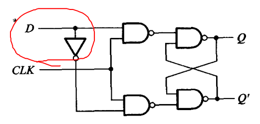

电平触发的D触发器（D锁存器）牢记！

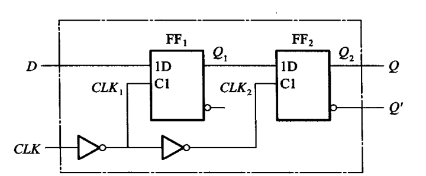

边沿触发的D触发器，有两个D锁存器构成

## 72. 画出DFF的结构图,用verilog实现之。（威盛）

```verilog
module dff(clk,d,qout);
  input clk,d;
  output qout;
  reg qout;
  always@(posedge clk)
  begin
    if(!reset)
      qout<=0;
    else
      qout<=d;
  end
endmodule
```

补充答案：

结构上，DFF 可看作两个 D latch 级联的 master-slave 结构，也可以直接理解为一个边沿采样寄存器。Verilog 描述时一般写成时钟边沿触发的 `always` 块。如果需要复位，应把 `reset` 加到端口列表中；原代码里使用了 `reset`，但模块端口未声明，严格来说需要补齐。

更完整的同步复位写法如下：

```verilog
module dff(
  input  wire clk,
  input  wire rst_n,
  input  wire d,
  output reg  qout
);
  always @(posedge clk) begin
    if (!rst_n)
      qout <= 1'b0;
    else
      qout <= d;
  end
endmodule
```

## 73. 画出一种CMOS的D锁存器的电路图和版图。（未知）

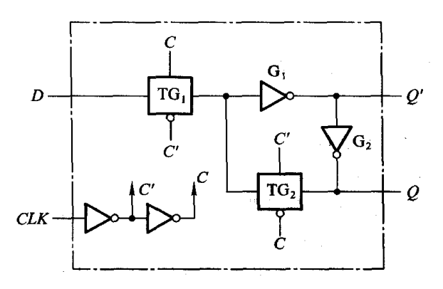

或者是利用前面与非门搭的D锁存器实现

补充答案：

CMOS D 锁存器可以用传输门实现。基本结构是输入传输门、两个反相器形成的存储环，以及反馈传输门。`CLK=1` 时输入传输门导通，反馈传输门关闭，锁存器透明；`CLK=0` 时输入传输门关闭，反馈传输门导通，输出状态被反馈环保持。

如果画版图，需要体现 PMOS 在 N-well 中、NMOS 在 P-sub/P-well 中，poly 形成栅，active 形成源漏，metal 完成互连。传输门由并联的 PMOS 和 NMOS 构成，分别用互补时钟控制，以减小单管传输高/低电平时的阈值损失。

## 74. 用filp-flop和logic-gate设计一个1位加法器，输入carryin和current-stage，输出carryout和next-stage. （未知）

补充答案：

这题本质是用一个触发器保存当前位 `current-stage`，并与输入进位 `carryin` 完成一位加法。两个 1 bit 数相加时：

```text
next-stage = current-stage ^ carryin
carryout   = current-stage & carryin
```

其中 `next-stage` 是本位求和结果，`carryout` 是向高位产生的进位。用门电路实现时，一个 XOR 门产生 `next-stage`，一个 AND 门产生 `carryout`；如果没有 XOR 门，也可以用与、或、非门实现：

```text
next-stage = (~current-stage & carryin) | (current-stage & ~carryin)
```

## 75. 用D触发器做个4进制的计数。（华为）

按照时序逻辑电路的设计步骤来：

写出状态转换表

寄存器的个数确定

状态编码

卡诺图化简

状态方程，驱动方程等

阎石数字电路 P314

## 76. 实现N位Johnson Counter, N=5。（南山之桥）

补充答案：

Johnson Counter 又叫扭环计数器，本质是移位寄存器首尾相连，但反馈到最低位的是最高位的反相信号。N 位 Johnson Counter 有 `2N` 个有效状态，因此 N=5 时有 10 个状态。

典型状态序列：

```text
00000 -> 10000 -> 11000 -> 11100 -> 11110 -> 11111
11111 -> 01111 -> 00111 -> 00011 -> 00001 -> 00000
```

Verilog 示例：

```verilog
module johnson_counter_5 (
  input  wire       clk,
  input  wire       rst_n,
  output reg  [4:0] q
);
  always @(posedge clk) begin
    if (!rst_n)
      q <= 5'b00000;
    else
      q <= {~q[0], q[4:1]};
  end
endmodule
```

也可以写成 `{q[3:0], ~q[4]}`，方向不同但原理相同。关键点是“移位 + 末位取反反馈”。

## 78. 数字电路设计当然必问Verilog/VHDL，如设计计数器。（未知）

补充答案：

设计计数器时一般先确定计数范围、复位方式、是否可加载、是否使能、溢出条件和输出编码。RTL 中通常使用时钟边沿触发的 `always` 块，所有寄存器用非阻塞赋值。

一个带同步复位和使能的 4 bit 计数器示例：

```verilog
module counter #(
  parameter WIDTH = 4,
  parameter MAX_VALUE = 9
)(
  input  wire             clk,
  input  wire             rst_n,
  input  wire             en,
  output reg  [WIDTH-1:0] count
);
  always @(posedge clk) begin
    if (!rst_n)
      count <= '0;
    else if (en) begin
      if (count == MAX_VALUE)
        count <= '0;
      else
        count <= count + 1'b1;
    end
  end
endmodule
```

面试中要说明：计数器属于时序逻辑；复位要明确同步/异步；计数到最大值后回零；如果跨时钟域使用计数值，需要额外同步或使用 Gray code。

## 79. 请用HDL描述四位的全加法器、5分频电路。（仕兰微电子）

```verilog
module adder4(a,b,ci,s,co);
  input ci;
  input [3:0] a,b;
  output co;
  output [3:0] s;
  assign {co,s}=a+b+ci;
endmodule
```


```verilog
module div5(clk,rst,clk_out);
  input clk,rst;
  output clk_out;
  reg [3:0] count;
  always@(posedge clk)
  begin
    if(!rst)
      begin
        count<=0;
        clk_out=0;
      end
    else if(count==3’d5)
      begin
        count<=0;
        clk_out=~clk_out;
      end
    else
      count<=count+1;
    end
endmodule
```


实现奇数倍分频且占空比为50%的情况：

```verilog
module div7 ( clk, reset_n, clkout );
  input clk,reset_n;
  output clkout;
  reg [3:0] count;
  reg div1;
  reg div2;
  always @( posedge clk )
  begin
    if ( ! reset_n )
      count <= 3'b000;
    else
      case ( count )
    3'b000 : count <= 3'b001;
    3'b001 : count <= 3'b010;
    3'b010 : count <= 3'b011;
    3'b011 : count <= 3'b100;
    3'b100 : count <= 3'b101;
    3'b101 : count <= 3'b110;
    3'b110 : count <= 3'b000;
    default :
    count <= 3'b000;
  endcase
  end
  always @( posedge clk )
  begin
    if ( ! reset_n )
      div1 <= 1'b0;
    else if ( count == 3'b000 )
      div1 <= ~ div1;
  end
  always @( negedge clk )
  begin
    if ( ! reset_n )
      div2 <= 1'b0;
    else if ( count == 3'b100 )
      div2 <= ~ div2;
  end
  assign clkout = div1 ^ div2;
endmodule
```

补充答案：

四位全加器可以直接用 Verilog 加法表达式实现，综合工具会推导出加法器结构。`{co, s} = a + b + ci` 中，`s` 是 4 bit 和，`co` 是最高位进位。

5 分频属于奇数分频，如果只在单个边沿翻转，难以得到严格 50% 占空比。常见做法是分别在上升沿和下降沿产生两个相位错开的分频信号，再异或或组合得到接近 50% 占空比的输出。代码里还应注意常量写法应为 ASCII 形式，例如 `3'd5`，不要写成弯引号 `3’d5`。

## 80. 用VERILOG或VHDL写一段代码，实现10进制计数器。（未知）

```verilog
module counter10(clk,rst,count);
  input clk,rst;
  output [3:0] count;
  reg [3:0] count;
  always@(posedge clk)
  begin
    if(!rst)
      count<=0;
    else if(count>=4’d9)
      count<=0;
    else
      count<=count+1;
  end
endmodule
```

补充答案：

10 进制计数器也叫 decade counter，计数范围为 0 到 9，需要 4 bit 寄存器表示。当复位有效时清零；否则每个时钟加 1；当计数到 9 后下一个时钟回到 0。

代码要点：

```text
if reset: count = 0
else if count == 9: count = 0
else count = count + 1
```

原代码思路是正确的，但常量建议写成 `4'd9`，不要使用弯引号。时序逻辑中寄存器赋值应使用非阻塞赋值 `<=`。

## 81. 描述一个交通信号灯的设计。（仕兰微电子）

按照时序逻辑电路的设计方法：

补充答案：

交通灯可以抽象成有限状态机。以东西向和南北向两组灯为例，常见状态包括：

```text
S0：东西绿，南北红
S1：东西黄，南北红
S2：东西红，南北绿
S3：东西红，南北黄
```

每个状态保持固定时间，由计数器计时；计数到达设定值后进入下一状态。输出由当前状态决定，例如 S0 时 `EW_G=1, NS_R=1`，S1 时 `EW_Y=1, NS_R=1`。

设计步骤：明确输入时钟、复位、车流/行人请求；明确两方向红黄绿灯输出；定义状态和状态转移条件；用计数器产生各状态持续时间；用状态机输出灯控信号。工程实现中通常采用三段式 FSM。

## 82. 画状态机，接受1，2，5分钱的卖报机，每份报纸5分钱。（扬智电子笔试）

1. 确定输入输出，投1分钱A=1，投2分钱B=1，投5分钱C=1，给出报纸Y=1

2. 确定状态数画出状态转移图，没有投币之前的初始状态S0，投入了1分硬币S1，投入了2分硬币S2，投入了3分硬币S3，投入了4分硬币S4。

3. 画卡诺图或者是利用verilog编码

## 83. 设计一个自动售货机系统，卖soda水的，只能投进三种硬币，要正确的找回钱

数。 （1）画出fsm（有限状态机）；（2）用verilog编程，语法要符合fpga设计的要求。（未知）

## 84. 设计一个自动饮料售卖机，饮料10分钱，硬币有5分和10分两种，并考虑找零：（1）画出fsm（有限状态机）；（2）用verilog编程，语法要符合fpga设计的要求；（3）设计工程中可使用的工具及设计大致过程。（未知）

1. 输入A=1表示投5分钱，B=1表示投10分钱，输出Y=1表示给饮料，Z=1表示找零

2. 确定状态数，没投币之前S0，投入了5分S1

## 85. 画出可以检测10010串的状态图,并verilog实现之。（威盛）

1. 输入data，1和0两种情况，输出Y=1表示连续输入了10010

2. 确定状态数没输入之前S0，输入一个0到了S1,10为S2,010为S3,0010为S4

## 86. 用FSM实现101101的序列检测模块。（南山之桥）

a为输入端，b为输出端，如果a连续输入为101101则b输出为1，否则为0。 例如 a： 0001100110110110100110 b： 0000000000100100000000 请画出state machine；请用RTL描述其state machine。（未知）

确定状态数，没有输入或输入0为S0，1为S1，01为S2,101为S3,1101为S4，01101为S5。知道了输入输出和状态转移的关系很容易写出状态机的verilog代码，一般采用两段式状态机

## 87. 给出单管DRAM的原理图

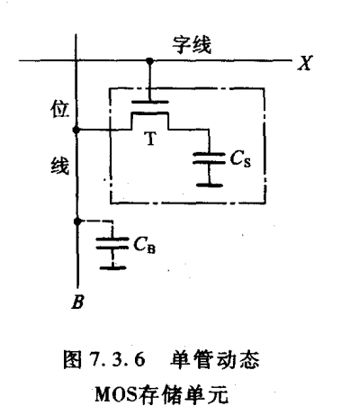

补充答案：

单管 DRAM 单元通常是 1T1C 结构，即一个访问晶体管加一个存储电容。访问晶体管的栅极接字线 WL，源/漏一端接位线 BL，另一端接存储电容，电容另一端接固定电位或参考板线。

写入时，字线 WL 打开访问管，位线 BL 上的电平给存储电容充电或放电，高电荷表示 1，低电荷表示 0。读取时，字线打开，存储电容与位线共享电荷，感放检测位线微小电压变化并放大。由于读取会扰动电容电荷，DRAM 读操作通常是破坏性读，需要读后恢复；同时电容会漏电，所以必须周期性刷新。

## 88. 什么叫做OTP片(OTP（一次性可编程）)、掩膜片，两者的区别何在？（仕兰微面试题目）

OTP与掩膜 OTP是一次性写入的单片机。过去认为一个单片机产品的成熟是以投产掩膜型单片机为标志的。由于掩膜需要一定的生产周期，而OTP型单片机价格不断下降，使得近年来直接使用OTP完成最终产品制造更为流行。它较之掩膜具有生产周期短、风险小的特点。近年来，OTP型单片机需量大幅度上扬，为适应这种需求许多单片机都采用了在系统编程技术(In System Programming)。未编程的OTP芯片可采用裸片Bonding技术或表面贴技术，先焊在印刷板上，然后通过单片机上引出的编程线、串行数据、时钟线等对单片机编程。解决了批量写OTP 芯片时容易出现的芯片与写入器接触不好的问题。使OTP的裸片得以广泛使用，降低了产品的成本。编程线与I/O线共用，不增加单片机的额外引脚。而一些生产厂商推出的单片机不再有掩膜型，全部为有ISP功能的OTP。

## 89. 你知道的集成电路设计的表达方式有哪几种？（仕兰微面试题目）

补充答案：

集成电路设计可以有多种表达层次和表达方式：系统级/算法级描述、行为级描述、RTL 级描述、门级网表、晶体管级描述和版图级描述。

从抽象到具体大致是：规格/算法 -> RTL -> gate-level netlist -> transistor-level -> layout。数字 IC 前端最核心的是 RTL 表达，综合后得到门级网表；后端则进一步转换为布局布线后的物理版图，最终以 GDS/OASIS 等格式交付制造。

## 90. 描述你对集成电路设计流程的认识。（仕兰微面试题目）

制定规格书-任务划分-设计输入-功能仿真-综合-优化-布局布线-时序仿真时序分析-芯片流片-芯片测试验证

## 91. 描述你对集成电路工艺的认识。（仕兰微面试题目）

工艺分类：TTL，CMOS两种比较流行，TTL速度快功耗高，CMOS速度慢功耗低。

集成电路的工艺主要是指CMOS电路的制造工艺，主要分为以下几个步骤：衬底准备-氧化、光刻-扩散和离子注入-淀积-刻蚀-平面化。

## 92. 简述FPGA等可编程逻辑器件设计流程。（仕兰微面试题目）

通常可将FPGA/CPLD设计流程归纳为以下7个步骤，这与ASIC设计有相似之处。

1. 设计输入。Verilog或VHDL编写代码。

2. 前仿真（功能仿真）。设计的电路必须在布局布线前验证电路功能是否有效。（ASCI设计中，这一步骤称为第一次Sign-off）PLD设计中，有时跳过这一步。

3. 设计编译（综合）。设计输入之后就有一个从高层次系统行为设计向门级逻辑电路设转化翻译过程，即把设计输入的某种或某几种数据格式(网表)转化为软件可识别的某种数据格式(网表)。

4. 优化。对于上述综合生成的网表，根据布尔方程功能等效的原则，用更小更快的综合结果代替一些复杂的单元，并与指定的库映射生成新的网表，这是减小电路规模的一条必由之路。

5. 布局布线。

6. 后仿真（时序仿真）需要利用在布局布线中获得的精确参数再次验证电路的时序。（ASCI设计中，这一步骤称为第二次Sign—off）。

7. 生产。布线和后仿真完成之后，就可以开始ASCI或PLD芯片的投产

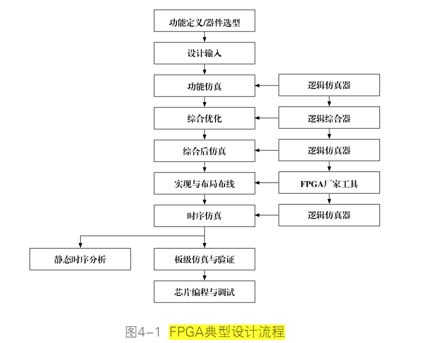

## 93. 分别写出IC设计前端到后端的流程和eda工具。（未知）

逻辑设计--子功能分解--详细时序框图--分块逻辑仿真--电路设计(RTL级描述)--功能仿真--综合(加时序约束和设计库)--电路网表--网表仿真)-预布局布线(SDF文件)--网表仿真(带延时文件)--静态时序分析--布局布线--参数提取--SDF文件--后仿真--静态时序分析--测试向量生成--工艺设计与生产--芯片测试--芯片应用，在验证过程中出现的时序收敛，功耗，面积问题，应返回前端的代码输入进行重新修改，再仿真，再综合，再验证，一般都要反复好几次才能最后送去foundry厂流片。设计公司是fabless

数字IC设计流程（zz）

1. 需求分析(制定规格书)。分析用户或市场的需求，并将其翻译成对芯片产品的技术需求。

2. 算法设计。设计和优化芯片钟所使用的算法。这一阶段一般使用高级编程语言（如C/C++），利用算法级建模和仿真工具（如MATLAB，SPW）进行浮点和定点的仿真，进而对算法进行评估和优化。

3. 构架设计。根据设计的功能需求和算法分析的结果，设计芯片的构架，并对不同的方案进行比较，选择性能价格最优的方案。这一阶段可以使用SystemC语言对芯片构架进行模拟和分析。

4. RTL设计（代码输入）。使用HDL语言完成对设计实体的RTL级描述。这一阶段使用VHDL和Verilog HDL语言的输入工具编写代码。

5. RTL验证（功能仿真）。使用仿真工具或其他RTL代码分析工具，验证RTL代码的质量和性能。

6. 综合。从RTL代码生成描述实际电路的门级网表文件。

7. 门级验证（综合后仿真）。对综合产生的门级网表进行验证。这一阶段通常会使用仿真、静态时序分析和形式验证等工具。

8. 布局布线。后端设计对综合产生的门级网表进行布局规划（Floorplanning）、布局（Placement）、布线（Routing），生成生产用的版图。

9. 电路参数提取确定芯片中互连线的寄生参数，从而获得门级的延时信息。

10. 版图后验证。根据后端设计后取得的新的延时信息，再次验证设计是否能够实现所有的功能和性能指标。

11. 芯片生产。生产在特定的芯片工艺线上制造出芯片。

12. 芯片测试。对制造好的芯片进行测试，检测生产中产生的缺陷和问题。

数字IC后端设计流程

1. 数据准备。对于 Cadance的 SE而言后端设计所需的数据主要有是Foundry厂提供的标准单元、宏单元和I/O Pad的库文件,它包括物理库、时序库及网表库,分别以.lef、.tlf和.v的形式给出。前端的芯片设计经过综合后生成的门级网表,具有时序约束和时钟定义的脚本文件和由此产生的.gcf约束文件以及定义电源Pad的DEF（Design Exchange Format）文件。(对synopsys 的Astro 而言, 经过综合后生成的门级网表,时序约束文件 SDC 是一样的,Pad的定义文件--tdf , .tf 文件 --technology file, Foundry厂提供的标准单元、宏单元和I/O Pad的库文件 就与FRAM, CELL view, LM view 形式给出(Milkway 参考库 and DB, LIB file)

2. 布局规划。主要是标准单元、I/O Pad和宏单元的布局。I/O Pad预先给出了位置,而宏单元则根据时序要求进行摆放,标准单元则是给出了一定的区域由工具自动摆放。布局规划后,芯片的大小,Core的面积,Row的形式、电源及地线的Ring和Strip都确定下来了。如果必要在自动放置标准单元和宏单元之后, 你可以先做一次PNA(power network analysis）--IR drop and EM .

3. Placement -自动放置标准单元。布局规划后,宏单元、I/O Pad的位置和放置标准单元的区域都已确定,这些信息SE（Silicon Ensemble）会通过DEF文件传递给PC(Physical Compiler),PC根据由综合给出的.DB文件获得网表和时序约束信息进行自动放置标准单元,同时进行时序检查和单元放置优化。如果你用的是PC +Astro那你可用write_milkway, read_milkway传递数据。 4. 时钟树生成(CTS Clock tree synthesis)。芯片中的时钟网络要驱动电路中所有的时序单元,所以时钟源端门单元带载很多,其负载延时很大并且不平衡,需要插入缓冲器减小负载和平衡延时。时钟网络及其上的缓冲器构成了时钟树。一般要反复几次才可以做出一个比较理想的时钟树。

5. STA静态时序分析和后仿真。时钟树插入后,每个单元的位置都确定下来了,工具可以提出Global Route形式的连线寄生参数,此时对延时参数的提取就比较准确了。SE把.V和.SDF文件传递给PrimeTime做静态时序分析。确认没有时序违规后,将这来两个文件传递给前端人员做后仿真。对Astro 而言,在detail routing 之后, 用starRC XT 参数提取,生成的E.V和.SDF文件传递给PrimeTime做静态时序分析,那将会更准确。

6. ECO(Engineering Change Order)。针对静态时序分析和后仿真中出现的问题,对电路和单元布局进行小范围的改动.

7. filler的插入(pad fliier, cell filler)。Filler指的是标准单元库和I/O Pad库中定义的与逻辑无关的填充物,用来填充标准单元和标准单元之间,I/O Pad和I/O Pad之间的间隙,它主要是把扩散层连接起来,满足DRC规则和设计需要。

8. 布线(Routing)。Global route-- Track assign --Detail routing—Routing optimization布线是指在满足工艺规则和布线层数限制、线宽、线间距限制和各线网可靠绝缘的电性能约束的条件下,根据电路的连接关系将各单元和I/O Pad用互连线连接起来,这些是在时序驱动(Timing driven ) 的条件下进行的,保证关键时序路径上的连线长度能够最小。--Timing report clear

9. Dummy Metal的增加。Foundry厂都有对金属密度的规定,使其金属密度不要低于一定的值,以防在芯片制造过程中的刻蚀阶段对连线的金属层过度刻蚀从而降低电路的性能。加入Dummy Metal是为了增加金属的密度。

10. DRC和LVS。DRC是对芯片版图中的各层物理图形进行设计规则检查(spacing ,width),它也包括天线效应的检查,以确保芯片正常流片。LVS主要是将版图和电路网表进行比较,来保证流片出来的版图电路和实际需要的电路一致。DRC和LVS的检查--EDA工具Synopsy hercules/ mentor calibre/ CDN Dracula进行的.Astro also include LVS/DRC check commands.

11. Tape out。在所有检查和验证都正确无误的情况下把最后的版图GDSⅡ文件传递给Foundry厂进行掩膜制造

## 94. 从RTL synthesis到tape out之间的设计flow,并列出其中各步使用的tool.

综合-布局布线-时序仿真-时序分析

简单说来，一颗芯片的诞生可以分成设计和制造。当设计结束的时候，设计方会把设计数据送给制造方。tapeout 是集成电路设计中一个重要的阶段性成果，是值得庆祝的。庆祝之后，就是等待，等待制造完的芯片回来做检测，看是不是符合设计要求，是否有什么严重的问题等等。

In electronics, tape-out is the name of the final stage of the design of an integrated circuit such as a microprocessor; the point at which the description of a circuit is sent for manufacture.

## 95. 是否接触过自动布局布线？请说出一两种工具软件。自动布局布线需要哪些基本元 素？（仕兰微面试题目）

自动布局布线其基本流程如下：

1. 读入网表，跟foundry提供的标准单元库和Pad库以及宏模块库进行映射； 2、整体布局，规定了芯片的大致面积和管脚位置以及宏单元位置等粗略的信息； 3、读入时序约束文件，设置好timing setup菜单，为后面进行时序驱动的布局布线做准备； 4、详细布局，力求使后面布线能顺利满足布线布通率100%的要求和时序的要求； 5、时钟树综合，为了降低clock skew而产生由许多buffer单元组成的“时钟树”； 6、布线，先对电源线和时钟信号布线，然后对信号线布线，目标是最大程度地满足时序； 7、为满足design rule从而foundry能成功制造出该芯片而做的修补工作，如填充一些dummy等。 常用的工具有Synopsys的ASTRO，Cadence的SE，ISE，Quartus II也可实现布局布线。

## 96. 列举几种集成电路典型工艺。工艺上常提到0.25,0.18指的是什么？（仕兰微面试题 目）

典型工艺：氧化，离子注入，光刻，刻蚀，扩散，淀积。/0.13,90,65

制造工艺：我们经常说的0.18微米、0.13微米制程，就是指制造工艺了。制造工艺直接关系到cpu的电气性能。而0.18微米、0.13微米这个尺度就是指的是cpu核心中线路的宽度。线宽越小，cpu的功耗和发热量就越低，并可以工作在更高的频率上了。所以以前0.18微米的cpu最高的频率比较低，用0.13微米制造工艺的cpu会比0.18微米的制造工艺的发热量低都是这个道理了。

## 97. 请描述一下国内的工艺现状。（仕兰微面试题目）

补充答案：

这个问题通常考察对产业链和制程能力的宏观认识。可以从“先进制程、成熟制程、特色工艺、封装测试、EDA/IP 生态”几个角度回答。

国内晶圆制造在成熟制程和特色工艺上应用广泛，例如功率器件、模拟/混合信号、MCU、显示驱动、CIS、射频、嵌入式存储等领域。先进制程方面与国际最先进水平仍有差距，主要受光刻、关键设备、材料、良率、EDA/IP 和长期工艺积累等因素制约。封装测试能力相对较强，先进封装、Chiplet、2.5D/3D 封装也是重要发展方向。

面试回答可以这样总结：国内工艺能力正在快速提升，成熟制程和特色工艺更适合当前大量产业需求；先进制程仍需要在设备、材料、工艺平台、设计生态和量产良率上持续突破。

## 98. 半导体工艺中，掺杂有哪几种方式？（仕兰微面试题目）

根据掺入的杂质不同，杂质半导体可以分为N型和P型两大类。 N型半导体中掺入的杂质为磷等五价元素，磷原子在取代原晶体结构中的原子并构成共价键时，多余的第五个价电子很容易摆脱磷原子核的束缚而成为自由电子，于是半导体中的自由电子数目大量增加，自由电子成为多数载流子，空穴则成为少数载流子。P型半导体中掺入的杂质为硼或其他三价元素，硼原子在取代原晶体结构中的原子并构成共价键时，将因缺少一个价电子而形成一个空穴，于是半导体中的空穴数目大量增加，空穴成为多数载流子，而自由电子则成为少数载流子。

## 99. 描述CMOS电路中闩锁效应产生的过程及最后的结果？（仕兰微面试题目）

闩锁效应是CMOS工艺所特有的寄生效应，严重会导致电路的失效，甚至烧毁芯片。闩锁效应是由NMOS的有源区、P衬底、N阱、PMOS的有源区构成的n-p-n-p结构产生的，当其中一个三极管正偏时，就会构成正反馈形成闩锁。避免闩锁的方法就是要减小衬底和N阱的寄生电阻，使寄生的三极管不会处于正偏状态。 静电是一种看不见的破坏力，会对电子元器件产生影响。ESD 和相关的电压瞬变都会引起闩锁效应（latch-up）是半导体器件失效的主要原因之一。如果有一个强电场施加在器件结构中的氧化物薄膜上，则该氧化物薄膜就会因介质击穿而损坏。很细的金属化迹线会由于大电流而损坏，并会由于浪涌电流造成的过热而形成开路。这就是所谓的“闩锁效应”。在闩锁情况下，器件在电源与地之间形成短路，造成大电流、EOS（电过载）和器件损坏。

## 100. 解释latch-up现象和Antenna effect及其预防措施.（科广试题）

在芯片生产过程中，暴露的金属线或者多晶硅(polysilicon)等导体，就象是一根根天线，会收集电荷（如等离子刻蚀产生的带电粒子）导致电位升高。天线越长，收集的电荷也就越多，电压就越高。若这片导体碰巧只接了MOS 的栅，那么高电压就可能把薄栅氧化层击穿，使电路失效，这种现象我们称之为“天线效应”。随着工艺技术的发展，栅的尺寸越来越小，金属的层数越来越多，发生天线效应的可能性就越大

## 101. 异步复位、同步释放的解释、原因和实现方法

异步复位、同步释放是指：复位信号拉有效时，不等待时钟边沿，寄存器立即进入复位状态；复位信号撤销时，不直接异步撤销到所有寄存器，而是经过目标时钟域同步后，在时钟边沿对该时钟域内的寄存器释放复位。

为什么复位要异步有效：系统上电、时钟未稳定、PLL 未锁定或时钟被关断时，也需要能把电路强制拉到确定初始状态。如果复位只能同步生效，那么没有时钟时复位就无法进入寄存器。

为什么释放要同步：复位撤销如果发生在时钟有效边沿附近，寄存器可能违反 recovery/removal timing，导致亚稳态；不同寄存器看到复位释放的时间也可能不同，造成部分逻辑先跑、部分逻辑还在复位，状态机和计数器可能进入非法状态。因此复位释放应在每个时钟域内同步，保证该域所有逻辑在确定的时钟边沿之后开始工作。

典型实现方法是在每个时钟域放一个 reset synchronizer。复位有效端异步进入两个触发器，释放时通过两级触发器同步移出。

低有效复位示例：

```verilog
module reset_sync (
  input  wire clk,
  input  wire arst_n,
  output wire srst_n
);
  reg [1:0] sync_ff;

  always @(posedge clk or negedge arst_n) begin
    if (!arst_n)
      sync_ff <= 2'b00;
    else
      sync_ff <= {sync_ff[0], 1'b1};
  end

  assign srst_n = sync_ff[1];
endmodule
```

使用方式：

```verilog
wire rst_n_cpu;

reset_sync u_reset_sync_cpu (
  .clk    (clk_cpu),
  .arst_n (global_rst_n),
  .srst_n (rst_n_cpu)
);

always @(posedge clk_cpu or negedge rst_n_cpu) begin
  if (!rst_n_cpu)
    state <= IDLE;
  else
    state <= next_state;
end
```

注意事项：

1. 每个时钟域都应有自己的 reset synchronizer，不能把一个时钟域同步后的复位直接送到另一个时钟域。
2. 同步器前两级触发器要避免被综合优化掉，工程中常加 `ASYNC_REG`、`dont_touch` 等属性。
3. 复位释放前要确认目标时钟稳定，例如 PLL lock 后再释放全局复位。
4. 对复位跨域路径，STA 中通常检查 recovery/removal；同步器内部路径可能需要按公司约束规范设置 false path 或 async reset 约束。
5. 数据通路寄存器不一定都需要复位，控制寄存器、状态机和有效标志通常需要复位，过度复位会增加面积、布线和时序压力。
